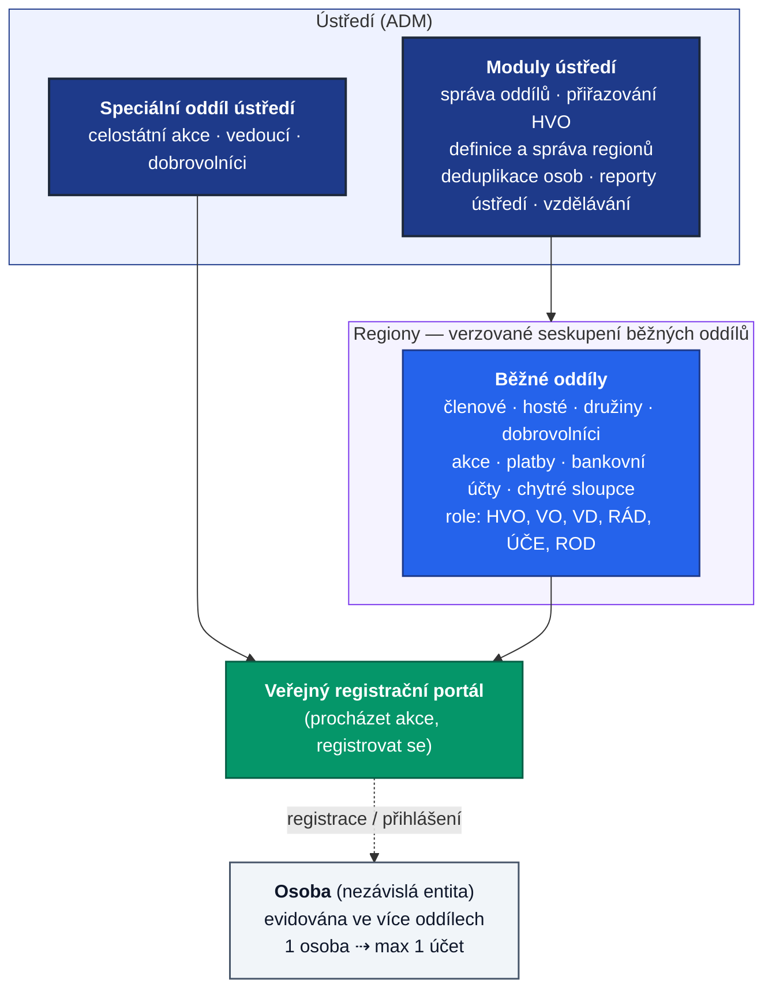

# Registrační systém oddílů DU — specifikace

## Přehled projektu

Systém registrací na akce pro oddíly DU. Strukturu tvoří ústředí, regiony a oddíly. Ústředí zastřešuje všechny oddíly, vede společnou členskou databázi a pořádá celostátní akce; jeho centrální agendu (správa oddílů, regiony, deduplikace, reporty, vzdělávání) zajišťují moduly ústředí. Každý oddíl spravuje vlastní akce, registrace a účastníky. Člen je nezávislá entita — může patřit do více oddílů současně.

**Rozsah:** Veřejný registrační portál, oddílová správa akcí, správa ústředí, self-management pro registrované.

---

## Přehled architektury

---

## Požadavky

### Role

- Uživatel může být ve více rolích, např. Administrátor a zároveň jeden z vedoucích oddílu nebo dobrovolník a rodič
- Role Hlavní vedoucí oddílu (HVO), Rádce (RÁD), Vedoucí oddílu (VO), Vedoucí družiny (VD), Administrátor (ADM), Účetní (ÚČE), Rodič (ROD)
- VO/VD nemají pevná globální práva, oprávnění se přidělují u akce / v rámci družiny.

#### Účetní

- Role, která má přístup jen k přihláškám (úpravy), akcím/cenám/stornům/bankovním účtům (čtení) a k párování/potvrzování plateb a výzvám.

#### Administrátor

- Spravuje oddíly a přiřazuje jim jejich Hlavní vedoucí
- Vytváří účty hlavním vedoucím - system vygeneruje pozvánku emailem

#### Hlavní vedoucí oddílu

- Nastavuje bankovní účty
- Vytváří účty účetním, vedoucím, rádcům - system vygeneruje pozvánku emailem
- Může do systému nahrát pověření od staršovstva
- Může definovat družiny, jejich vedoucí a členy
- Eviduje registrované členy (jméno, příjmení, pohlaví, datum narození)
- Eviduje hosty (min. jméno, příjmení nebo přezdívka)

#### Rádce

- Rádci nevidí citlivá data dětí, nejsou plnoletí

#### Rodič (zákonný zástupce)

- Rodič je osoba, která má vazbu na alespoň jedno dítě (typicky nezletilé)
- Rodič může zastupovat jedno nebo více nezletilých dětí
- Jedno dítě může být svázáno s více rodiči (oba zákonní zástupci)
- Rodič může své zastupované děti přihlašovat na akce a spravovat jejich přihlášky (registrace, storno, platby za dítě) a údaje v systému (adresy, pojišťovny, ...)
- Vazba rodič ↔ dítě vzniká registraci dítěte rodičem
- Po dosažení zletilosti se zastoupení rodičem přepne do režimu jen pro čtení. Výjimkou je doplnění kontaktního e-mailu dítěte, pokud chybí — slouží k doručení výzvy k převzetí účtu. Zletilý člen může přístup rodiče kdykoli zcela zrušit.
- Vazbu může zrušit sám rodič (vystoupení), případně HVO na žádost; zrušení se loguje. Zůstane-li nezletilé dítě bez navázaného rodiče, jeho údaje a přihlášky spravuje HVO, dokud se nepřipojí nový zákonný zástupce.
- Oba rodiče mají plná práva, platí poslední zápis.
- Druhého zákonného zástupce přidává stávající rodič nebo HVO pozvánkou (e-mailem). Vazba vznikne přijetím pozvánky druhým rodičem. Nemá-li dítě žádného navázaného rodiče, schvaluje připojení HVO, kde je dítě evidováno.

### Osoba vs. uživatelský účet

- Oddělujeme dvě entity:
  - **Osoba** = datový subjekt / účastník; může existovat bez přihlášení (host, nezletilé dítě spravované rodičem)
  - **Účet (uživatel)** = přihlašovací identita (heslo / OAuth), navázaná právě na jednu osobu
- Jedna osoba má nejvýše jeden účet

#### Stav osoby (lifecycle)

- Host / registrovaný člen / člen DU je **stav jedné osoby**, nikoli samostatná entita:
  - `host → registrovaný člen` (migrace provedená HVO - Registrovaný člen má povinné datum narození)
  - `registrovaný člen → člen DU`
  - `člen DU → registrovaný člen` (automatický přechod koncem roku, pokud nebyl zaplacen příspěvek na další rok — členství DU vyprší 31. 12.)
  - `* → neaktivní` (osoba opustila oddíl nebo dlouhodobě bez aktivity; záznam zůstává kvůli historii, ale nezapočítává se do počtu členů a nedostává automatické výzvy)
  - `neaktivní → registrovaný člen / host` (reaktivace, pokud se osoba vrátí)
  - `* → archivovaný` (GDPR: po uplynutí retenční doby se osobní a citlivá data anonymizují; zachovají se jen agregované/nepřímo identifikující údaje nutné pro reporting)
- Stavy `neaktivní` a `archivovaný` jsou kolmé na členský stav výše — určují, zda je záznam živý, uspaný, nebo anonymizovaný.
- U každého je evidována historie - změny, registrace, pod jakým oddílem

### Retence a GDPR

- Citlivá data jsou izolovaná per oddíl, každý oddíl proto maže/anonymizuje jen svoji verzi
- Administrátor může spustit výmaz napříč všemi oddíly.

> Lhůty jsou orientační a je nutné je potvrdit s DPO/právníkem (odvíjejí se od dotačních pravidel a interních směrnic).

| Kategorie dat                                               | Lhůta                                                         | Důvod / právní základ                                   |
| ----------------------------------------------------------- | ------------------------------------------------------------- | ------------------------------------------------------- |
| Citlivá data (zdravotní, alergie, léky, stravovací omezení) | smazat do 30 dnů po skončení akce                             | nutná jen pro průběh akce; minimalizace                 |
| Údaje hosta / jednorázového účastníka (nečlen)              | 12 měsíců od poslední aktivity, pak anonymizace               | žádný trvající vztah                                    |
| Členská evidence (registrovaný člen, člen DU)               | po dobu členství + 10 let                                     | doložitelnost pro dotace/kontroly (MŠMT obvykle 10 let) |
| Docházka, dobrovolnické hodiny                              | 10 let                                                        | výkaznictví k dotacím                                   |
| Účetní doklady (platby, párování, vratky)                   | 5 let (běžné), 10 let u dokladů s DPH                         | zákon o účetnictví / zákon o DPH                        |
| Souhlasy se zpracováním (GDPR)                              | po dobu zpracování + 4 roky po odvolání                       | doložení souhlasu, promlčecí doba                       |
| Úrazy / pojistné události nezletilých                       | do zletilosti dítěte + 4 roky                                 | promlčecí lhůty nároků nezletilých                      |
| Auditní logy (merge, bezpečnostní, změny)                   | 3 roky                                                        | bezpečnost, řešení sporů o spojení osob                 |
| Přihlašovací účet (neaktivní)                               | smazat/anonymizovat po 24 měsících nečinnosti (po upozornění) | minimalizace                                            |

- **Anonymizace, ne mazání** u záznamů potřebných pro agregovaný reporting (návaznost na stav `archivovaný`) — zachovají se jen nepřímo identifikující údaje (rok narození, oddíl, region-snapshot).
- **Nejdelší lhůta vyhrává:** je-li osoba zároveň člen i účastník akce s platbou, řídí se výmaz nejdelší relevantní lhůtou pro daný typ dat (citlivá data se ale mažou samostatně dřív).
- **Automatické joby:** systém periodicky označuje záznamy po expiraci a spouští anonymizaci; citlivá data mají vlastní (kratší) job.

### Deduplikace osob, merge

- system oveřuje správnost českých jmen podle seznamu (spravovaného administrátorem), nabízí možnost přidáni vyjímky HVO v rámci oddílu.
- Osobě s účtem se zobrazí možný kandidát na propojení (z jiného oddílu). Účet zadá Žádost o sloučení. Systém rozešle emailem žádost - iniciátorovi, HVO druhého oddílu a případně i účtu kandidáta na propojení. Po odsouhlasení všemi stranami (HVO se zobrazí pro porovnání náhled obou osob) může uživatel pokračovat se spojením: Záznamy obou osob se spojí do jedné osoby, konflikt základních polí se řeší volbou A/B, účet se naváže na sjednocenou osobu, pokud obě osoby mají účet, pak druhý účet se zruší (uživatel vybere), citlivá data zůstávají per oddíl, OAuth identity se přenesou pod ponechaný účet.
- Podobně se zpracuje duplicitní dítě, které se zobrazí rodiči s tím, že další strana je rodič dítěte kandidáta a výsledek nespojí účty rodičů do jednoho, jen osobu dítěte. Nemá-li dítě žádného navázaného rodiče, schvaluje připojení HVO, kde je dítě evidováno.
- Systém loguje, kdo kdy které osoby spojil, je možné zrušit merge pro nápravu chybného spojení.

### Člen DU

- Je vlastnost osoby
- Osoba se může stát členem DU od ledna následujícího roku po zaplacení příspěvku do listopadu
- Členství DU trvá: leden–prosinec (kalendářní rok)

### Region

- Region je vrstva mezi ústředím a běžnými oddíly: `Ústředí → Region → Oddíl`. Ústředí (celostátní) do regionů nepatří.
- Regiony definuje a spravuje ADM a přiřazuje do nich běžné oddíly. Oddíl je v daném okamžiku nejvýše v jednom regionu.
- **Příslušnost oddílu k regionu je verzovaná** (platnost od/do) — díky tomu lze určit, do jakého regionu oddíl patřil k libovolnému datu.
- Regiony se v čase mění:
  - **Vznik** – ADM založí nový region.
  - **Přesun oddílu** – uzavře se stávající příslušnost a založí nová do jiného regionu (bez přepisování historie).
  - **Sloučení (A + B → C)** – zdrojové regiony se označí jako _sloučené_ s odkazem na nástupnický region; všem oddílům z A i B se uzavře příslušnost a otevře nová na C.
  - **Rozdělení** – opačná operace ke sloučení.
- Regiony se **nemažou**, jen označí stavem _sloučený / zrušený_ — kvůli zachování historie.
- **Reporty (snapshot):** region oddílu/akce se zaznamenává jako **snapshot na akci v okamžiku jejího vzniku** (`region_id` se uloží k akci). Pozdější přesun oddílu nebo sloučení regionu **nemění už existující reporty**; nové akce počítají podle aktuálního zařazení. _Modul reporty ústředí_ tím získá dimenzi „region".

### Oddíl

- Typy oddílů: IČO ústředí, Pobočný spolek (vlastní IČO), kolektivní člen (bez DU v názvu, vlastní IČO)
- Ústředí je **speciální typ oddílu** určený pro celostátní akce. **Nemá registrované členy**.
- Registrace - Je možné vytvořit formulář (na úrovni oddílu) určený k registraci s možností zvolit políčka k vyplnění o členovi (lze vybírat z chytré tabulky)
- Oddíl si vede vlastní seznam lokací (GPS souřadnice a volitelně adresa), které jsou viditelné jen v rámci klubu; lze je přiřadit jako sídlo oddílu i jako místo konání akce

#### Družina

- Členy družiny mohou být členové, hosté, Vedoucí a Rádci z oddílu
- Družina může mít vlastní chytré sloupce nad rámec sloupců oddílu

### Přihlašování do systému

- Každý uživatel si může v systému změnit heslo
- Každý si může vytvořit účet v systému a v něm editovat svojí identitu, kterou může použít při dalších registracích na akce
- Pro přihlášení do aplikace půjde použít účet Google nebo Facebook (OAuth)
- jeden účet může mít více propojených OAuth identit (Google, Facebook)

### Konfigurace akce

- Hlavní vedoucí vytváří akce
- Hlavní vedoucí přiřazuje k akcím Vedoucí - získají přístup k přihláškám, nastaví jim uroveň oprávnění, zda můžou editovat akci, přihlášky, ceny, atd.
- Každá akce může být svazána s maximálně jedním bankovním účtem
- Každá akce může mít místo konání vybrané z lokací oddílu (GPS)
- Název, SS, max kapacita, počet náhradníků, ceny pro členy DU i ostatní, začátek akce, začátek a konec přihlašování, termíny pro storno podmínky
- Pokud akce vyžaduje dobrovolníky, lze zadat cenu, začátek a konec přihlašování, systém nabídne samostatnou stránku pro přihlášení dobrovolníků
- Náhradníci - po uvolnění místa jsou informováni vedoucí akce, po výběru náhradníka, náhradník dostane časově omezenou nabídku, po vypršení propadá a vedoucí znovu vybírá.
- Akce může mít definované sloupce s předdefinovanými hodnotami, ze kterých si účastníci při přihlášení vybírají; sloupec je buď exkluzivní (každou hodnotu může mít jen jeden účastník), nebo sdílený (stejnou hodnotu může zvolit více účastníků)
- Sloupec může mít podmínku - vyplňují jej a hodnoty vybírají jen účastníci, kteří ji splňují (např. věk, členství DU, role); ostatním se sloupec nezobrazí
- Akce může být veřejná, vnitřní nebo neveřejná. Každá akce má neveřejnou adresu (sdílecí odkaz), kterou lze sdílet a přihlašovat se přes ni, aniž by se akce publikovala ve veřejném výpisu. Veřejná akce se navíc zobrazuje ve veřejném výpisu portálu, interní akce je viditelná pouze po prihlášeným osobám, kteří jsou členy klubu.

#### Ceny a storna na akcích

- Systém umožňuje definovat více cen platných v různých termínech pro různé typy účastníků - DU, bez DU, dobrovolníky, oddílové vedoucí i děti oddílových vedoucích a sponzorské ceny
- Systém umožnuje definovat storno poplatky procentuálně v různých termínech
- Vratky schvaluje a odesílá Účetní nebo HVO ručně po skončení akce

#### Typy akcí

- Pravidelné kluby - pro účely zíápisu docházky
- Jednorázové akce - bez potřeby registrace
- Víkendovky/jednoosobové = Obecná přihláška
- Kurz - vazba na nabízené kurzy ústředí
- S certifikátem - v přihlašovacím formuláři je navíc pole pro tituly (před/za) a povinná adresu trvalého bydliště
- S doporučením mentora, vedoucího - v přihlašovacím formuláři je pole na vyplněné kontaktů. Systém osloví zadané mentory a vedoucí o doplnění očekávání vedoucího/účastníka a potvrzení přihlášky
- Skupinové - v přihlašovacím formuláři lze vyplnit více účastníků včetně jejich zákonných zástupců najednou
- Stezka - umožňuje po registraci z účastníků vytvořit hlídky pro účely závodu na akci - přiřadit jméno, vybrat kapitána, viz implementační detaily
- Workshopové - eviduje workshopy (název, popis, gps, lektor, min věk, potřeby, ...), časové bloky pro jejich zařazení a přihlašování účastníků do jednotlivých běhů workshopů

#### Přihlašování na akce

- Účastník, který nemá účet získa registrací identifikátor (token), kterým si může účet založit (po založení se účet propojí s existující osobou) a spravovat své přihlášky (storno, měnit nebo přidávat další účastníky)
- Systém posílá potvrzení přihlášky s výzvou k zaplacení (QR kód + platební údaje, pokud je stanovena cena akce)
- Systém připomíná nezaplacené platby - četnost lze upravit v Nastavení oddílu
- Systém kategorizuje přihlášky: Učastník, Dobrovolník, Náhradník
- Stavy přihlášky: Paid, New, Canceled, PartialPaid, Overpayment, PendingPayment, Expired

### Docházka

- Vedoucí můžou vytvářet události i zpětně - např. pravidelné kluby a rovnou vybrat libovolné účastníky ze seznamu osob z oddílu
- Při evidenci dobrovolníku je možné zadat počet hodin
- Systém rozděluje Krátkodobé dobrovolníky (pod 50hod.) a dlouhodobé (nad 50hod.)

#### Reporty

- Seznam akcí/výprav, docházka členů/nečlenů/vedoucích/rádců/dobrovolníků
- Počty členů v čase — vývoj registrovaných členů / členů DU / hostů po měsících nebo letech (růst/úbytek oddílu).
- Účast na akcích — kolik lidí chodí na akce v jednotlivých obdobích, naplněnost kapacit, podíl náhradníků.
- Docházka klubů — průměrná návštěvnost pravidelných klubů v průběhu roku (sezónní výkyvy).
- Dobrovolnické hodiny — vývoj odpracovaných hodin, poměr krátkodobých/dlouhodobých dobrovolníků.
- Retence / odchody — kolik osob přechází do neaktivní, míra reaktivací.
- Platby — vývoj inkasa, podíl včas/pozdě zaplacených, storna.
- Vzdělávání — kolik vedoucích má platné kurzy v čase, blížící se expirace.

### Volitelné moduly

- Povoluje Hlavní vedoucí pro svůj oddíl v Nastavení oddílu

#### Pomocná evidence

- Vedoucí může pro svůj oddíl nebo družinu definovat nové sloupce (do tabulky hostů/členů)
- Sloupcům lze nastavit viditelnost - zda je vlastník účtu může vidět nebo upravovat
- Sloupcům lze nastavit oprávnění - zda Rádci můžou vidět nebo upravovat

#### Modul párování plateb

- Aktivuje se doplněním tokenu k bankovnímu účtu
- Párování je M:N — jedna bankovní transakce může pokrýt více přihlášek (např. rodič platí za více dětí jednou platbou) a jedna přihláška může být uhrazena více platbami (postupné / částečné platby)
- Systém automaticky navrhuje párování podle SS=akce a VS=přihláška; když částka neodpovídá jediné přihlášce, umožní ruční rozdělení (alokaci) částky mezi více přihlášek
- Každá alokace eviduje napárovanou částku; stav přihlášky se počítá ze součtu alokací vůči ceně
- Nealokovaný zůstatek transakce zůstává k ručnímu dořešení; přeplatky lze evidovat a vracet
- Systém automaticky posílá poděkování po plném uhrazení přihlášky

#### Modul Potvrzení o platbě

- Vyžaduje aktivní Platební modul
- Účetní do systému zadá systému šablonu s razítkem/podpisem
- Systém automaticky připraví potvrzení o platbě ke stažení

#### Modul reporty ústředí

- Počítá unikátni počet dětí v rámci všech akcí všech oddílů (počítá se jednou, ikdyž bylo na více akcích)
- Lze filtrovat a agregovat podle **regionu** (region akce = snapshot uložený při vzniku akce)
- Zobrazí možné kandidáty (jméno, příjmení, datum narození). Systém nabídne "Reportovací sloučení" osob pro účely unikátních počtů, záznamy zůstanou oddělené
- nepočítá hosty ostatních oddílů

#### Modul vzdělávání

- Administrátor definuje jaké kurzy ústředí lze použít pro vzdělání vedoucích - eviduje se i doba platnosti
- Vzdělávací akce ústředí může být provázána s kurzem; po absolvování vznikne každému účastníkovi vazba s odkazem na zdrojovou akci
- Hlavní vedoucí, Vedoucí a Rádci můžou sobě přiřadit kurzy z nabídky
- Systém automaticky přiřadí kurz ústředí všem účastníkům po jeho absolvování
- Všichni Vedoucí a Rádci mají možnost vložit do systému svoje certifikáty, potvrzení od doktora a jiné absolvované kurzy
- Modul vzdělání zobrazuje Administrátorovi, jaké kurzy absolvovali jednotliví vedoucí v oddílech

---

## Datový model (ER diagram)

> Návrh schématu odvozený ze specifikace. Spojovací (M:N) a historizační tabulky jsou uvedeny zvlášť.

```mermaid
erDiagram
    REGION ||--o{ UNIT_REGION : includes
    UNIT ||--o{ UNIT_REGION : "membership (versioned)"
    UNIT ||--o{ EVENT : organizes
    UNIT ||--o{ BANK_ACCOUNT : has
    UNIT ||--o{ PATROL : has
    UNIT ||--o{ PERSON_UNIT : tracks
    UNIT ||--o{ USER_ROLE : "scoped to"
    UNIT ||--o{ ATTENDANCE_EVENT : has
    UNIT ||--o{ CUSTOM_FIELD : defines
    UNIT ||--o{ LOCATION : defines
    UNIT }o--o| LOCATION : "based at"
    EVENT }o--o| LOCATION : "held at"

    PERSON ||--o| ACCOUNT : has
    PERSON ||--o{ PERSON_UNIT : "tracked in"
    PERSON ||--o{ PARENT_CHILD : "as parent"
    PERSON ||--o{ PARENT_CHILD : "as child"
    PERSON ||--o{ PATROL_MEMBER : is
    PERSON ||--o{ REGISTRATION : submits
    PERSON ||--o{ DU_MEMBERSHIP : has
    PERSON ||--o{ ATTENDANCE_RECORD : attends
    PERSON ||--o{ CUSTOM_FIELD_VALUE : has
    PERSON ||--o{ PERSON_COURSE : completes

    ACCOUNT ||--o{ OAUTH_IDENTITY : has
    ACCOUNT ||--o{ USER_ROLE : has

    PATROL ||--o{ PATROL_MEMBER : contains
    PATROL ||--o{ CUSTOM_FIELD : scopes

    EVENT ||--o{ EVENT_PRICE : has
    EVENT ||--o{ CANCELLATION_RULE : has
    EVENT ||--o{ EVENT_FIELD : has
    EVENT ||--o{ REGISTRATION : contains
    EVENT }o--o| BANK_ACCOUNT : "linked to"
    EVENT }o--o| REGION : "region snapshot"

    EVENT_FIELD ||--o{ EVENT_FIELD_OPTION : offers
    EVENT_FIELD_OPTION ||--o{ REGISTRATION_FIELD_VALUE : "chosen by"
    REGISTRATION ||--o{ REGISTRATION_FIELD_VALUE : selects

    EVENT ||--o{ RACE_PATROL : "race patrols"
    RACE_PATROL ||--o{ RACE_PATROL_MEMBER : has
    REGISTRATION ||--o{ RACE_PATROL_MEMBER : "in patrol"
    EVENT ||--o{ WORKSHOP : offers
    WORKSHOP ||--o{ WORKSHOP_SLOT : "scheduled in"
    WORKSHOP }o--o| LOCATION : "held at"
    WORKSHOP_SLOT ||--o{ WORKSHOP_REGISTRATION : has
    REGISTRATION ||--o{ WORKSHOP_REGISTRATION : "enrolled in"

    REGISTRATION ||--o{ PAYMENT_ALLOCATION : "paid by"
    BANK_ACCOUNT ||--o{ BANK_TRANSACTION : records
    BANK_TRANSACTION ||--o{ PAYMENT_ALLOCATION : "split into"
    BANK_TRANSACTION |o--o{ DU_MEMBERSHIP : "membership receipt"

    ATTENDANCE_EVENT ||--o{ ATTENDANCE_RECORD : contains
    CUSTOM_FIELD ||--o{ CUSTOM_FIELD_VALUE : has
    COURSE ||--o{ PERSON_COURSE : "offered as"
    COURSE ||--o{ EVENT : "awarded by"
    EVENT ||--o{ PERSON_COURSE : "completed at"

    PERSON ||--o{ CONSENT : grants
    PERSON ||--o{ AUDIT_LOG : "subject of"
    PERSON ||--o{ RECOMMENDATION : "as mentor"
    PERSON ||--o{ REPORT_MERGE : "candidate A"
    PERSON ||--o{ REPORT_MERGE : "candidate B"
    ACCOUNT ||--o{ AUDIT_LOG : "performed by"
    REGISTRATION ||--o{ SUBSTITUTE_OFFER : offers
    REGISTRATION ||--o{ RECOMMENDATION : requires
    UNIT ||--o{ REGISTRATION_FORM : has
    UNIT ||--o{ UNIT_MODULE : enables
    UNIT ||--o{ UNIT_SETTING : has
    UNIT ||--o{ MANDATE : has
    REGISTRATION_FORM ||--o{ FORM_FIELD : contains
    CUSTOM_FIELD ||--o{ FORM_FIELD : "field source"

    REGION {
        int id PK
        string name
        string state "active / merged / cancelled"
        date valid_from
        date valid_to "NULL = active"
        int merged_into_region_id FK "successor region"
    }
    UNIT {
        int id PK
        string name
        string type "hq_ico / branch / collective"
        string ico
        bool is_hq
        int location_id FK "GPS umisteni (volitelne)"
        string smtp_email "Google email pro odchozi komunikaci (volitelne)"
        string smtp_app_password_enc "Heslo aplikaci (Google)"
    }
    UNIT_REGION {
        int id PK
        int unit_id FK
        int region_id FK
        date valid_from
        date valid_to "NULL = current"
    }
    PERSON {
        int id PK
        string first_name
        string last_name
        string nickname
        string gender "male / female / other"
        date birth_date "required for registered member"
        string email
    }
    PERSON_UNIT {
        int id PK
        int person_id FK
        int unit_id FK
        string membership_state "guest / registered_member / du_member"
        string record_state "active / inactive / archived"
        datetime valid_from
        datetime valid_to
    }
    ACCOUNT {
        int id PK
        int person_id FK "1:1"
        string email
        string password_hash
    }
    OAUTH_IDENTITY {
        int id PK
        int account_id FK
        string provider "google / facebook"
        string provider_user_id
        bool email_verified
    }
    USER_ROLE {
        int id PK
        int account_id FK
        int unit_id FK "role scope"
        string role "HVO / VO / VD / RAD / ADM / UCE / ROD"
    }
    PARENT_CHILD {
        int id PK
        int parent_person_id FK
        int child_person_id FK
        string state "active / cancelled / readonly_after_adulthood"
        datetime valid_from
        datetime valid_to
    }
    PATROL {
        int id PK
        int unit_id FK
        string name
    }
    PATROL_MEMBER {
        int id PK
        int patrol_id FK
        int person_id FK
        string role "leader / advisor / member"
    }
    EVENT {
        int id PK
        int unit_id FK
        int bank_account_id FK
        int region_id_snapshot FK "region at event creation"
        int location_id FK "GPS umisteni konani (volitelne)"
        string name
        string ss "specific symbol"
        string type "club / one_off / weekend / training / ..."
        int course_id FK "udeluje kurz po absolvovani (jen vzdelavaci akce)"
        int capacity
        int substitute_count
        bool public
        string share_slug "neverejny sdileci odkaz (bez publikace)"
        datetime starts_at
        datetime registration_from
        datetime registration_to
        bool volunteers_enabled
        datetime volunteer_registration_from
        datetime volunteer_registration_to
    }
    EVENT_PRICE {
        int id PK
        int event_id FK
        string membership_type "DU / non_DU / volunteer / leader / leader_child / sponsor"
        decimal amount
        date valid_from
        date valid_to
    }
    CANCELLATION_RULE {
        int id PK
        int event_id FK
        decimal percent
        date valid_until
    }
    EVENT_FIELD {
        int id PK
        int event_id FK
        string name
        string selection_mode "exclusive / shared"
        string condition "podminka pro vyplneni (vek / DU / role; NULL = vsichni)"
    }
    EVENT_FIELD_OPTION {
        int id PK
        int event_field_id FK
        string value "preddefinovana hodnota"
        int capacity "limit u shared (NULL = bez limitu)"
    }
    REGISTRATION_FIELD_VALUE {
        int id PK
        int registration_id FK
        int event_field_option_id FK
    }
    RACE_PATROL {
        int id PK
        int event_id FK
        string name
        int captain_registration_id FK "kapitan"
        string category "Stezka / Pesinka / Serpa_s_detmi / Pocestni"
    }
    RACE_PATROL_MEMBER {
        int id PK
        int race_patrol_id FK
        int registration_id FK
    }
    WORKSHOP {
        int id PK
        int event_id FK
        int location_id FK "GPS (volitelne)"
        string name
        string description
        string instructor "lektor"
        int min_age "min vek"
        string requirements "potreby"
    }
    WORKSHOP_SLOT {
        int id PK
        int workshop_id FK
        string time_block "casovy blok"
        int capacity
    }
    WORKSHOP_REGISTRATION {
        int id PK
        int workshop_slot_id FK
        int registration_id FK
    }
    REGISTRATION {
        int id PK
        int event_id FK
        int person_id FK
        int price_id FK
        string vs "variable symbol"
        string category "participant / volunteer / substitute"
        string state "New / PendingPayment / PartialPaid / Paid / Overpayment / Canceled / Expired"
        bool is_substitute
        string token "management without account"
    }
    PAYMENT_ALLOCATION {
        int id PK
        int bank_transaction_id FK
        int registration_id FK
        decimal amount "alokovana cast platby"
        string matched_by "auto / manual"
        datetime matched_at
    }
    BANK_ACCOUNT {
        int id PK
        int unit_id FK
        string name
        string account_number "cislo uctu"
        string bank_code "kod banky"
        string api_token_enc
    }
    BANK_TRANSACTION {
        int id PK
        int bank_account_id FK
        string ss
        string vs
        decimal amount
        string sender_name "nazev odesilatele"
        string sender_account "ucet odesilatele"
        string sender_bank_code "kod banky odesilatele"
        string message "zprava pro prijemce"
        string transaction_type "typ transakce"
        date date
    }
    DU_MEMBERSHIP {
        int id PK
        int person_id FK
        int year
        int bank_transaction_id FK "uhrada prispevku"
        bool paid
    }
    ATTENDANCE_EVENT {
        int id PK
        int unit_id FK
        string name
        date date
    }
    ATTENDANCE_RECORD {
        int id PK
        int attendance_event_id FK
        int person_id FK
        bool present
        decimal volunteer_hours
    }
    CUSTOM_FIELD {
        int id PK
        int unit_id FK
        int patrol_id FK "optional"
        string name
        string visibility "owner sees / edits"
        string permission "advisor sees / edits"
    }
    CUSTOM_FIELD_VALUE {
        int id PK
        int field_id FK
        int person_id FK
        string value
    }
    COURSE {
        int id PK
        string name
        int validity_months
    }
    LOCATION {
        int id PK
        int unit_id FK "vlastnik (klub) - viditelne per klub"
        string name
        decimal lat "zemepisna sirka"
        decimal lng "zemepisna delka"
        string address "volitelne"
    }
    PERSON_COURSE {
        int id PK
        int person_id FK
        int course_id FK
        int source_event_id FK "z jake vzdelavaci akce (volitelne)"
        date completed_on
        date valid_to
        string certificate_file
    }
    CONSENT {
        int id PK
        int person_id FK
        string type "processing / photo / health / ..."
        string purpose
        datetime granted_at
        datetime revoked_at "NULL = valid"
        date retention_until
    }
    SUBSTITUTE_OFFER {
        int id PK
        int registration_id FK
        string token
        datetime offered_at
        datetime expires_at
        string state "offered / accepted / expired"
    }
    RECOMMENDATION {
        int id PK
        int registration_id FK
        int mentor_person_id FK "NULL = email only"
        string mentor_email
        string type "mentor / leader"
        string expectation
        string state "requested / confirmed / rejected"
        datetime confirmed_at
    }
    REGISTRATION_FORM {
        int id PK
        int unit_id FK
        string name
        bool active
    }
    FORM_FIELD {
        int id PK
        int form_id FK
        int custom_field_id FK "optional (field source)"
        string name
        bool required
    }
    MANDATE {
        int id PK
        int unit_id FK
        string file
        date valid_from
        date valid_to
    }
    UNIT_MODULE {
        int id PK
        int unit_id FK
        string code "payment_matching / payment_confirmation / training / custom_fields / reports"
        bool active
        json config "module-specific settings"
        datetime activated_at
    }
    UNIT_SETTING {
        int id PK
        int unit_id FK
        string key "e.g. reminder_frequency_days"
        string value
    }
    AUDIT_LOG {
        int id PK
        int account_id FK "who (NULL = system)"
        int person_id FK "affected person"
        string type "merge / unmerge / security / change"
        string entity
        string description
        datetime created_at
    }
    REPORT_MERGE {
        int id PK
        int person_a_id FK
        int person_b_id FK
        string reason "reporting merge (records stay separate)"
        datetime created_at
    }
```

