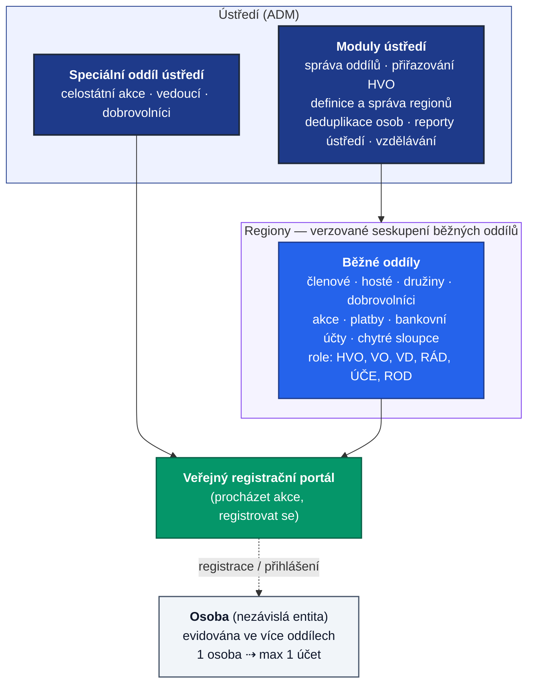

# Registrační systém oddílů DU — specifikace

## Přehled projektu

Systém registrací na akce pro oddíly DU. Strukturu tvoří ústředí, regiony a oddíly. Ústředí zastřešuje všechny oddíly, vede společnou členskou databázi a pořádá celostátní akce; jeho centrální agendu (správa oddílů, regiony, deduplikace, reporty, vzdělávání) zajišťují moduly ústředí. Každý oddíl spravuje vlastní akce, registrace a účastníky. Člen je nezávislá entita — může patřit do více oddílů současně.

**Rozsah:** Veřejný registrační portál, oddílová správa akcí, správa ústředí, self-management pro registrované.

---

## Přehled architektury

---

## Požadavky

### Role

- Uživatel může být ve více rolích, např. Administrátor a zároveň jeden z vedoucích oddílu nebo dobrovolník a rodič
- Role Hlavní vedoucí oddílu (HVO), Rádce (RÁD), Vedoucí oddílu (VO), Vedoucí družiny (VD), Administrátor (ADM), Účetní (ÚČE), Rodič (ROD)
- VO/VD nemají pevná globální práva, oprávnění se přidělují u akce / v rámci družiny.

#### Účetní

- Role, která má přístup jen k přihláškám (úpravy), akcím/cenám/stornům/bankovním účtům (čtení) a k párování/potvrzování plateb a výzvám.

#### Administrátor

- Spravuje oddíly a přiřazuje jim jejich Hlavní vedoucí
- Vytváří účty hlavním vedoucím - system vygeneruje pozvánku emailem

#### Hlavní vedoucí oddílu

- Spravuje bankovní účty
- Vytváří účty účetním, vedoucím, rádcům - system vygeneruje pozvánku emailem
- Můžou do systému nahrát pověření od staršovstva
- Může definovat družiny, jejich vedoucí a členy
- Eviduje registrované členy
- Eviduje hosty (min jméno příjmení nebo přezdívka)

#### Rádce

- Rádci nevidí citlivá data dětí, nejsou plnoletí

#### Rodič (zákonný zástupce)

- Rodič je osoba, která má vazbu na alespoň jedno dítě (typicky nezletilé)
- Rodič může zastupovat jedno nebo více nezletilých dětí (vazba rodič ↔ dítě, typu 1:N)
- Jedno dítě může být svázáno s více rodiči (oba zákonní zástupci) — vazba je M:N
- Rodič může své zastupované děti přihlašovat na akce a spravovat jejich přihlášky (registrace, storno, platby za dítě)
- Rodič se sám může akcí účastnit jako účastník (vystupuje pak zároveň jako účastník i jako zástupce dětí)
- Rodič vidí a edituje pouze údaje a přihlášky vlastních dětí
- Vazba rodič ↔ dítě vzniká registraci dítěte rodičem
- Po dosažení zletilosti se zastoupení rodičem přepne do režimu jen pro čtení. Výjimkou je doplnění kontaktního e-mailu dítěte, pokud chybí — slouží k doručení výzvy k převzetí účtu. Zletilý člen může přístup rodiče kdykoli zcela zrušit.
- Vazbu může zrušit sám rodič (vystoupení), případně HVO na žádost; zrušení se loguje. Zůstane-li nezletilé dítě bez navázaného rodiče, jeho údaje a přihlášky spravuje HVO, dokud se nepřipojí nový zákonný zástupce.
- Oba rodiče mají plná práva, platí poslední zápis.
- Druhého zákonného zástupce přidává stávající rodič nebo HVO pozvánkou (e-mailem). Vazba vznikne přijetím pozvánky druhým rodičem. Nemá-li dítě žádného navázaného rodiče, schvaluje připojení HVO, kde je dítě evidováno.

### Osoba vs. uživatelský účet

- Oddělujeme dvě entity:
  - **Osoba** = datový subjekt / účastník; může existovat bez přihlášení (host, nezletilé dítě spravované rodičem)
  - **Účet (uživatel)** = přihlašovací identita (heslo / OAuth), navázaná právě na jednu osobu
- Jedna osoba má nejvýše jeden účet
- Host nemá účet — má pouze identifikátor (token), kterým si může účet založit; po založení se účet propojí s existující osobou (nevznikne duplicita)

#### Stav osoby (lifecycle)

- Host / registrovaný člen / člen DU je **stav jedné osoby**, nikoli samostatná entita:
  - `host → registrovaný člen` (migrace provedená HVO - Registrovaný člen má povinné datum narození)
  - `registrovaný člen → člen DU`
  - `člen DU → registrovaný člen` (automatický přechod koncem roku, pokud nebyl zaplacen příspěvek na další rok — členství DU vyprší 31. 12.)
  - `* → neaktivní` (osoba opustila oddíl nebo dlouhodobě bez aktivity; záznam zůstává kvůli historii, ale nezapočítává se do počtu členů a nedostává automatické výzvy)
  - `neaktivní → registrovaný člen / host` (reaktivace, pokud se osoba vrátí)
  - `* → archivovaný` (GDPR: po uplynutí retenční doby se osobní a citlivá data anonymizují; zachovají se jen agregované/nepřímo identifikující údaje nutné pro reporting)
- Stavy `neaktivní` a `archivovaný` jsou kolmé na členský stav výše — určují, zda je záznam živý, uspaný, nebo anonymizovaný.
- U každého je evidována historie - změny, registrace, pod jakým oddílem

### Retence a GDPR

- citlivá data (zdravotní apod.) se mažou dříve než základní evidence
- konkrétní lhůty retence jsou TODO
- Citlivá data jsou izolovaná per oddíl, každý oddíl proto maže/anonymizuje jen svoji verzi
- Administrátor může spustit výmaz napříč všemi oddíly.

### Deduplikace osob, merge

- Osobě s účtem se zobrazí možný kandidát na propojení (z jiného oddílu). Účet zadá Žádost o sloučení. Systém rozešle emailem žádost - iniciátorovi, HVO druhého oddílu a případně i účtu kandidáta na propojení. Po odsouhlasení všemi stranami (HVO se zobrazí pro porovnání náhled obou osob) může uživatel pokračovat se spojením: Záznamy obou osob se spojí do jedné osoby, konflikt základních polí se řeší volbou A/B, účet se naváže na sjednocenou osobu, pokud obě osoby mají účet, pak druhý účet se zruší (uživatel vybere), citlivá data zůstávají per oddíl, OAuth identity se přenesou pod ponechaný účet.
- Podobně se zpracuje duplicitní dítě, které se zobrazí rodiči s tím, že další strana je rodič dítěte kandidáta a výsledek nespojí účty rodičů do jednoho, jen osobu dítěte. Nemá-li dítě žádného navázaného rodiče, schvaluje připojení HVO, kde je dítě evidováno.
- Systém loguje, kdo kdy které osoby spojil, je možné zrušit merge pro nápravu chybného spojení.

### Člen DU

- Je vlastnost osoby
- Osoba se může stát členem DU od ledna následujícího roku po zaplacení příspěvku do listopadu
- Členství DU trvá: leden–prosinec (kalendářní rok)

### Region

- Region je vrstva mezi ústředím a běžnými oddíly: `Ústředí → Region → Oddíl`. Ústředí (celostátní) do regionů nepatří.
- Regiony definuje a spravuje ADM a přiřazuje do nich běžné oddíly. Oddíl je v daném okamžiku nejvýše v jednom regionu (nově vzniklý oddíl může být dočasně bez regionu).
- **Příslušnost oddílu k regionu je verzovaná** (platnost od/do) — díky tomu lze určit, do jakého regionu oddíl patřil k libovolnému datu.
- Regiony se v čase mění:
  - **Vznik** – ADM založí nový region.
  - **Přesun oddílu** – uzavře se stávající příslušnost a založí nová do jiného regionu (bez přepisování historie).
  - **Sloučení (A + B → C)** – zdrojové regiony se označí jako _sloučené_ s odkazem na nástupnický region; všem oddílům z A i B se uzavře příslušnost a otevře nová na C.
  - **Rozdělení** – opačná operace ke sloučení.
- Regiony se **nemažou**, jen označí stavem _sloučený / zrušený_ — kvůli zachování historie.
- **Reporty (snapshot):** region oddílu/akce se zaznamenává jako **snapshot na akci v okamžiku jejího vzniku** (`region_id` se uloží k akci). Pozdější přesun oddílu nebo sloučení regionu **nemění už existující reporty**; nové akce počítají podle aktuálního zařazení. _Modul reporty ústředí_ tím získá dimenzi „region".

### Oddíl

- Typy oddílů: IČO ústředí, Pobočný spolek (vlastní IČO), kolektivní člen (bez DU v názvu, vlastní IČO)
- Ústředí je **speciální typ oddílu** určený pro celostátní akce. **Nemá registrované členy**.
- Registrace - Je možné vytvořit formulář (na úrovni oddílu) určený k registraci s možností zvolit políčka k vyplnění o členovi (lze vybírat z chytré tabulky)

#### Družina

- Má své Vedoucí, Rádce a členy

### Přihlašování do systému

- Každý uživatel si může v systému změnit heslo
- Každý si může vytvořit účet v systému a v něm editovat svojí identitu, kterou může použít při dalších registracích na akce
- Pro přihlášení do aplikace půjde použít účet Google nebo Facebook (OAuth)
- jeden účet může mít více propojených OAuth identit (Google, Facebook)

### Konfigurace akce

- Hlavní vedoucí vytváří akce
- Hlavní vedoucí přiřazuje k akcím Vedoucí - získají přístup k přihláškám, nastaví jim uroveň oprávnění, zda můžou editovat akci, přihlášky, ceny, atd.
- Každá akce může být svazána s maximálně jedním bankovním účtem
- Název, SS, max kapacita, počet náhradníků, ceny pro členy DU i ostatní, začátek akce, začátek a konec přihlašování, termíny pro storno podmínky
- Pokud akce vyžaduje dobrovolníky, lze zadat cenu, začátek a konec přihlašování, systém nabídne samostatnou stránku pro přihlášení dobrovolníků
- Náhradníci - po uvolnění místa jsou informováni vedoucí akce, po výběru náhradníka, náhradník dostane časově omezenou nabídku, po vypršení propadá a vedoucí znovu vybírá.
- Akce může být veřejná nebo neveřejná (dostupná přes odkaz)

#### Ceny a storna na akcích

- Systém umožňuje definovat více cen platných v různých termínech pro různé typy členství - DU, bez DU
- Systém umožňuje definovat ceny pro oddílové vedoucí i děti oddílových vedoucích
- Systém umožňuje sponzorské ceny - několik variant
- Systém umožnuje definovat storno poplatky procentuálně v různých termínech
- Vratky schvaluje a odesílá Účetní nebo HVO ručně po skončení akce

#### Typy akcí

- Pravidelné kluby
- Jednorázové akce
- Víkendovky
- Vzdělávací - vyžaduje tituly, adresu trvalého bydliště
- S doporučením mentora, vedoucího - system osloví zadané vedoucí/mentory o doplnění očekávání, potvrzení
- Jednoosobové - obecná přihláška
- Klubové - lze přihlašovat více účastníků včetně jejich zákonných zástupců najednou

#### Přihlašování na akce

- Neregistrovaným uživatelům je umožněno přes token spravovat jejich přihlášky (storno, měnit nebo přidávat další účastníky)
- Systém posílá posílá potvrzení přihlášky s výzvou k zaplacení (QR kód + platební údaje), hostům je navíc vygenerován identifikátor, díky kterému je možné si založit účet
- Systém připomíná nezaplacené platby - četnost lze upravit v Nastavení oddílu
- Systém kategorizuje přihlášky: Učastník, Dobrovolník, Náhradník
- Stavy přihlášky: Paid, New, Canceled, PartialPaid, Overpayment, PendingPayment, Expired

### Docházka

- Vedoucí můžou vytvářet události - např. páteční kluby
- Vedoucí můžou vybirat účastníky ze seznamu osob z oddílu
- Při evidenci dobrovolníku je možné zadat počet hodin
- Dobrovolníci krátkodobí (pod 50hod.), dlouhodobí (nad 50hod.)

#### Reporty

- Seznam akcí/výprav, docházka členů/nečlenů/vedoucích/rádců/dobrovolníků
- Trendy - TODO

### Volitelné moduly

- Povoluje Hlavní vedoucí pro svůj oddíl v Nastavení oddílu

#### Pomocná evidence

- Vedoucí může pro svůj oddíl nebo družinu definovat nové sloupce (do tabulky hostů/členů)
- Sloupcům lze nastavit viditelnost - zda je vlastník účtu může vidět nebo upravovat
- Sloupcům lze nastavit oprávnění - zda Rádci můžou vidět nebo upravovat

#### Modul párování plateb

- Aktivuje se doplněním tokenu k bankovnímu účtu
- Systém automaticky páruje bankovní transakce s přihláškami podle SS=akce a VS=přihláška
- Systém automaticky posílá poděkování za přijatou platbu

#### Modul Potvrzení o platbě

- Vyžaduje aktivní Platební modul
- Účetní do systému zadá systému šablonu s razítkem/podpisem
- Systém automaticky připraví potvrzení o platbě ke stažení

#### Modul reporty ústředí

- Počítá unikátni počet dětí v rámci všech akcí všech oddílů (počítá se jednou, ikdyž bylo na více akcích)
- Lze filtrovat a agregovat podle **regionu** (region akce = snapshot uložený při vzniku akce)
- Zobrazí možné kandidáty (jméno, příjmení, datum narození). Systém nabídne "Reportovací sloučení" osob pro účely unikátních počtů, záznamy zůstanou oddělené
- nepočítá hosty ostatních oddílů

#### Modul vzdělávání

- Administrátor definuje jaké kurzy ústředí lze použít pro vzdělání vedoucích - eviduje se i doba platnosti
- Hlavní vedoucí, Vedoucí a Rádci můžou sobě přiřadit kurzy z nabídky
- Systém automaticky přiřadí kurz ústředí všem účastníkům po jeho absolvování
- Všichni Vedoucí a Rádci mají možnost vložit do systému svoje certifikáty, potvrzení od doktora a jiné absolvované kurzy
- Modul vzdělání zobrazuje Administrátorovi, jaké kurzy absolvovali jednotliví vedoucí v oddílech

---

## Datový model (ER diagram)

> Návrh schématu odvozený ze specifikace. Spojovací (M:N) a historizační tabulky jsou uvedeny zvlášť. `*_enc` = šifrovaný sloupec, `platnost_od/do` = časová verzování.

```mermaid
erDiagram
    REGION ||--o{ ODDIL_REGION : zahrnuje
    ODDIL ||--o{ ODDIL_REGION : "prislusnost (verzovana)"
    ODDIL ||--o{ AKCE : porada
    ODDIL ||--o{ BANKOVNI_UCET : ma
    ODDIL ||--o{ DRUZINA : ma
    ODDIL ||--o{ OSOBA_ODDIL : eviduje
    ODDIL ||--o{ UZIVATEL_ROLE : "v ramci"
    ODDIL ||--o{ DOCHAZKA_UDALOST : ma
    ODDIL ||--o{ CHYTRY_SLOUPEC : definuje

    OSOBA ||--o| UCET : ma
    OSOBA ||--o{ OSOBA_ODDIL : evidovana
    OSOBA ||--o{ RODIC_DITE : "jako rodic"
    OSOBA ||--o{ RODIC_DITE : "jako dite"
    OSOBA ||--o{ DRUZINA_CLEN : je
    OSOBA ||--o{ PRIHLASKA : podava
    OSOBA ||--o{ CLENSTVI_DU : ma
    OSOBA ||--o{ DOCHAZKA_ZAZNAM : "ucastni se"
    OSOBA ||--o{ CHYTRY_SLOUPEC_HODNOTA : ma
    OSOBA ||--o{ OSOBA_KURZ : absolvuje

    UCET ||--o{ OAUTH_IDENTITY : ma
    UCET ||--o{ UZIVATEL_ROLE : ma

    DRUZINA ||--o{ DRUZINA_CLEN : obsahuje

    AKCE ||--o{ AKCE_CENA : ma
    AKCE ||--o{ STORNO_PRAVIDLO : ma
    AKCE ||--o{ PRIHLASKA : obsahuje
    AKCE }o--o| BANKOVNI_UCET : svazana
    AKCE }o--o| REGION : "snapshot regionu"

    PRIHLASKA ||--o{ PLATBA : ma
    BANKOVNI_UCET ||--o{ BANKOVNI_TRANSAKCE : eviduje
    BANKOVNI_TRANSAKCE |o--o| PLATBA : paruje
    CLENSTVI_DU |o--o| PLATBA : doklad

    DOCHAZKA_UDALOST ||--o{ DOCHAZKA_ZAZNAM : obsahuje
    CHYTRY_SLOUPEC ||--o{ CHYTRY_SLOUPEC_HODNOTA : ma
    KURZ ||--o{ OSOBA_KURZ : "v nabidce"

    REGION {
        int id PK
        string nazev
        string stav "aktivni / slouceny / zruseny"
        date platnost_od
        date platnost_do "NULL = aktivni"
        int slouceno_do_region_id FK "nastupnicky region"
    }
    ODDIL {
        int id PK
        string nazev
        string typ "ico_ustredi / pobocny_spolek / kolektivni"
        string ico
        bool je_ustredi
    }
    ODDIL_REGION {
        int id PK
        int oddil_id FK
        int region_id FK
        date platnost_od
        date platnost_do "NULL = aktualni"
    }
    OSOBA {
        int id PK
        string jmeno
        string prijmeni
        string prezdivka
        date datum_narozeni "povinne u registrovaneho clena"
        string email
    }
    OSOBA_ODDIL {
        int id PK
        int osoba_id FK
        int oddil_id FK
        string stav "host / registrovany_clen / clen_du"
        string zaznamovy_stav "aktivni / neaktivni / archivovany"
        datetime platnost_od
        datetime platnost_do
    }
    UCET {
        int id PK
        int osoba_id FK "1:1"
        string email
        string heslo_hash
    }
    OAUTH_IDENTITY {
        int id PK
        int ucet_id FK
        string provider "google / facebook"
        string provider_user_id
        bool email_verified
    }
    UZIVATEL_ROLE {
        int id PK
        int ucet_id FK
        int oddil_id FK "scope role"
        string role "HVO / VO / VD / RAD / ADM / UCE / ROD"
    }
    RODIC_DITE {
        int id PK
        int rodic_osoba_id FK
        int dite_osoba_id FK
        string stav "aktivni / zruseno / readonly_po_zletilosti"
        datetime platnost_od
        datetime platnost_do
    }
    DRUZINA {
        int id PK
        int oddil_id FK
        string nazev
    }
    DRUZINA_CLEN {
        int id PK
        int druzina_id FK
        int osoba_id FK
        string role "vedouci / radce / clen"
    }
    AKCE {
        int id PK
        int oddil_id FK
        int bankovni_ucet_id FK
        int region_id_snapshot FK "region pri vzniku akce"
        string nazev
        string ss "specificky symbol"
        string typ "klub / jednorazova / vikendovka / vzdelavaci / ..."
        int kapacita
        int pocet_nahradniku
        bool verejna
        datetime zacatek
        datetime prihlaseni_od
        datetime prihlaseni_do
    }
    AKCE_CENA {
        int id PK
        int akce_id FK
        string typ_clenstvi "DU / bez_DU / vedouci / dite_vedouciho / sponzorska"
        decimal castka
        date platnost_od
        date platnost_do
    }
    STORNO_PRAVIDLO {
        int id PK
        int akce_id FK
        decimal procento
        date platne_do
    }
    PRIHLASKA {
        int id PK
        int akce_id FK
        int osoba_id FK
        int cena_id FK
        string vs "variabilni symbol"
        string stav "nova / potvrzena / zaplacena / stornovana"
        bool je_nahradnik
        string token "sprava bez uctu"
    }
    PLATBA {
        int id PK
        int prihlaska_id FK
        decimal castka
        date datum
        bool sparovano
    }
    BANKOVNI_UCET {
        int id PK
        int oddil_id FK
        string nazev
        string cislo_uctu
        string api_token_enc
        string smtp_token_enc
    }
    BANKOVNI_TRANSAKCE {
        int id PK
        int bankovni_ucet_id FK
        int platba_id FK "po sparovani"
        string ss
        string vs
        decimal castka
        date datum
    }
    CLENSTVI_DU {
        int id PK
        int osoba_id FK
        int rok
        int platba_id FK
        bool zaplaceno
    }
    DOCHAZKA_UDALOST {
        int id PK
        int oddil_id FK
        string nazev
        date datum
    }
    DOCHAZKA_ZAZNAM {
        int id PK
        int udalost_id FK
        int osoba_id FK
        bool pritomen
        decimal hodiny_dobrovolnik
    }
    CHYTRY_SLOUPEC {
        int id PK
        int oddil_id FK
        int druzina_id FK "volitelne"
        string nazev
        string viditelnost "vlastnik vidi / upravuje"
        string opravneni "radce vidi / upravuje"
    }
    CHYTRY_SLOUPEC_HODNOTA {
        int id PK
        int sloupec_id FK
        int osoba_id FK
        string hodnota
    }
    KURZ {
        int id PK
        string nazev
        int platnost_mesicu
    }
    OSOBA_KURZ {
        int id PK
        int osoba_id FK
        int kurz_id FK
        date datum_absolvovani
        date platnost_do
        string certifikat_soubor
    }
```

---

## Technologický stack

| Vrstva   | Technologie                               |
| -------- | ----------------------------------------- |
| Backend  | Nette, PHP 8.2+                           |
| Databáze | Nette Database (Explorer), MySQL          |
| Frontend | Vite, React 18+, TypeScript, Tailwind CSS |
| API      | REST, JSON, autentizace přes session      |
| Stav     | React Query pro stav serveru              |

---

## Implementační detaily

### Komunikační modul

- systém ve výchozím stavu komunikuje emailem přes ověřený SMTP účet dorostove unie
- každý oddíl může volitelně definovat svůj email pro odchozí komunikaci nastavením SMTP tokenu
- šablony jsou ve složce emails/

### Ukládání tokenů

Tokeny jsou uloženy v databázi šifrovaně, klíč je uložen na serveru v neveřejné části.
https://github.com/defuse/php-encryption

### Pravidla přihlášení přes OAuth (bezpečné párování)

1. **Existující propojení:** Pokud (`provider`, `provider_user_id`) už existuje
   v `user_oauth_identities`, přihlas příslušného uživatele. (E-mail se
   nepoužívá k vyhledání účtu.)
2. **Nové propojení — jen ověřený e-mail:** Propojení s existujícím účtem podle
   e-mailu je povoleno **pouze** když provider vrátí `email_verified = true`.
   Neověřený e-mail (typicky Facebook) nikdy automaticky nepropojí ani nevytvoří
   účet.
3. **Potvrzení vlastnictví účtu:** I při ověřeném e-mailu se účet automaticky
   nepřebírá. Před propojením musí uživatel prokázat vlastnictví existujícího
   účtu jedním z:
   - přihlášením stávajícím heslem, nebo
   - kliknutím na potvrzovací odkaz odeslaný na e-mail účtu (platnost např. 30 min,
     jednorázový token).
4. **Žádný účet v systému:** Pokud e-mail v systému neexistuje a je ověřený,
   lze založit nový účet a rovnou vytvořit OAuth identitu. Při neověřeném e-mailu
   založení odmítni a vyžádej standardní registraci.
5. **Odpojení:** Uživatel může OAuth identitu odpojit; nesmí ale zůstat bez
   možnosti přihlášení (musí mít heslo nebo alespoň jednu identitu).

---
