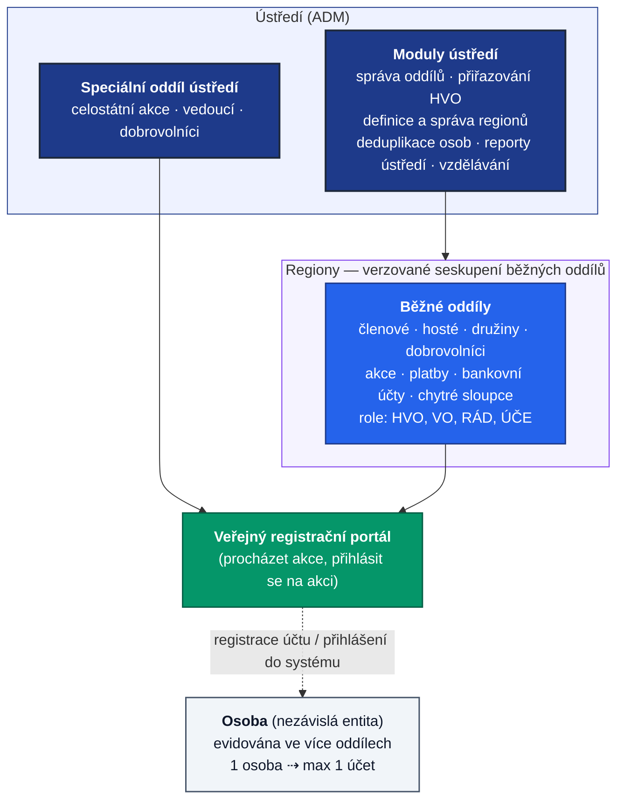

# Registrační systém oddílů DU — specifikace

## Přehled projektu

Systém přihlášek na akce pro oddíly DU. Strukturu tvoří ústředí, regiony a oddíly. Ústředí zastřešuje všechny oddíly, vede společnou členskou databázi a pořádá celostátní akce; jeho centrální agendu (správa oddílů, regiony, deduplikace, reporty, vzdělávání) zajišťují moduly ústředí. Každý oddíl spravuje vlastní akce, přihlášky a účastníky. Člen je nezávislá entita — může patřit do více oddílů současně.

**Rozsah:** Veřejný registrační portál, oddílová správa akcí, správa ústředí, self-management pro registrované.

**Rozhraní je navržené mobile-first** — zákonní zástupci i vedoucí pracují převážně z telefonu, desktop je menšinový scénář (účetní, ústředí). Detail viz [docs/non-functional.md](docs/non-functional.md).

---

## Přehled architektury

```mermaid
flowchart TD
    subgraph USTREDI["Ústředí (ADM)"]
        direction TB
        MODULY["<b>Moduly ústředí</b><br/>správa oddílů · přiřazování HVO<br/>definice a správa regionů<br/>deduplikace osob · reporty ústředí · vzdělávání"]
        USTODD["<b>Speciální oddíl ústředí</b><br/>celostátní akce · vedoucí · dobrovolníci"]
    end

    subgraph REGIONY["Regiony — verzované seskupení běžných oddílů"]
        ODDILY["<b>Běžné oddíly</b><br/>členové · hosté · družiny · dobrovolníci<br/>akce · platby · bankovní účty · chytré sloupce<br/>role: HVO, VO, RÁD, ÚČE"]
    end

    PORTAL["<b>Veřejný registrační portál</b><br/>(procházet akce, přihlásit se na akci)"]
    OSOBA["<b>Osoba</b> (nezávislá entita)<br/>evidována ve více oddílech<br />1 osoba ⇢ max 1 účet"]

    MODULY --> REGIONY
    USTODD --> PORTAL
    ODDILY --> PORTAL
    PORTAL -. "registrace účtu / přihlášení do systému" .-> OSOBA

    classDef modul fill:#1e3a8a,stroke:#1e293b,stroke-width:2px,color:#ffffff;
    classDef oddil fill:#2563eb,stroke:#1e3a8a,stroke-width:1.5px,color:#ffffff;
    classDef portal fill:#059669,stroke:#065f46,stroke-width:1.5px,color:#ffffff;
    classDef osoba fill:#f1f5f9,stroke:#475569,stroke-width:1.5px,color:#0f172a;

    class MODULY,USTODD modul;
    class ODDILY oddil;
    class PORTAL portal;
    class OSOBA osoba;

    style USTREDI fill:#eef2ff,stroke:#1e3a8a,stroke-width:1px;
    style REGIONY fill:#f5f3ff,stroke:#7c3aed,stroke-width:1px;
```

---

##### K diskusi

1. Role Rádce (vedoucí družiny) - určuje HVO a končí s odebráním role nebo opuštěním družiny? Co s Rádcem, když dosáhne 18? Může být někdo Rádce a Vedoucí současně?

---

### Role

- Uživatel může být ve více rolích, např. Administrátor a zároveň jeden z vedoucích oddílu nebo dobrovolník a zákonný zástupce
- Role Hlavní vedoucí oddílu (HVO), Vedoucí oddílu (VO), Rádce (vedoucí družiny, RÁD), Administrátor (ADM), Účetní oddílu (ÚČE)
- **Zákonný zástupce není přidělovaná role** — postavení zákonného zástupce se **odvozuje z aktivní vazby zákonný zástupce ↔ dítě**. Rozsah práv je vždy **per dítě**, ne globální; role se proto nepřiděluje ani neodebírá a nemůže se rozejít se skutečným stavem vazby (zrušení, přechod do režimu jen pro čtení po zletilosti dítěte).
- VO a Rádce (vedoucí družiny) nemají pevná globální práva, oprávnění se přidělují u akce / v rámci družiny.
- **Vedoucí akce** je role v týmu konkrétní akce, nikoli další globální role oddílu. HVO jí může pověřit člena týmu s rolí VO nebo RÁD; vedoucí akce pak u přihlášek své akce vidí konkrétní předepsanou, uhrazenou a zbývající částku. Nevidí bankovní transakce ani platební údaje mimo svou akci.
- Úplnou matici oprávnění (akce × role × scope) viz [docs/authorization.md](docs/authorization.md).

#### Účetní oddílu

- **Oprávnění platí pro celý oddíl, ne per akci** — párování je operace nad bankovním účtem oddílu a jedna platba může pokrýt přihlášky z více akcí. Účetní se proto k akci nepřiřazuje.
- **Čtení všech přihlášek** oddílu (nutné pro párování) — bez citlivých údajů.
- **Úpravy jen platebních atributů** přihlášky; ostatní obsah přihlášky mění vedoucí.
- Čtení akcí, cen, storen a bankovních účtů.
- Párování a potvrzování plateb, řešení přeplatků a vratek, výzvy k platbě.

#### Administrátor

- Spravuje oddíly a přiřazuje jim jejich Hlavní vedoucí
- Vytváří účty hlavním vedoucím — systém vygeneruje pozvánku e-mailem
- Definuje a spravuje regiony, přiřazuje do nich oddíly (viz **Region**)
- Čte osobní údaje a přihlášky napříč oddíly; toto oprávnění je pouze čtecí
- Může dočasně delegovat konkrétní část svých oprávnění jinému účtu v rámci svého oddílu

#### Hlavní vedoucí oddílu

- Nastavuje bankovní účty
- Vytváří účty účetním, vedoucím, rádcům — systém vygeneruje pozvánku e-mailem
- Vytváří účty dětem na základě písemné přihlášky — systém vygeneruje pozvánku e-mailem pro zákonného zástupce ke vstupu do portálu a potvrzení účtu dítěte
- Může do systému nahrát **pověření od staršovstva**. Pověření je oddílový dokument, který dokládá mandát oddílu a jeho platnost; samo o sobě nezakládá ani nemění roli `USER_ROLE` a nenahrazuje odbornou kvalifikaci.
- Může definovat družiny, jejich vedoucí a členy
- Eviduje registrované členy (jméno, příjmení, pohlaví, datum narození)
- Eviduje hosty (min. jméno, příjmení nebo přezdívka)

#### Rádce (vedoucí družiny)

- Rádci nejsou plnoletí — jsou to nezletilí pomocníci vedoucích
- **Nezletilého Rádce registruje do systému (přihlašuje jako rádce do oddílu) zákonný zástupce** — pozvánku od HVO a založení role musí schválit zákonný zástupce. Bez schválení zákonní zástupcim role nevznikne a pozvánka zůstává v čekajícím stavu.
- Nemá-li nezletilý Rádce navázaného aktivního zákonní zástupci, nelze roli založit — nejprve musí vzniknout vazba zákonný zástupce ↔ dítě (viz **Zákonný zástupce (zákonný zástupce)**).
- **Rádce právně odpovídá za své činy v systému.** Zákonný zástupce schvaluje vznik role, ale jednotlivé úkony Rádce (zápis docházky, úprava chytrých sloupců, čtení údajů dětí) nečte, neschvaluje ani za ně neodpovídá. V auditním logu je aktérem vždy Rádce, ne jeho zástupce.
- **Na akce svého oddílu se přihlašuje sám** — na rozdíl od ostatních nezletilých účastníků může RÁD podat vlastní přihlášku bez schválení zákonným zástupcem. Toto oprávnění platí jen pro jeho vlastní účast, ne pro přihlašování jiných osob.
- **Vidí údaje dětí, které k práci rádce potřebuje** — kontakty, informace o dítěti i **zdravotní údaje (alergie, diety, ADHD apod.)**, a to v rámci svého rozsahu: svá družina a zdravotní údaje účastníků akcí, ke kterým je přiřazený. Základní detail akcí svého oddílu a seznam přihlášených vidí i bez přiřazení k akci; toto základní čtení samo o sobě nezpřístupňuje zdravotní údaje, dokumenty ani platební atributy.
- **Nevidí finanční údaje** — kdo zaplatil či nezaplatil, částky, dary, přeplatky, vratky ani bankovní účty. Přihlášky vidí **bez platebních atributů**.
- Může otevřít obsah nahraných dokumentů k přihláškám v rozsahu svých přiřazených akcí a družiny.
- Zapisuje docházku a vyplňuje chytré sloupce (pomocnou evidenci) — v rozsahu, který je u sloupce nastavený (viz **Pomocná evidence**).

#### Zákonný zástupce

- Zákonný zástupce může zastupovat jedno nebo více nezletilých dětí
- Jedno dítě může být svázáno s více zákonnými zástupci
- Zákonný zástupce může své zastupované děti přihlašovat na akce a spravovat jejich přihlášky (přihlášení na akci, storno, platby za dítě) a údaje v systému (adresy, pojišťovny, ...)
- **Trvalé dokumenty dítěte:** aktivní zákonný zástupce může za dítě nahrát, obnovit nebo vybrat trvalý dokument, například průkaz pojišťovny nebo potvrzení o lékařské způsobilosti k účasti na letním táboře. Dokument je uložený u osoby a při další přihlášce se může použít znovu, takže se nemusí nahrávat opakovaně. Zákonný zástupce vidí stav a platnost dokumentu; po zletilosti přechází tato správa do režimu jen pro čtení.
- Nemá-li zákonný zástupce účet, systém mu odešle e-mail s jednorázovým tokenem pro jeho založení. Uživatelským jménem účtu je e-mail příjemce; po dokončení registrace se účet spáruje s dítětem vazbou zákonný zástupce ↔ dítě a token se zneplatní.
- **Vznik vazby zákonný zástupce ↔ dítě přihlášením na akci:**
  - Nemá-li dítě dosud žádného navázaného zákonného zástupce, vazba vznikne rovnou jako aktivní — zákonný zástupce v přihlášce explicitně prohlásí, že je zákonným zástupcem (prohlášení se loguje).
  - Má-li dítě už navázaného zákonného zástupce, nová vazba vznikne jako **čekající** a musí ji schválit stávající zákonný zástupce, nebo HVO oddílu, kde je dítě evidováno — stejně jako u pozvánky druhému zákonnému zástupci níže.
- Po dosažení zletilosti se zastoupení zákonnými zástupci přepne do režimu jen pro čtení. Výjimkou je doplnění kontaktního e-mailu dítěte, pokud chybí — slouží k doručení výzvy k převzetí účtu. Zletilý člen může přístup zákonným zástupcům kdykoli zcela zrušit.
- Vazbu může zrušit sám zákonný zástupce (vystoupení), případně HVO na žádost; zrušení se loguje. Zůstane-li nezletilé dítě bez navázaného zákonného zástupce, jeho údaje a přihlášky spravuje HVO, dokud se nepřipojí nový zákonný zástupce.
- Oba zákonní zástupci mají plná práva, platí poslední zápis.
- Druhého zákonného zástupce přidává stávající zákonný zástupce nebo HVO pozvánkou (e-mailem). Vazba vznikne přijetím pozvánky druhým zákonní zástupcim. Nemá-li dítě žádného navázaného zákonní zástupci, schvaluje připojení HVO, kde je dítě evidováno.
- Přesná pravidla přechodů, guardy a práva podle stavu viz [docs/parent-child-lifecycle.md](docs/parent-child-lifecycle.md).

### Osoba vs. uživatelský účet

- Oddělujeme dvě entity:
  - **Osoba** = datový subjekt / účastník; může existovat bez přihlášení (host, nezletilé dítě spravované zákonní zástupcim)
  - **Účet (uživatel)** = přihlašovací identita (heslo / OAuth), navázaná právě na jednu osobu
- Jedna osoba má nejvýše jeden účet
- **Údaje osoby**: jméno, příjmení, přezdívka, tituly před a za jménem, pohlaví, datum narození, kontaktní e-mail, adresa trvalého bydliště a zdravotní pojišťovna. Vyplňují se podle potřeby akce (např. tituly a adresa u akcí s certifikátem); cokoli nad tento rámec patří do **chytrých sloupců** oddílu.
- **Pojmy** (důsledně v celé specifikaci):
  - **Registrace** = založení **účtu v systému** (identita osoby); _přihlášení do systému_ = následné ověření (heslo / OAuth).
  - **Přihláška na akci** = účast na konkrétní akci; _přihlásit se na akci_ = vytvořit přihlášku.
  - Slovo „přihlášení“ samotné se používá jen pro login; účast je vždy „přihláška na akci“.

#### Stav osoby (lifecycle)

- Stav osoby v rámci oddílu tvoří **dvě nezávislé osy**: typ vztahu (**host** ↔ **registrovaný člen**) a životnost záznamu (**aktivní** → **neaktivní** → **archivovaný**, GDPR anonymizace).
- **Členství DU není stav osoby** — odvozuje se z existence záznamu o členství pro daný rok (viz **Člen DU**).
- Formální model (matice kombinací, guardy, přechody, dopady na ostatní vazby, historie) viz [docs/person-lifecycle.md](docs/person-lifecycle.md).

### Retence a GDPR

- Citlivá data jsou izolovaná per oddíl, každý oddíl proto maže/anonymizuje jen svoji verzi
- Administrátor může spustit výmaz napříč všemi oddíly.

> Lhůty jsou orientační a je nutné je potvrdit s DPO/právníkem (odvíjejí se od dotačních pravidel a interních směrnic).

| Kategorie dat                                               | Lhůta                                                                                                                                                                         | Důvod / právní základ                                   |
| ----------------------------------------------------------- | ----------------------------------------------------------------------------------------------------------------------------------------------------------------------------- | ------------------------------------------------------- |
| Citlivá data (zdravotní, alergie, léky, stravovací omezení) | smazat do 30 dnů po skončení akce                                                                                                                                             | nutná jen pro průběh akce; minimalizace                 |
| Údaje hosta / jednorázového účastníka (nečlen)              | 12 měsíců od poslední aktivity, pak anonymizace                                                                                                                               | žádný trvající vztah                                    |
| Členská evidence (registrovaný člen, člen DU)               | po dobu členství + 10 let                                                                                                                                                     | doložitelnost pro dotace/kontroly (MŠMT obvykle 10 let) |
| Docházka, dobrovolnické hodiny                              | 10 let                                                                                                                                                                        | výkaznictví k dotacím                                   |
| Přístup vedoucích k akci (přiřazení a jeho odebrání)        | 10 let od skončení akce                                                                                                                                                       | doložení, kdo měl přístup k údajům účastníků            |
| Účetní doklady (platby, párování, vratky)                   | 5 let (běžné), 10 let u dokladů s DPH                                                                                                                                         | zákon o účetnictví / zákon o DPH                        |
| Souhlasy se zpracováním (GDPR)                              | po dobu zpracování + 4 roky po odvolání                                                                                                                                       | doložení souhlasu, promlčecí doba                       |
| Úrazy / pojistné události nezletilých                       | do zletilosti dítěte + 4 roky                                                                                                                                                 | promlčecí lhůty nároků nezletilých                      |
| Auditní logy (merge, bezpečnostní, změny)                   | 3 roky                                                                                                                                                                        | bezpečnost, řešení sporů o spojení osob                 |
| Přihlašovací účet (neaktivní)                               | po 24 měsících nečinnosti deaktivovat přihlášení; účetní/identifikační údaje smazat/anonymizovat až současně s příslušnými uživatelskými daty podle nejdelší relevantní lhůty | minimalizace; účet není samostatná retenční kategorie   |

- **Anonymizace, ne mazání** u záznamů potřebných pro agregovaný reporting (návaznost na stav _archivovaný_) — zachovají se jen nepřímo identifikující údaje (rok narození, oddíl, region k okamžiku akce).
- **Nejdelší lhůta vyhrává:** je-li osoba zároveň člen i účastník akce s platbou, řídí se výmaz nejdelší relevantní lhůtou pro daný typ dat (citlivá data se ale mažou samostatně dřív).
- **Účet není samostatná retenční kategorie:** deaktivace přihlášení po dlouhé nečinnosti brání dalšímu přístupu, ale nemaže osobu ani historii. Účetní a identifikační údaje účtu se odstraňují nebo anonymizují teprve v rámci anonymizace příslušných uživatelských dat; záznamy potřebné pro přihlášky, platby nebo audit zůstanou zachované v anonymizované podobě, pokud jejich vlastní lhůta trvá déle.
- **Automatické joby:** systém periodicky označuje záznamy po expiraci a spouští anonymizaci; citlivá data mají vlastní (kratší) job.

#### Auditní log

- Změnové události napříč systémem se zapisují do jednoho společného auditního logu — mutace hlídek, zrušení vazby zákonný zástupce ↔ dítě, změny přiřazení vedoucích k akci, úpravy akce a přihlášky, posouzení dokumentů.
- Záznam nese **cíl**, **operaci**, **aktéra** a detail s tím, co se změnilo, případně důvodem. **Aktér nemusí mít účet** — přihlášku i hlídku lze spravovat přes odkaz z e-mailu, proto se užívá i e-mail aktéra; u automatických úloh je aktérem systém.
- Log je vedený **per oddíl**, takže ho lze mazat a anonymizovat samostatně a naplňovat lhůtu **3 roky** z tabulky výše.
- Mimo tento log zůstávají čtyři evidence, které nejsou jen auditem: **záznam o sloučení osob** (umožňuje sloučení vrátit zpět), **historie stavů osoby** (čtou ji reporty), **historie přístupu vedoucích k akci** (vlastní retence 10 let) a **doklad o výmazu podle GDPR** (vlastní retence a okruh čtenářů).
- Detail modelu viz [docs/audit-log.md](docs/audit-log.md).

### Deduplikace osob, merge

- Systém ověřuje správnost českých **křestních jmen** podle seznamu (spravovaného administrátorem), nabízí možnost přidání výjimky HVO v rámci oddílu. Příjmení se proti seznamu neověřují.
- Osobě s účtem se zobrazí možný kandidát na propojení (z jiného oddílu). Účet zadá Žádost o sloučení. Systém rozešle emailem žádost - iniciátorovi, HVO druhého oddílu a případně i účtu kandidáta na propojení. Po odsouhlasení všemi stranami (HVO se zobrazí pro porovnání náhled obou osob) může uživatel pokračovat se spojením: Záznamy obou osob se spojí do jedné osoby, konflikt základních polí se řeší volbou A/B, účet se naváže na sjednocenou osobu, pokud obě osoby mají účet, pak druhý účet se zruší (uživatel vybere), citlivá data zůstávají per oddíl, OAuth identity se přenesou pod ponechaný účet.
- Podobně se zpracuje duplicitní dítě, které se zobrazí zákonnými zástupci s tím, že další strana je zákonný zástupce dítěte kandidáta a výsledek nespojí účty zákonných zástupců do jednoho, jen osobu dítěte. Nemá-li dítě žádného navázaného zákonní zástupci, schvaluje připojení HVO, kde je dítě evidováno.
- Systém loguje, kdo kdy které osoby spojil, je možné zrušit merge pro nápravu chybného spojení.
- Konflikt se řeší **pole po poli** — je-li jedna strana prázdná, vyhrává vyplněná hodnota; liší-li se, musí člověk vybrat. Nabízí se jen výběr z obou hodnot, ne ruční přepsání, aby šlo sloučení věrně vrátit zpět.
- **Zrušení sloučení vrátí jen to, co v okamžiku sloučení existovalo.** Záznamy vzniklé až potom (nová přihláška, platba, členství) zůstanou u sjednocené osoby; systém je vypíše před potvrzením, ne až po něm.
- Podrobná pravidla (schvalování, kolize přihlášek a členství, rozsah revertu) viz [docs/person-merge.md](docs/person-merge.md).

### Člen DU

- **Členství DU je samostatný záznam, ne stav osoby**: osoba je členem DU pro rok _R_ právě tehdy, existuje-li záznam o členství s touto osobou a rokem.
- **Členství je globální vůči osobě a roku** — osoba má nejvýše jedno členství DU za kalendářní rok v celém systému, bez ohledu na to, v kolika oddílech je evidovaná.
- Součástí záznamu je **evidenční oddíl**, který členství založil. Slouží k dohledatelnosti a k výkaznictví (report se ptá, který oddíl člena vykázá), **neomezuje ale platnost členství**.
- **Platné členství DU se uznává ve všech oddílech, kde je osoba evidovaná** — cena pro členy DU i podmínky způsobilosti platí i na akcích jiného oddílu než toho evidenčního. Přesun osoby mezi oddíly v průběhu roku členství nezaniká ani nezakládá nové.
- Osoba se může stát členem DU od ledna následujícího roku po zaplacení příspěvku do listopadu.
- **Oddíl může vybírat členský příspěvek přes registrační systém** přímo od svých registrovaných členů nebo jejich zákonných zástupců. HVO pro rok nastaví lokální složku příspěvku; systém členovi vystaví jeden předpis a platební QR kód na účet oddílu.
- **Předpis oddílového členského příspěvku se skládá ze dvou složek:** příspěvek DU podle celostátní sazby a lokální příspěvek na provoz oddílu. Částky se ukládají jako neměnný snapshot, aby pozdější změna sazby nepřepsala již vystavené nebo uhrazené předpisy. Má-li osoba už pro daný rok platné členství DU z jiného oddílu, předpis obsahuje jen lokální složku.
- **Úhrada od člena nejprve kryje složku DU, potom lokální složku.** HVO může do dávky pro ústředí zařadit pouze osobu, pro niž oddíl vybral celou složku DU; lokální část zůstává oddílu. Systém pak z těchto osob spočítá částku a vygeneruje **jeden QR kód pro hromadnou platbu** na účet ústředí.
- **Sazbu příspěvku pro daný rok stanovuje ADM** a je společná pro celý systém. **Jakmile na daný rok dorazí první platba, sazba se uzamkne** — nelze ji změnit, aby dva oddíly nezaplatily za stejný rok jinou částku a aby už rozeslané QR kódy zůstaly platné.
- **Členství vzniká spárováním platby, ne ručním zápisem.** Hromadnou platbu páruje **účetní ústředí** stejným mechanismem jako platby za akce (SS = příspěvek DU, VS = dávka); spárováním systém všem osobám dávky nastaví příznak člena DU — založí záznam o členství s evidenčním oddílem = oddíl, který dávku podal.
- **Dávka je nedělitelná.** Po vygenerování QR se seznam osob uzamkne (jinak by částka nesouhlasila s QR); změna znamená dávku zrušit a založit novou. Částečná úhrada příznak nikomu nenastaví — dávka zůstane jako nedoplatek, dokud ji HVO nedoplatí.
- Do dávky lze zařadit jen osobu, která pro daný rok **ještě členství nemá**, **není v jiné nevypořádané dávce** a má uhrazenou složku DU svého oddílového předpisu.
- **První zaplacená dávka vyhrává** — je-li osoba evidovaná ve víc oddílech, nerozhoduje se, kdo má přednost. Podají-li dávku dva oddíly, uspěje ta, jejíž platba dorazila první; druhá položka se přeskočí a rozdíl řeší účetní ústředí jako přeplatek dávky.
- **Evidenční oddíl lze přepsat:** HVO jiného oddílu, kde je osoba evidovaná, požádá o převedení a potvrdí ho HVO stávajícího evidenčního oddílu, nebo ADM. Změna se loguje a mění **jen výkaznictví**, ne platnost členství — to platí dál ve všech oddílech.
- Členství DU trvá: leden–prosinec (kalendářní rok). **Vyprší tím, že pro nový rok záznam nevznikne** — není potřeba žádný přechod stavu ani úklidová úloha k 31. 12.
- Kombinace osoba + rok je unikátní (jedno členství DU na osobu a rok)
- Kde se členství vyhodnocuje (cena podle typu účastníka, podmínka způsobilosti u číselníku, reporty), rozhoduje se vždy **k roku dané akce**, ne podle aktuálního data. U ceny se navíc vyhodnotí jen **jednou, při podání přihlášky** — pozdější vznik členství cenu už nemění (viz **Ceny a storna na akcích**).

### Region

- Region je vrstva mezi ústředím a běžnými oddíly: `Ústředí → Region → Oddíl`. Ústředí (celostátní) do regionů nepatří.
- Regiony definuje a spravuje ADM a přiřazuje do nich běžné oddíly. Oddíl je v daném okamžiku nejvýše v jednom regionu.
- **Příslušnost oddílu k regionu je verzovaná** (platnost od/do) — díky tomu lze určit, do jakého regionu oddíl patřil k libovolnému datu.
- Regiony se v čase mění:
  - **Vznik** – ADM založí nový region.
  - **Přesun oddílu** – uzavře se stávající příslušnost a založí nová do jiného regionu (bez přepisování historie).
  - **Sloučení (A + B → C)** – zdrojové regiony se označí jako _sloučené_ s odkazem na nástupnický region; všem oddílům z A i B se uzavře příslušnost a otevře nová na C.
  - **Rozdělení** – opačná operace ke sloučení.
- Regiony se **nemažou**, jen označí stavem _sloučený / zrušený_ — kvůli zachování historie.
- **Reporty (snapshot):** region oddílu/akce se zaznamenává jako **snapshot na akci v okamžiku jejího vzniku**. Pozdější přesun oddílu nebo sloučení regionu **nemění už existující reporty**; nové akce počítají podle aktuálního zařazení. _Modul reporty ústředí_ tím získá dimenzi „region".- Stavy regionu, guardy operací a invarianty verzované příslušnosti viz [docs/region-lifecycle.md](docs/region-lifecycle.md).

### Oddíl

- Typy oddílů: IČO ústředí, Pobočný spolek (vlastní IČO), kolektivní člen (bez DU v názvu, vlastní IČO)
- Ústředí je **speciální typ oddílu** určený pro celostátní akce. **Nemá registrované členy**.
- Registrace — chytré sloupce oddílu (viz níže) lze **zařadit do přihlášky na akci** jako volitelná nebo povinná pole; vyplněná hodnota se uloží k osobě
- Oddíl si vede vlastní seznam lokací (GPS souřadnice a volitelně adresa), které jsou viditelné jen v rámci oddílu; lze je přiřadit jako sídlo oddílu i jako místo konání akce

#### Družina

- Členy družiny mohou být členové, hosté, Vedoucí a Rádci z oddílu
- Družina může mít vlastní chytré sloupce nad rámec sloupců oddílu

### Přihlašování do systému

- Každý uživatel si může v systému změnit heslo
- Pro přihlášení do aplikace půjde použít účet Google nebo Facebook (OAuth)
- Jeden účet může mít více propojených OAuth identit (Google, Facebook)

### Konfigurace akce

- Hlavní vedoucí vytváří akce
- **Při založení akce nebo při její úpravě s oprávněním `can_edit_event` Vedoucí akce vyplňuje:**
  - stav akce: **veřejný**, **koncept**, **neviditelný** nebo **zrušený**,
  - název a typ akce,
  - varianty ceny podle typu účastníka nebo jiné cenové varianty,
  - sraz: místo, datum a čas,
  - místo konání nebo cíl akce (kam se jde či jede),
  - návrat: místo, datum a čas,
  - popis akce, program a poznámku,
  - co s sebou; položky lze převzít ze šablony a upravit pro konkrétní akci,
  - nutné dokumenty podle seznamu dokumentů,
  - kontakt na Vedoucího akce a další členy týmu; kontakty se zobrazují podle aktivních přiřazení VO/RÁD k akci,
  - datum a čas uzavření přihlášek.
- **Šablony akcí:** HVO může vytvořit šablonu s výchozím typem, programem, seznamem „co s sebou“, dokumenty, cenami a další konfigurací. Z ní lze opakovaně zakládat například jednodenní výpravy; vytvořená akce je samostatná a pozdější změna šablony ji nemění.
- **Stav a viditelnost:** koncept není určen k publikaci ani přihlašování, veřejný stav akci publikuje, neviditelný stav ji skryje z běžných výpisů a zrušený stav ukončí její další provoz podle pravidel storna. Samostatné nastavení viditelnosti dále určuje, zda je zveřejněná akce veřejná, vnitřní nebo dostupná jen přes sdílecí odkaz.
- **Pozvánky na akci:** HVO nebo Vedoucí s oprávněním upravit akci může pozvat vybrané členy svého oddílu. Výběr může tvořit celý oddíl, konkrétní družiny, věková skupina, pohlaví, oddílová rada (členové vedení) nebo jednotlivě zvolené osoby; při naplánování se uloží konkrétní seznam pozvaných. Pro každou pozvánku nastaví datum a čas odeslání a volitelně jeden termín automatické připomínky. Pozvánka obsahuje volby **Přihlásit** a **Omluvit**; připomínka se odešle jen osobě, která se dosud ani nepřihlásila, ani neomluvila.
- **Přihláška klubu na akci ústředí:** organizátor může u konkrétní akce zapnout režim přihlášky klubu. HVO nebo VO založí za svůj oddíl jednu `CLUB_REGISTRATION` a získá sdílený odkaz, který předá zákonným zástupcům. Zástupce přes odkaz přidá své dítě a dokončí jeho běžnou `REGISTRATION`; vedoucí může předem založit základní záznam a dítě nebo jeho zástupce jej následně doplní a potvrdí. Klubová přihláška nemá vlastní cenu, platbu ani místo v kapacitě — každé dítě má vlastní stav, dokumenty, cenu a platbu a do kapacity se započítává samostatně po potvrzení. Vedoucí ji může spravovat a uzavřít do konce přihlašování; uzavření zabrání dalšímu přidávání, existující individuální přihlášky tím nestornuje. Režim neobchází schválení zákonného zástupce.
- **Veřejný seznam klubů:** u akce se stavem `public`, typem `club` a zapnutým režimem klubových přihlášek portál zobrazí jen názvy otevřených klubových přihlášek. Účastník nebo jeho zákonný zástupce vybere klub a přihlášku dokončí v běžném toku; vzniká individuální `REGISTRATION` pod vybraným klubem. Veřejný seznam nezobrazuje vedoucího, seznam účastníků ani jejich počet.
- **Základní čtení akce:** každý aktivní **Vedoucí (VO)** a **Rádce (RÁD)** vidí v rámci svého oddílu detail akce a seznam přihlášených, i když k akci není přiřazený a nezúčastní se její organizace. Základní čtení neobsahuje platební atributy, zdravotní údaje ani obsah nahraných dokumentů.
- **Tým akce:** tvoří jej jen konkrétní **Vedoucí (VO)** a **Rádci (RÁD)** přiřazení k akci. HVO může jednomu či více členům týmu určit roli **Vedoucí akce**. Každému členu týmu nastaví rozsah oprávnění — úprava akce, úprava přihlášek, úprava cen a storen, zápis docházky. Vedoucí akce navíc vidí předepsanou, uhrazenou a zbývající částku u přihlášek své akce. Eviduje se, kdo a kdy přiřazení založil. **Účetní oddílu se do týmu akce nezařazuje** — má oprávnění pro celý oddíl (viz **Účetní oddílu**).
- **Přiřazení je verzované a nemaže se** — odebrání přístupu záznam jen uzavře (kdo a kdy odebral), změna rozsahu oprávnění uzavře starý a založí nový. I po letech tak lze zjistit, **kdo měl k akci a jejím přihláškám přístup a v jakém období**. Retenci určuje vlastní řádek v tabulce **Retence a GDPR** (10 let), ne 3letá lhůta auditního logu.
- Každá akce může být svazána s maximálně jedním bankovním účtem
- Každá akce může mít místo konání vybrané z lokací oddílu (GPS)
- Název, SS, max kapacita, počet náhradníků, ceny pro členy DU i ostatní, začátek a konec akce, začátek a konec přihlašování, termíny pro storno podmínky
- **Splatnost je nastavení akce** — buď **relativní** (počet dní od podání přihlášky, výchozích 14), nebo **absolutní** (pevné datum společné pro celou akci). Volba je výlučná: buď počet dní, nebo datum.
- **Evidence dobrovolníků (volitelná, per akce):** je-li u akce zapnutá, systém nabídne **samostatnou stránku pro přihlášení dobrovolníků** s vlastní cenou a začátkem/koncem přihlašování. Dobrovolníci se **evidují odděleně od účastníků**, **nezapočítávají se do kapacity ani do počtu náhradníků** akce a vedou se ve zvláštním seznamu. Bez zapnutí se dobrovolnická stránka nenabízí.
- Náhradníci — po uvolnění místa jsou informováni vedoucí akce; po výběru náhradníka dostane náhradník časově omezenou nabídku, po vypršení propadá a vedoucí znovu vybírá.
- Akce může mít libovolný počet **výběrových číselníků** (např. ubytování, strava, doprava, stanoviště) — viz **Výběrové číselníky akce**
- **Viditelnost akce** má tři vzájemně výlučné úrovně:
  - **veřejná** — zobrazuje se ve veřejném výpisu portálu, přihlásit se může kdokoli,
  - **vnitřní** — ve výpisu není; vidí ji jen přihlášená osoba s aktivní vazbou na pořádající oddíl (u akce ústředí všichni registrovaní členové),
  - **neveřejná** — dostupná výhradně přes sdílecí odkaz; odkaz slouží ke čtení detailu i k podání přihlášky.
    Sdílecí odkaz má **každá** akce bez ohledu na úroveň — je to přístupová cesta, ne publikace ve výpisu. U neveřejné akce může přihlášku podat i osoba bez účtu nebo bez vazby na pořádající oddíl.
- Akce může definovat **povinné dokumenty** k přihlášce; seznam a povinnost se přebírají ze **šablony akce** jako výchozí a lze je přepsat v nastavení konkrétní akce — detail a schvalovací flow viz **Přihlašování na akce**

#### Výběrové číselníky akce

Obecný, znovupoužitelný mechanismus: vedoucí u libovolné akce nadefinuje **libovolný počet číselníků**, z nichž si účastník při přihlášení vybírá předdefinované hodnoty (výběr lůžka, turnusu, dopravy, velikosti trika, role …).

- Číselník patří akci, má název, množinu položek a volitelně **veřejný popis** pro účastníka i **neveřejnou poznámku** pro vedoucí.
- Položku může zvolit buď **nejvýše jeden účastník** (např. konkrétní lůžko), nebo **více účastníků** — pak počet omezuje **kapacita položky** (např. ubytovací kapacita budovy). Po naplnění se položka přestane nabízet.
- Číselník může být **jednovýběrový** (typ ubytování) i **vícevýběrový** (výběr jídel).
- **Podmínka způsobilosti** (např. věk, členství DU, role) číselník skryje těm, kdo ji nesplňují.
- **Povinný číselník** má určeno, kdy nejpozději musí účastník volbu provést: při odeslání přihlášky (výchozí), před výzvou k platbě, nebo před konáním akce. U **náhradníka** se povinný výběr (stejně jako dokumenty) vynucuje až po schválení přihlášky.
- Položka může mít **cenový příplatek** (i nulový nebo záporný): **výsledná cena = základní cena podle typu účastníka + součet příplatků zvolených položek.**
- Číselník vyplňuje buď **účastník** sám, nebo ho přiřazuje **vedoucí** až po přihlášení (např. stanoviště na závodě).

Tím se stejným modelem pokryje **ubytování** (jednovýběrový číselník budova/stan, kde „budova“ nese vyšší příplatek) i **strava** (vícevýběrový číselník snídaně/oběd/večeře, každá položka s vlastní cenou). Detail modelu viz [docs/event-fields.md](docs/event-fields.md).

#### Ceny a storna na akcích

- Systém umožňuje definovat více cen platných v různých termínech pro různé typy účastníků - DU, bez DU, dobrovolníky, oddílové vedoucí i děti oddílových vedoucích a sponzorské ceny
- **Cena se fixuje v okamžiku podání přihlášky.** Rozhoduje typ účastníka a cenové období platné k tomuto okamžiku; pozdější zdražení, zlevnění ani vznik členství DU už cenu neřídí. Účastník tak vidí ve výzvě k platbě i v QR týž údaj, jaký platil při podání.
- **Změnit už zafixovanou cenu může jen vedoucí** s oprávněním k úpravě cen a storen, a to ručně u konkrétní přihlášky (např. dodatečně prokázané členství DU); změna se loguje a přepočítá stav úhrady.
- **Výjimkou jsou příplatky z číselníků** — změní-li účastník volbu (jiné ubytování, strava), cena se přepočte, protože se mění sama objednaná služba, ne ceník.
- Volitelné příplatky (ubytování, strava apod.) se modelují přes **výběrové číselníky** — každá položka může nést cenový příplatek; výsledná cena přihlášky = základní cena + součet příplatků zvolených položek (viz **Výběrové číselníky akce**)
- Systém umožňuje definovat storno poplatky procentuálně v různých termínech
- Vratky systém neřeší

#### Typy a šablony akcí

- **Typ akce** je klasifikace, která řídí zapnuté subsystémy, obsah přihlašovacího formuláře, filtrování a reporty.
- **Šablona** je přednastavená konfigurace daného typu, ze které HVO/Vedoucí zakládá konkrétní akci, aby se vše nemuselo nastavovat ručně. **K jednomu typu může existovat více šablon** (systémové i vlastní oddílové s odlišnými výchozími hodnotami).
- Akce si při vzniku uloží **odkaz na šablonu i vlastní typ** (snapshot); pozdější úprava šablony už založené akce nemění.

**Co jednotlivé typy zapínají / vyžadují** (výchozí obsah šablony):

| Typ                       | Zapíná / vyžaduje                                                                                                                                                                                                                                                                                                                                                |
| ------------------------- | ---------------------------------------------------------------------------------------------------------------------------------------------------------------------------------------------------------------------------------------------------------------------------------------------------------------------------------------------------------------- |
| Pravidelné schůzky        | **opakující se** oddílová činnost — každá schůzka je samostatná datovaná akce; zápis docházky, bez přihlášek (neotevírá registraci, neřeší cenu ani platbu)                                                                                                                                                                                                      |
| Jednorázové akce          | **neopakující se** samostatná akce (výlet, brigáda, oddílová akce) — bez přihlášek; docházku lze zapsat, cenu a platbu neřeší                                                                                                                                                                                                                                    |
| Víkendovky / jednoosobové | obecná přihláška                                                                                                                                                                                                                                                                                                                                                 |
| Kurz                      | vazba na nabízené kurzy ústředí                                                                                                                                                                                                                                                                                                                                  |
| S certifikátem            | v přihlašovacím formuláři navíc tituly (před/za) a povinná adresa trvalého bydliště                                                                                                                                                                                                                                                                              |
| Mentor a doporučení       | při registraci se zadává jméno a e-mail mentora. Účastník bez aktivní vazby na oddíl povinně zadá e-mail hlavního vedoucího; u účastníka oddílu se vedoucí odvodí z vybraného aktivního oddílu. Po potvrzení e-mailu registrujícího systém odešle mentorovi žádost o přijetí role a hlavnímu vedoucímu žádost o doporučení. Detail viz **Přihlašování na akce**. |
| Skupinové                 | v přihlašovacím formuláři více účastníků vč. zákonných zástupců najednou                                                                                                                                                                                                                                                                                         |
| Stezka                    | po přihlášení sestavení **hlídek** pro závod (jméno, kapitán, rozhodčí na stanovištích) — viz **Hlídky na závodních akcích**                                                                                                                                                                                                                                     |
| Workshopové               | akce má několik časových **bloků**; workshopy a semináře se nabízejí jako **běhy** v blocích a mohou se **opakovat ve více blocích**; každý běh má vlastní kapacitu; účastník si v každém bloku vybere jeden běh                                                                                                                                                 |

**Šablona dále definuje:**

- **povinná a nabízená pole** přihlašovacího formuláře — která pole osoby jsou u daného typu povinná (např. tituly a trvalé bydliště u certifikátu) a **zařazení chytrých sloupců oddílu** do přihlášky jako volitelných/povinných (např. kontakty na mentora u doporučení),
- **zapnuté subsystémy** (hlídky Stezky, workshopy, doporučení mentora, více účastníků u skupinových, vazba na kurz ústředí),
- **výchozí povinné dokumenty** (např. potvrzení o lékařské způsobilosti),
- **výchozí hodnoty** cen podle typu účastníka, splatnosti, storno termínů, kapacity a počtu náhradníků, podpory dobrovolníků, referenčního data pro výpočet věku (**věk ke konci roku** vs. k datu akce).

- **Rozsah šablony:** systémové šablony spravuje ADM (ústředí) a jsou dostupné všem oddílům; oddíl si může nad jejich rámec založit vlastní (unit-scoped) šablony.
- Šablony jsou vstupem pro AI návrh nové akce (viz [AI_support.md](AI_support.md)) — předvyplní název, termíny a storno podle typu.

#### Hlídky na závodních akcích (Stezka)

Akce typu **Stezka** umožní z přihlášených osob sestavit **hlídky** (družstva) pro závod. V rámci jedné přihlášky a jejích dílčích přihlášek může být přihlášeno **více osob** (každý účastník má vlastní přihlášku); vlastník přihlášky skládá hlídky z osob své přihlášky a jejích potvrzených dílčích přihlášek. Hlídka se skládá z těchto osob a jedna z nich je jejím **kapitánem**.

- **Vlastnictví:** hlídku vlastní přihláška, která ji založila; upravovat a smazat ji smí jen vlastník. Název hlídky je v rámci akce unikátní.
- **Členství:** každá osoba je nejvýše v jedné hlídce. V kategorii Stezka/Pěšinka je jeden kapitán.
- **Výpočet věku:** volba akce určuje, zda se věk počítá **ke konci roku** (výchozí), nebo **k datu konání akce**. Chybí-li datum narození, člena nelze plně ověřit a kontrola složení to hlásí.
- **Kategorie a pravidla složení:**

| Kategorie         | Počet členů | Způsobilost                  | Věková pravidla                                    |
| ----------------- | ----------- | ---------------------------- | -------------------------------------------------- |
| **Stezka**        | přesně 3    | každý závodník               | nejstarší ≤ 16; součet věků ≤ 42                   |
| **Pěšinka**       | přesně 3    | každý závodník               | nejstarší ≤ 12                                     |
| **Šerpa s dětmi** | 3–4         | závodník / šerpa / dítě < 16 | právě 1 doprovod ≥ 16; 1–3 děti (věk < 4 nebo > 8) |
| **Pocestní**      | 2–3         | každý závodník               | nejmladší ≥ 9                                      |

- **Kontrola konzistence:** poruší-li hlídka pravidla složení po změně údajů některého člena (věk, příznak závodníka, kategorie), **hlídka se rozpustí** — všichni členové se odpojí, hlídka zanikne a vlastník je informován s důvodem.
- **Připomínka:** N dní před akcí systém upozorní vedoucí na závodníky bez hlídky.
- Každá změna hlídky se **loguje** (založení, vstup, odchod, úprava, smazání včetně aktéra).
- Detail modelu a výpočtů viz [docs/race-patrols.md](docs/race-patrols.md).

##### Stanoviště a rozhodčí

Na závodních akcích se **dospělí pomocníci** (rozhodčí) přiřazují ke **stanovištím**. Přiřazení ke stanovišti je vzájemně výlučné s členstvím v hlídce — účastník je buď závodník v hlídce, nebo dospělý na stanovišti, nikdy obojí.

- Stanoviště patří konkrétní akci; přiřazení platí jen v jejím rámci.
- **Přiřazuje vedoucí** až po přihlášení na akci — vybírá jen z osob vlastní přihlášky a jejích potvrzených dílčích přihlášek.
- **Způsobilost rozhodčího:** dospělá osoba (≥ 16), která není závodník ani šerpa a není v žádné hlídce.
- Běžné stanoviště obsadí **nejvýše jeden rozhodčí**; pseudo-stanoviště „Jakékoliv“ je bez limitu. Rozhodčí je nejvýše na jednom stanovišti.

#### Přihlašování na akce

- Účastník, který nemá účet, získá přihláškou odkaz, kterým si může účet založit (po založení se účet propojí s existující osobou) a spravovat své přihlášky (storno, měnit nebo přidávat další účastníky)
- **Mentor a doporučení:** tento proces se použije výhradně u akce typu **Mentor a doporučení**. Při podání se pro každého účastníka volitelně vyplní jméno a e-mail mentora. Nemá-li účastník žádnou aktivní vazbu `PERSON_UNIT`, **povinně** se vyplní e-mail hlavního vedoucího. Má-li jednu aktivní vazbu na oddíl, systém e-mail hlavního vedoucího odvodí z aktivní role HVO tohoto oddílu; při více aktivních vazbách registrující vybere oddíl, od něhož doporučení vyžádá. E-mail HVO se v tomto případě ručně nezadává. Po úspěšném vytvoření přihlášky a potvrzení e-mailu registrujícího systém pro každý vyplněný nebo odvozený kontakt vytvoří jednorázový token a odešle příslušnou žádost. Žádost ani její potvrzení **nejsou bránou životního cyklu přihlášky** a neovlivňují kapacitu, dokumenty ani platbu. Mentor potvrzením uloží čas přijetí role; hlavní vedoucí přes odkaz vyplní dvě povinné odpovědi, každou nejvýše 600 znaků: proč má účastník na akci jet a proč na ni chce jet účastník. Po odeslání se token zneplatní, odpovědi se už přes veřejný odkaz nemění a hlavní vedoucí dostane jejich kopii e-mailem. Změní-li registrující mentora, systém zruší předchozí potvrzení, zneplatní jeho token, vytvoří nový a pošle novou žádost; změna se loguje.
- **Nezletilý účastník (< 18 let):** přihlašuje-li se nezletilý sám (nemá navázaného zákonní zástupci, který přihlášku provádí), musí v přihlášce zadat **e-mail zákonného zástupce**. Systém pošle zástupci žádost o schválení; přihláška **čeká na schválení zástupcem** a nezapočítává se do kapacity, dokud zástupce neschválí (odkazem v e-mailu). Po schválení přihláška pokračuje standardním tokem (výzva k platbě apod.); neschválí-li zástupce do vypršení, přihláška expiruje. Schválením vzniká vazba zákonný zástupce ↔ dítě. Chybí-li datum narození, přihlášku nelze vyhodnotit a systém e-mail zástupce vyžádá.
- **Klubová přihláška není hromadné přihlášení vedoucím:** pod ní vznikají individuální přihlášky dětí. Každá se vyhodnocuje samostatně včetně brány zákonného zástupce, dokumentů, kapacity a platby; vedoucí nemůže jedním úkonem potvrdit účast za všechny děti.
- **Povinné dokumenty:** každý dokument má konkrétní typ a může mít dobu platnosti. Akce může vyžadovat dokument k jedné přihlášce (např. souhlas zákonného zástupce) nebo konkrétní typ trvalého dokumentu osoby (např. **potvrzení o lékařské způsobilosti**, kopie průkazu pojišťovny). Je-li u osoby dokument požadovaného typu platný po celou dobu akce, systém jej při podání přihlášky automaticky přiřadí. Chybí-li dokument nebo skončila-li jeho platnost před koncem akce, systém zákonnému zástupci zobrazí varování a nabídne nahrání nového dokumentu; stejnou informaci vidí zletilý účastník u vlastní přihlášky. Dokumenty k jedné přihlášce lze nahrávat **postupně nebo najednou**. Dokud nejsou všechny povinné dokumenty splněné, přihláška **čeká na dokumenty**. **Náhradník** dokumenty nahrává nebo vybírá až **po schválení přihlášky** (po přijetí nabídky z náhradnického místa) — do té doby je nahrávání uzamčené.
- **Schvalování dokumentů:** vedoucí u každého nahraného dokumentu vidí stav a dokument buď **schválí**, nebo **zamítne s komentářem** (např. nečitelný, prošlý, nesprávný dokument). Zamítnutí se zaznamená včetně toho, kdo a kdy posoudil, a **e-mailem vyzve účastníka k opětovnému nahrání**. Přihláška zůstává (příp. se vrátí) do stavu čekání na dokumenty, dokud nejsou všechny povinné dokumenty schválené. Nahrání lze vyžádat i připomínkou.
- Systém posílá potvrzení přihlášky s výzvou k zaplacení (QR kód + platební údaje, pokud je stanovena cena akce). Výzva i QR nezávisí na bankovním API — posílají se i oddílům, které transakce evidují ručně.
- **Splatnost:** u relativní splatnosti je přihláška splatná za nastavený počet dní od podání, nejpozději ale k začátku akce; u absolutní platí datum akce pro všechny stejně. Později podáná přihláška je splatná ihned. Změna nastavení akce nemění splatnost už podáných přihlášek (u relativní varianty).
- Systém připomíná nezaplacené platby — četnost lze upravit v Nastavení oddílu. Připomínky se posílají **jen u účtů napojených na bankovní API**; bez něj systém stav úhrady nezná v reálném čase a urgoval by i ty, kdo už zaplatili (vedoucí může výzvu poslat ručně).
- Systém kategorizuje přihlášky: Účastník, Dobrovolník, Náhradník
- Stavy přihlášky (pořadí podle životního cyklu): nová → čeká na zákonného zástupce → čeká na dokumenty → čeká na platbu → částečně zaplaceno → zaplaceno / přeplatek; kdykoli stornována nebo expirovaná. Cesta není jednosměrná — zamítnutý dokument nebo vratka vrátí přihlášku zpět. Přesná pravidla přechodů viz [docs/registration-lifecycle.md](docs/registration-lifecycle.md).

### Docházka

- Docházka se vede **přímo na akci** — samostatná docházková událost neexistuje. Každá osoba má na akci nejvýše jeden docházkový záznam.
- Vedoucí můžou vytvářet akce i zpětně — např. pravidelné schůzky — a rovnou vybrat libovolné účastníky ze seznamu osob z oddílu
- **Klubová schůzka je akce bez přihlášek** — nemá otevřenou registraci, takže se u ní nespouští potvrzení přihlášky, výzvy k platbě ani připomínky. Účast se eviduje jen docházkovým záznamem.
- U akce s přihláškami jsou obě evidence odlišené: přihláška = kdo se přihlásil, docházka = kdo se skutečně zúčastnil a kolik odpracoval.
- Docházkový záznam má právě jeden stav: **Přišel včas**, **Přišel pozdě**, **Nepřišel** nebo **Nepřišel – omluven předem**. Nezapsaná osoba nemá žádný docházkový záznam a zůstává odlišená od nepřítomnosti.
- U stavu **Nepřišel** vedoucí uvede důvod: nemoc, rodinné důvody, jiný kroužek, škola, učí se, zapomněl, zaracha, bez motivace nebo jiný. Omluva předem je samostatný stav a důvod nevyžaduje.
- Při evidenci dobrovolníků je možné zadat počet hodin — vždy na docházkovém záznamu téže akce
- Systém rozděluje Krátkodobé dobrovolníky (pod 50 hod.) a dlouhodobé (nad 50 hod.)
- Zápis docházky je **samostatné oprávnění na akci** — může ho mít i Rádce, který nemá přístup k platbám.

#### Reporty

- Seznam akcí/schůzek, docházka členů/nečlenů/vedoucích/rádců/dobrovolníků
- Počty členů v čase — vývoj registrovaných členů / členů DU / hostů po měsících nebo letech (růst/úbytek oddílu).
- Účast na akcích — kolik lidí chodí na akce v jednotlivých obdobích, naplněnost kapacit, podíl náhradníků.
- Docházka — průměrná návštěvnost pravidelných schůzek v průběhu roku, sezónní výkyvy, časová řada docházky jednotlivců, družin a celého oddílu; Rádce vidí jen svou družinu, VO/HVO svůj oddíl a ADM rozsah podle oprávnění.
- Dobrovolnické hodiny — vývoj odpracovaných hodin, poměr krátkodobých/dlouhodobých dobrovolníků.
- Retence / odchody — kolik osob přechází do neaktivní, míra reaktivací.
- Platby — vývoj inkasa, podíl včas/pozdě zaplacených, storna.
- Vzdělávání — kolik vedoucích má platné kurzy v čase, blížící se expirace.
- Každý report respektuje rozsah oprávnění toho, kdo ho otevřel, a jde exportovat do tabulky. Žádný report nevrací citlivé údaje. Přesné definice metrik viz [docs/reports.md](docs/reports.md).

### Volitelné moduly

- Povoluje Hlavní vedoucí pro svůj oddíl v Nastavení oddílu

#### Pomocná evidence

- Vedoucí může pro svůj oddíl nebo družinu definovat nové sloupce (do tabulky hostů/členů)
- Sloupce lze zařadit do přihlášky na akci a vyplněná hodnota se ukládá k osobě
- Typy polí, povinnost a pravidla přístupu vlastníka, zákonného zástupce a Rádce viz [docs/validation.md](docs/validation.md) a [docs/authorization.md](docs/authorization.md)

#### Modul párování plateb

- Modul má dvě nezávislé vrstvy: **evidence plateb** (VS/SS, výzvy k platbě, QR, párování, stav úhrady, vratky, potvrzení) je dostupná každému oddílu s bankovním účtem, **bankovní synchronizace** se aktivuje doplněním tokenu k účtu.
- Transakce se **stahují pravidelně z banky, samostatně za každý bankovní účet**; opakovaný import stejné platby nic nezdvojí a hned po stažení běží automatické párování. Do párování vstupují jen příchozí platby. Detaily integrace viz [docs/fio-sync.md](docs/fio-sync.md).
- **Oddíl bez bankovního API** (jiná banka než Fio, účet bez tokenu) plní transakce sám — nahráním výpisu z internetbankingu, nebo ručním zápisem jednotlivé platby. Párovací pravidla, výpočet stavu úhrady i vratky pak fungují úplně stejně; systém jen sám neví, kdy platba dorazila, a proto **neposílá připomínky nezaplacených plateb** a neruší nezaplacené přihlášky.
- Párování je M:N — jedna bankovní transakce může pokrýt více přihlášek (např. zákonný zástupce platí za více dětí jednou platbou) a jedna přihláška může být uhrazena více platbami (postupné / částečné platby)
- Systém automaticky navrhuje párování podle SS=akce a VS=přihláška, případně podle jména odesílatele; když částka neodpovídá jediné přihlášce, umožní účetní ruční rozdělení částky mezi více přihlášek. U každé části se eviduje, jak vznikla — automaticky a podle jaké shody, nebo ručně.
- Stav úhrady přihlášky (částečně zaplaceno / zaplaceno / přeplatek) se počítá ze součtu přiřazených částek vůči ceně. Částky se porovnávají přesně — rozdíl o korunu je nedoplatek nebo přeplatek, systém nic nezaokrouhluje.
- **Přeplatek se nevrací automaticky** — systém ho jen ukáže a nabídne účetní tři možnosti: vrátit odesílateli, převést na jinou přihlášku téže osoby, nebo ponechat jako dar. Samotnou výplatu vratky provádí účetní ve své bance, systém ji jen eviduje.
- Systém automaticky posílá potvrzení za každou napárovanou platbu (i částečnou); odeslání se eviduje, aby se neposílalo dvakrát
- Přesná pravidla párování viz [docs/payment-matching.md](docs/payment-matching.md).

#### Modul Potvrzení o platbě

- Vyžaduje aktivní Platební modul
- Účetní nahraje šablonu potvrzení s razítkem/podpisem v nastavení modulu
- Systém automaticky připraví potvrzení o platbě ke stažení

#### Modul reporty ústředí

- Počítá unikátní počet dětí v rámci všech akcí všech oddílů (počítá se jednou, i když bylo na více akcích)
- Lze filtrovat a agregovat podle **regionu** (region akce = snapshot uložený při vzniku akce)
- Zobrazí možné kandidáty (jméno, příjmení, datum narození). Systém nabídne "Reportovací sloučení" osob pro účely unikátních počtů, záznamy zůstanou oddělené
- nepočítá hosty ostatních oddílů

#### Modul vzdělávání

- **Ústředí (ADM) spravuje centrální katalog kurzů a kvalifikační požadavky na role** — například povinný zdravotnický kurz nebo školení ŠHVT pro HVO; u každého kurzu se eviduje i doba platnosti.
- **Pověření od staršovstva a vzdělávání jsou oddělené evidence:** pověření potvrzuje, že staršovstvo sboru osobu pověřilo výkonem funkce, zatímco kurz nebo certifikát potvrzuje její odbornou způsobilost. Pověření nenahrazuje povinný kurz a absolvování kurzu samo nevytváří pověření ani roli.
- Splnění požadavku na roli lze vyhodnotit až tehdy, když existuje platné pověření, pokud je pro danou funkci vyžadováno oddílem, a současně platné povinné kurzy podle katalogu ústředí.
- Modul vzdělávání zobrazuje ústředí splnění požadavků za jednotlivé HVO, VO a Rádce v oddílech, včetně chybějící nebo prošlé kvalifikace.
- Vzdělávací akce ústředí může být provázána s kurzem; po absolvování vznikne každému účastníkovi vazba s odkazem na zdrojovou akci
- Hlavní vedoucí, Vedoucí a Rádci můžou sobě přiřadit kurzy z nabídky a nahrát doklad; doklad podléhá schválení podle pravidel ústředí.
- Systém automaticky přiřadí kurz ústředí všem účastníkům po jeho absolvování
- Všichni Vedoucí a Rádci mají možnost vložit do systému svoje certifikáty, potvrzení od doktora a jiné absolvované kurzy
- HVO vidí kvalifikace vedoucích a rádců svého oddílu; ADM vidí kvalifikace napříč oddíly a může ověřovat splnění centrálních požadavků.

---

## Implementační dokumentace

Tento dokument popisuje **co** systém dělá a proč — je určený zadavatelům, hlavním vedoucím, účetním a právníkům. Technické **jak** je vyčleněné do samostatných dokumentů:

| Dokument                                                         | Obsah                                                                 |
| ---------------------------------------------------------------- | --------------------------------------------------------------------- |
| [docs/data-model.md](docs/data-model.md)                         | ER diagram — entity, pole, číselníkové hodnoty, vazby                 |
| [docs/validation.md](docs/validation.md)                         | validační pravidla, unikátnosti a byznys-invarianty                   |
| [docs/person-lifecycle.md](docs/person-lifecycle.md)             | stavový automat osoby — dvě osy, matice kombinací, guardy             |
| [docs/parent-child-lifecycle.md](docs/parent-child-lifecycle.md) | vazba zákonný zástupce ↔ dítě — vznik, schvalování, práva podle stavu |
| [docs/region-lifecycle.md](docs/region-lifecycle.md)             | regiony — stavy, slučování, verzovaná příslušnost oddílů              |
| [docs/event-fields.md](docs/event-fields.md)                     | model výběrových číselníků akce                                       |
| [docs/registration-lifecycle.md](docs/registration-lifecycle.md) | stavový automat přihlášky — brány, události, lhůty                    |
| [docs/race-patrols.md](docs/race-patrols.md)                     | hlídky Stezky — výpočet věku, kontrola složení, stanoviště            |
| [docs/payment-matching.md](docs/payment-matching.md)             | pravidla párování plateb a výpočet stavu úhrady                       |
| [docs/reports.md](docs/reports.md)                               | definice metrik reportů, parametry a rozsah dat                       |
| [docs/person-merge.md](docs/person-merge.md)                     | sloučení osob — schvalování, konflikty polí, revert                   |
| [docs/fio-sync.md](docs/fio-sync.md)                             | stahování bankovních transakcí z Fio                                  |
| [docs/audit-log.md](docs/audit-log.md)                           | struktura auditního logu                                              |
| [docs/authorization.md](docs/authorization.md)                   | matice oprávnění — akce × role × scope, citlivá data                  |
| [docs/modules.md](docs/modules.md)                               | hranice modulů, vlastnictví entit a katalog doménových událostí       |
| [docs/non-functional.md](docs/non-functional.md)                 | technologický stack, OAuth, úložiště, šifrování, e-maily, joby        |
| [docs/notifications.md](docs/notifications.md)                   | katalog notifikací — událost → příjemce → šablona → načasování        |
| [AI_support.md](AI_support.md)                                   | AI funkce nad systémem                                                |
| [TODO.md](TODO.md)                                               | hodnocení specifikace a co ještě dopsat                               |
