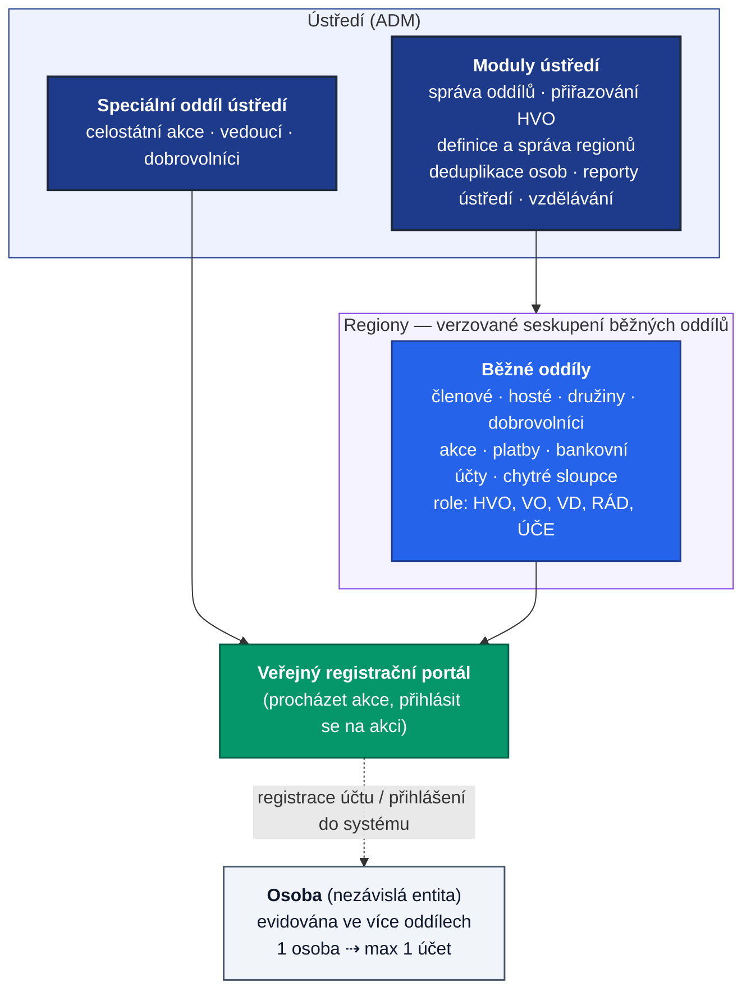

# Registrační systém oddílů DU — specifikace

## Přehled projektu

Systém přihlášek na akce pro oddíly DU. Strukturu tvoří ústředí, regiony a oddíly. Ústředí zastřešuje všechny oddíly, vede společnou členskou databázi a pořádá celostátní akce; jeho centrální agendu (správa oddílů, regiony, deduplikace, reporty, vzdělávání) zajišťují moduly ústředí. Každý oddíl spravuje vlastní akce, přihlášky a účastníky. Člen je nezávislá entita — může patřit do více oddílů současně.

**Rozsah:** Veřejný registrační portál, oddílová správa akcí, správa ústředí, self-management pro registrované.

---

## Přehled architektury

```mermaid
flowchart TD
    subgraph USTREDI["Ústředí (ADM)"]
        direction TB
        MODULY["<b>Moduly ústředí</b><br/>správa oddílů · přiřazování HVO<br/>definice a správa regionů<br/>deduplikace osob · reporty ústředí · vzdělávání"]
        USTODD["<b>Speciální oddíl ústředí</b><br/>celostátní akce · vedoucí · dobrovolníci"]
    end

    subgraph REGIONY["Regiony — verzované seskupení běžných oddílů"]
        ODDILY["<b>Běžné oddíly</b><br/>členové · hosté · družiny · dobrovolníci<br/>akce · platby · bankovní účty · chytré sloupce<br/>role: HVO, VO, VD, RÁD, ÚČE"]
    end

    PORTAL["<b>Veřejný registrační portál</b><br/>(procházet akce, přihlásit se na akci)"]
    OSOBA["<b>Osoba</b> (nezávislá entita)<br/>evidována ve více oddílech<br />1 osoba ⇢ max 1 účet"]

    MODULY --> REGIONY
    USTODD --> PORTAL
    ODDILY --> PORTAL
    PORTAL -. "registrace účtu / přihlášení do systému" .-> OSOBA

    classDef modul fill:#1e3a8a,stroke:#1e293b,stroke-width:2px,color:#ffffff;
    classDef oddil fill:#2563eb,stroke:#1e3a8a,stroke-width:1.5px,color:#ffffff;
    classDef portal fill:#059669,stroke:#065f46,stroke-width:1.5px,color:#ffffff;
    classDef osoba fill:#f1f5f9,stroke:#475569,stroke-width:1.5px,color:#0f172a;

    class MODULY,USTODD modul;
    class ODDILY oddil;
    class PORTAL portal;
    class OSOBA osoba;

    style USTREDI fill:#eef2ff,stroke:#1e3a8a,stroke-width:1px;
    style REGIONY fill:#f5f3ff,stroke:#7c3aed,stroke-width:1px;
```

---

## Požadavky

### Lokalizace a formáty

- **Měna:** výhradně CZK. Všechny částky (ceny, storna, platby, alokace) jsou v korunách; zobrazují se s oddělovačem tisíců a symbolem, např. `1 250 Kč`, desetinná čárka.
- **Časové pásmo:** `Europe/Prague`. Časy se ukládají v UTC a zobrazují v místním čase včetně přechodu na letní/zimní čas; čistě datumové údaje bez času se pásmem nepřepočítávají.
- **Formát data a času:** česky, den v týdnu s velkým počátečním písmenem, den a měsíc bez úvodních nul — `Středa 29.7. 14:19`. **Rok se zobrazuje jen tehdy, liší-li se od aktuálního** (`Středa 29.7.2025 14:19`).
- **Jazyk:** čeština (rozhraní i e-maily).
- **DPH systém neřeší** — oddíly jsou neplátci, ceny akcí jsou konečné. Jediným dopadem DPH je delší retenční lhůta u dokladů, které ji obsahují.
- Ostatní provozní a technické požadavky (přihlašování přes Google/Facebook, ukládání dokumentů, šifrování přístupových údajů, odchozí pošta, plánované úlohy) viz [docs/non-functional.md](docs/non-functional.md).

### Role

- Uživatel může být ve více rolích, např. Administrátor a zároveň jeden z vedoucích oddílu nebo dobrovolník a rodič
- Role Hlavní vedoucí oddílu (HVO), Rádce (RÁD), Vedoucí oddílu (VO), Vedoucí družiny (VD), Administrátor (ADM), Účetní (ÚČE)
- **Rodič není přidělovaná role** — postavení zákonného zástupce se **odvozuje z aktivní vazby rodič ↔ dítě**. Rozsah práv je vždy **per dítě**, ne globální; role se proto nepřiděluje ani neodebírá a nemůže se rozejít se skutečným stavem vazby (zrušení, přechod do režimu jen pro čtení po zletilosti dítěte).
- VO/VD nemají pevná globální práva, oprávnění se přidělují u akce / v rámci družiny.

#### Účetní

- Role, která má přístup jen k přihláškám (úpravy), akcím/cenám/stornům/bankovním účtům (čtení) a k párování/potvrzování plateb a výzvám.

#### Administrátor

- Spravuje oddíly a přiřazuje jim jejich Hlavní vedoucí
- Vytváří účty hlavním vedoucím — systém vygeneruje pozvánku e-mailem

#### Hlavní vedoucí oddílu

- Nastavuje bankovní účty
- Vytváří účty účetním, vedoucím, rádcům — systém vygeneruje pozvánku e-mailem
- Může do systému nahrát pověření od staršovstva
- Může definovat družiny, jejich vedoucí a členy
- Eviduje registrované členy (jméno, příjmení, pohlaví, datum narození)
- Eviduje hosty (min. jméno, příjmení nebo přezdívka)

#### Rádce

- Rádci nevidí citlivá data dětí, nejsou plnoletí

#### Rodič (zákonný zástupce)

- Rodič může zastupovat jedno nebo více nezletilých dětí
- Jedno dítě může být svázáno s více rodiči (oba zákonní zástupci)
- Rodič může své zastupované děti přihlašovat na akce a spravovat jejich přihlášky (přihlášení na akci, storno, platby za dítě) a údaje v systému (adresy, pojišťovny, ...)
- Vazba rodič ↔ dítě vzniká přihlášením dítěte na akci rodičem
- Po dosažení zletilosti se zastoupení rodičem přepne do režimu jen pro čtení. Výjimkou je doplnění kontaktního e-mailu dítěte, pokud chybí — slouží k doručení výzvy k převzetí účtu. Zletilý člen může přístup rodiče kdykoli zcela zrušit.
- Vazbu může zrušit sám rodič (vystoupení), případně HVO na žádost; zrušení se loguje. Zůstane-li nezletilé dítě bez navázaného rodiče, jeho údaje a přihlášky spravuje HVO, dokud se nepřipojí nový zákonný zástupce.
- Oba rodiče mají plná práva, platí poslední zápis.
- Druhého zákonného zástupce přidává stávající rodič nebo HVO pozvánkou (e-mailem). Vazba vznikne přijetím pozvánky druhým rodičem. Nemá-li dítě žádného navázaného rodiče, schvaluje připojení HVO, kde je dítě evidováno.

### Osoba vs. uživatelský účet

- Oddělujeme dvě entity:
  - **Osoba** = datový subjekt / účastník; může existovat bez přihlášení (host, nezletilé dítě spravované rodičem)
  - **Účet (uživatel)** = přihlašovací identita (heslo / OAuth), navázaná právě na jednu osobu
- Jedna osoba má nejvýše jeden účet
- **Údaje osoby**: jméno, příjmení, přezdívka, tituly před a za jménem, pohlaví, datum narození, kontaktní e-mail, adresa trvalého bydliště a zdravotní pojišťovna. Vyplňují se podle potřeby akce (např. tituly a adresa u akcí s certifikátem); cokoli nad tento rámec patří do **chytrých sloupců** oddílu.
- **Pojmy** (důsledně v celé specifikaci):
  - **Registrace** = založení **účtu v systému** (identita osoby); _přihlášení do systému_ = následné ověření (heslo / OAuth).
  - **Přihláška na akci** = účast na konkrétní akci; _přihlásit se na akci_ = vytvořit přihlášku.
  - Slovo „přihlášení“ samotné se používá jen pro login; účast je vždy „přihláška na akci“.

#### Stav osoby (lifecycle)

- **Host** a **registrovaný člen** jsou dva stavy jedné osoby v rámci oddílu, nikoli samostatné entity:
  - _host → registrovaný člen_ — migrace provedená HVO; registrovaný člen má povinné datum narození,
  - _→ neaktivní_ — osoba opustila oddíl nebo je dlouhodobě bez aktivity; záznam zůstává kvůli historii, ale nezapočítává se do počtu členů a nedostává automatické výzvy,
  - _neaktivní → registrovaný člen / host_ — reaktivace, pokud se osoba vrátí,
  - _→ archivovaný_ — GDPR: po uplynutí retenční doby se osobní a citlivá data anonymizují, zachovají se jen agregované/nepřímo identifikující údaje nutné pro reporting.
- **Členství DU není stav osoby** — odvozuje se z existence záznamu o členství pro daný rok (viz **Člen DU**).
- **Neaktivní** a **archivovaný** jsou **kolmé** na členský stav výše — jedno vyjadřuje typ vztahu k oddílu, druhé životnost záznamu.
- U každého je evidována historie — změny, přihlášky, pod jakým oddílem.

##### TODO - dořešit

1. Dvě osy, ale jen jedna sada přechodů
   Text sám říká, že členský stav (host / registrovaný člen) a stav záznamu (neaktivní / archivovaný) jsou kolmé, jenže přechody vypisuje v jednom seznamu. Chybí matice povolených kombinací a přechody zvlášť pro každou osu. Stav aktivní (v modelu record_state = active) se v próze vůbec nejmenuje.

2. Guardy a kdo přechod provádí
   Jen u host → registrovaný člen je řečeno „HVO" a „povinné datum narození". U ostatních přechodů není, kdo je smí provést, ani co je blokuje — např. jestli lze deaktivovat osobu s otevřenou nezaplacenou přihláškou, nebo archivovat osobu s nedořešenou pohledávkou. Chybí i opačný přechod registrovaný člen → host (je vůbec povolený?).

3. Definice „dlouhodobě bez aktivity"
   Není určeno, co je aktivita (přihláška, docházka, login?), jaká je lhůta, jak často job běží a zda se deaktivaci předchází upozorněním. Retenční tabulka zná jen 12 měsíců u hosta a 24 měsíců u účtu — vztah těchto lhůt ke stavu osoby není popsaný.

4. Rozpor scope: stav je per oddíl, anonymizace je globální
   record_state visí na vazbě osoba–oddíl, ale anonymizace maže data osoby jako celku. Není popsáno, co znamená „archivovaný v oddílu A, aktivní v oddílu B" a kdo smí spustit výmaz, když je osoba aktivní jinde.

5. Terminálnost archivace a návrat po ní
   Není řečeno, že archivace je nevratná (data jsou pryč) a že návrat osoby po anonymizaci znamená novou osobu — tedy potenciální duplicitu, kterou pak řeší deduplikace a reportovací sloučení.

6. Dopady stavu na ostatní vazby
   Co se při deaktivaci stane s členstvím v družině, vazbou rodič–dítě, rolemi účtu, přiřazením k akcím a s tím, jestli si osoba může dál založit přihlášku.

7. Vazba osoba ↔ účet
   Deaktivace osoby vs. platnost loginu není nikde popsaná, přestože retenční tabulka mazání nečinného účtu řeší.

8. Obsah historie
   „U každého je evidována historie" je jediná věta, přestože na ní stojí report Retence — chybí, že se zapisuje výchozí a cílový stav obou os, kdo, kdy a proč, a že u systémových změn je původce prázdný.

9. Interakce s členstvím DU
   Není řečeno, zda může být neaktivní nebo archivovaná osoba členem DU pro daný rok a jak se to promítne do počtů.

### Retence a GDPR

- Citlivá data jsou izolovaná per oddíl, každý oddíl proto maže/anonymizuje jen svoji verzi
- Administrátor může spustit výmaz napříč všemi oddíly.

> Lhůty jsou orientační a je nutné je potvrdit s DPO/právníkem (odvíjejí se od dotačních pravidel a interních směrnic).

| Kategorie dat                                               | Lhůta                                                         | Důvod / právní základ                                   |
| ----------------------------------------------------------- | ------------------------------------------------------------- | ------------------------------------------------------- |
| Citlivá data (zdravotní, alergie, léky, stravovací omezení) | smazat do 30 dnů po skončení akce                             | nutná jen pro průběh akce; minimalizace                 |
| Údaje hosta / jednorázového účastníka (nečlen)              | 12 měsíců od poslední aktivity, pak anonymizace               | žádný trvající vztah                                    |
| Členská evidence (registrovaný člen, člen DU)               | po dobu členství + 10 let                                     | doložitelnost pro dotace/kontroly (MŠMT obvykle 10 let) |
| Docházka, dobrovolnické hodiny                              | 10 let                                                        | výkaznictví k dotacím                                   |
| Účetní doklady (platby, párování, vratky)                   | 5 let (běžné), 10 let u dokladů s DPH                         | zákon o účetnictví / zákon o DPH                        |
| Souhlasy se zpracováním (GDPR)                              | po dobu zpracování + 4 roky po odvolání                       | doložení souhlasu, promlčecí doba                       |
| Úrazy / pojistné události nezletilých                       | do zletilosti dítěte + 4 roky                                 | promlčecí lhůty nároků nezletilých                      |
| Auditní logy (merge, bezpečnostní, změny)                   | 3 roky                                                        | bezpečnost, řešení sporů o spojení osob                 |
| Přihlašovací účet (neaktivní)                               | smazat/anonymizovat po 24 měsících nečinnosti (po upozornění) | minimalizace                                            |

- **Anonymizace, ne mazání** u záznamů potřebných pro agregovaný reporting (návaznost na stav _archivovaný_) — zachovají se jen nepřímo identifikující údaje (rok narození, oddíl, region k okamžiku akce).
- **Nejdelší lhůta vyhrává:** je-li osoba zároveň člen i účastník akce s platbou, řídí se výmaz nejdelší relevantní lhůtou pro daný typ dat (citlivá data se ale mažou samostatně dřív).
- **Automatické joby:** systém periodicky označuje záznamy po expiraci a spouští anonymizaci; citlivá data mají vlastní (kratší) job.

#### Auditní log

- Změnové události napříč systémem se zapisují do jednoho společného auditního logu — mutace hlídek, zrušení vazby rodič ↔ dítě, změny přiřazení vedoucích k akci, úpravy akce a přihlášky, posouzení dokumentů.
- Záznam nese **cíl**, **operaci**, **aktéra** a detail s tím, co se změnilo, případně důvodem. **Aktér nemusí mít účet** — přihlášku i hlídku lze spravovat přes odkaz z e-mailu, proto se užívá i e-mail aktéra; u automatických úloh je aktérem systém.
- Log je vedený **per oddíl**, takže ho lze mazat a anonymizovat samostatně a naplňovat lhůtu **3 roky** z tabulky výše.
- Mimo tento log zůstávají tři evidence, které nejsou jen auditem: **záznam o sloučení osob** (umožňuje sloučení vrátit zpět), **historie stavů osoby** (čtou ji reporty) a **doklad o výmazu podle GDPR** (vlastní retence a okruh čtenářů).
- Detail modelu viz [docs/audit-log.md](docs/audit-log.md).

### Deduplikace osob, merge

- Systém ověřuje správnost českých **křestních jmen** podle seznamu (spravovaného administrátorem), nabízí možnost přidání výjimky HVO v rámci oddílu. Příjmení se proti seznamu neověřují.
- Osobě s účtem se zobrazí možný kandidát na propojení (z jiného oddílu). Účet zadá Žádost o sloučení. Systém rozešle emailem žádost - iniciátorovi, HVO druhého oddílu a případně i účtu kandidáta na propojení. Po odsouhlasení všemi stranami (HVO se zobrazí pro porovnání náhled obou osob) může uživatel pokračovat se spojením: Záznamy obou osob se spojí do jedné osoby, konflikt základních polí se řeší volbou A/B, účet se naváže na sjednocenou osobu, pokud obě osoby mají účet, pak druhý účet se zruší (uživatel vybere), citlivá data zůstávají per oddíl, OAuth identity se přenesou pod ponechaný účet.
- Podobně se zpracuje duplicitní dítě, které se zobrazí rodiči s tím, že další strana je rodič dítěte kandidáta a výsledek nespojí účty rodičů do jednoho, jen osobu dítěte. Nemá-li dítě žádného navázaného rodiče, schvaluje připojení HVO, kde je dítě evidováno.
- Systém loguje, kdo kdy které osoby spojil, je možné zrušit merge pro nápravu chybného spojení.
- Konflikt se řeší **pole po poli** — je-li jedna strana prázdná, vyhrává vyplněná hodnota; liší-li se, musí člověk vybrat. Nabízí se jen výběr z obou hodnot, ne ruční přepsání, aby šlo sloučení věrně vrátit zpět.
- **Zrušení sloučení vrátí jen to, co v okamžiku sloučení existovalo.** Záznamy vzniklé až potom (nová přihláška, platba, členství) zůstanou u sjednocené osoby; systém je vypíše před potvrzením, ne až po něm.
- Podrobná pravidla (schvalování, kolize přihlášek a členství, rozsah revertu) viz [docs/person-merge.md](docs/person-merge.md).

### Člen DU

- **Členství DU je samostatný záznam, ne stav osoby**: osoba je členem DU v oddílu _X_ pro rok _R_ právě tehdy, existuje-li záznam o členství s touto osobou, oddílem a rokem.
- Osoba se může stát členem DU od ledna následujícího roku po zaplacení příspěvku do listopadu — **systém platbu příspěvku neřeší**; členství pro daný rok zakládá HVO
- Členství DU trvá: leden–prosinec (kalendářní rok). **Vyprší tím, že pro nový rok záznam nevznikne** — není potřeba žádný přechod stavu ani úklidová úloha k 31. 12.
- Osoba je členem DU vždy pod konkrétním oddílem
- Kombinace osoba + rok je unikátní (jedno členství DU na osobu a rok)
- Kde se členství vyhodnocuje (cena podle typu účastníka, podmínka způsobilosti u číselníku, reporty), rozhoduje se vždy **k roku dané akce**, ne podle aktuálního data

### Region

- Region je vrstva mezi ústředím a běžnými oddíly: `Ústředí → Region → Oddíl`. Ústředí (celostátní) do regionů nepatří.
- Regiony definuje a spravuje ADM a přiřazuje do nich běžné oddíly. Oddíl je v daném okamžiku nejvýše v jednom regionu.
- **Příslušnost oddílu k regionu je verzovaná** (platnost od/do) — díky tomu lze určit, do jakého regionu oddíl patřil k libovolnému datu.
- Regiony se v čase mění:
  - **Vznik** – ADM založí nový region.
  - **Přesun oddílu** – uzavře se stávající příslušnost a založí nová do jiného regionu (bez přepisování historie).
  - **Sloučení (A + B → C)** – zdrojové regiony se označí jako _sloučené_ s odkazem na nástupnický region; všem oddílům z A i B se uzavře příslušnost a otevře nová na C.
  - **Rozdělení** – opačná operace ke sloučení.
- Regiony se **nemažou**, jen označí stavem _sloučený / zrušený_ — kvůli zachování historie.
- **Reporty (snapshot):** region oddílu/akce se zaznamenává jako **snapshot na akci v okamžiku jejího vzniku**. Pozdější přesun oddílu nebo sloučení regionu **nemění už existující reporty**; nové akce počítají podle aktuálního zařazení. _Modul reporty ústředí_ tím získá dimenzi „region".

### Oddíl

- Typy oddílů: IČO ústředí, Pobočný spolek (vlastní IČO), kolektivní člen (bez DU v názvu, vlastní IČO)
- Ústředí je **speciální typ oddílu** určený pro celostátní akce. **Nemá registrované členy**.
- Registrace — chytré sloupce oddílu (viz níže) lze **zařadit do přihlášky na akci** jako volitelná nebo povinná pole; vyplněná hodnota se uloží k osobě
- Oddíl si vede vlastní seznam lokací (GPS souřadnice a volitelně adresa), které jsou viditelné jen v rámci oddílu; lze je přiřadit jako sídlo oddílu i jako místo konání akce

#### Družina

- Členy družiny mohou být členové, hosté, Vedoucí a Rádci z oddílu
- Družina může mít vlastní chytré sloupce nad rámec sloupců oddílu

### Přihlašování do systému

- Každý uživatel si může v systému změnit heslo
- Pro přihlášení do aplikace půjde použít účet Google nebo Facebook (OAuth)
- Jeden účet může mít více propojených OAuth identit (Google, Facebook)

### Konfigurace akce

- Hlavní vedoucí vytváří akce
- **Přiřazení vedoucích k akci:** HVO přiřadí k akci konkrétní lidi (Vedoucí, Rádce, Účetní) a každému nastaví rozsah oprávnění — úprava akce, úprava přihlášek, úprava cen a storen, zápis docházky. Samo přiřazení dává **čtení přihlášek** akce; bez přiřazení k akci vedoucí přístup nemá. Eviduje se, kdo a kdy přiřazení založil.
- Každá akce může být svazána s maximálně jedním bankovním účtem
- Každá akce může mít místo konání vybrané z lokací oddílu (GPS)
- Název, SS, max kapacita, počet náhradníků, ceny pro členy DU i ostatní, začátek a konec akce, začátek a konec přihlašování, termíny pro storno podmínky
- **Splatnost je nastavení akce** — buď **relativní** (počet dní od podání přihlášky, výchozích 14), nebo **absolutní** (pevné datum společné pro celou akci). Volba je výlučná: buď počet dní, nebo datum.
- **Evidence dobrovolníků (volitelná, per akce):** je-li u akce zapnutá, systém nabídne **samostatnou stránku pro přihlášení dobrovolníků** s vlastní cenou a začátkem/koncem přihlašování. Dobrovolníci se **evidují odděleně od účastníků**, **nezapočítávají se do kapacity ani do počtu náhradníků** akce a vedou se ve zvláštním seznamu. Bez zapnutí se dobrovolnická stránka nenabízí.
- Náhradníci — po uvolnění místa jsou informováni vedoucí akce; po výběru náhradníka dostane náhradník časově omezenou nabídku, po vypršení propadá a vedoucí znovu vybírá.
- Akce může mít libovolný počet **výběrových číselníků** (např. ubytování, strava, doprava, stanoviště) — viz **Výběrové číselníky akce**
- **Viditelnost akce** má tři vzájemně výlučné úrovně:
  - **veřejná** — zobrazuje se ve veřejném výpisu portálu, přihlásit se může kdokoli,
  - **vnitřní** — ve výpisu není; vidí ji jen přihlášená osoba s aktivní vazbou na pořádající oddíl (u akce ústředí všichni registrovaní členové),
  - **neveřejná** — dostupná výhradně přes sdílecí odkaz.
    Sdílecí odkaz má **každá** akce bez ohledu na úroveň — je to přístupová cesta, ne publikace ve výpisu.
- Akce může definovat **povinné dokumenty** k přihlášce; seznam a povinnost se přebírají ze **šablony akce** jako výchozí a lze je přepsat v nastavení konkrétní akce — detail a schvalovací flow viz **Přihlašování na akce**

#### Výběrové číselníky akce

Obecný, znovupoužitelný mechanismus: vedoucí u libovolné akce nadefinuje **libovolný počet číselníků**, z nichž si účastník při přihlášení vybírá předdefinované hodnoty (výběr lůžka, turnusu, dopravy, velikosti trika, role …).

- Číselník patří akci, má název, množinu položek a volitelně **veřejný popis** pro účastníka i **neveřejnou poznámku** pro vedoucí.
- Položku může zvolit buď **nejvýše jeden účastník** (např. konkrétní lůžko), nebo **více účastníků** — pak počet omezuje **kapacita položky** (např. ubytovací kapacita budovy). Po naplnění se položka přestane nabízet.
- Číselník může být **jednovýběrový** (typ ubytování) i **vícevýběrový** (výběr jídel).
- **Podmínka způsobilosti** (např. věk, členství DU, role) číselník skryje těm, kdo ji nesplňují.
- **Povinný číselník** má určeno, kdy nejpozději musí účastník volbu provést: při odeslání přihlášky (výchozí), před výzvou k platbě, nebo před konáním akce. U **náhradníka** se povinný výběr (stejně jako dokumenty) vynucuje až po schválení přihlášky.
- Položka může mít **cenový příplatek** (i nulový nebo záporný): **výsledná cena = základní cena podle typu účastníka + součet příplatků zvolených položek.**
- Číselník vyplňuje buď **účastník** sám, nebo ho přiřazuje **vedoucí** až po přihlášení (např. stanoviště na závodě).

Tím se stejným modelem pokryje **ubytování** (jednovýběrový číselník budova/stan, kde „budova“ nese vyšší příplatek) i **strava** (vícevýběrový číselník snídaně/oběd/večeře, každá položka s vlastní cenou). Detail modelu viz [docs/event-fields.md](docs/event-fields.md).

#### Ceny a storna na akcích

- Systém umožňuje definovat více cen platných v různých termínech pro různé typy účastníků - DU, bez DU, dobrovolníky, oddílové vedoucí i děti oddílových vedoucích a sponzorské ceny
- Volitelné příplatky (ubytování, strava apod.) se modelují přes **výběrové číselníky** — každá položka může nést cenový příplatek; výsledná cena přihlášky = základní cena + součet příplatků zvolených položek (viz **Výběrové číselníky akce**)
- Systém umožňuje definovat storno poplatky procentuálně v různých termínech
- Vratky systém neřeší

#### Typy a šablony akcí

- **Typ akce** je klasifikace, která řídí zapnuté subsystémy, obsah přihlašovacího formuláře, filtrování a reporty.
- **Šablona** je přednastavená konfigurace daného typu, ze které HVO/Vedoucí zakládá konkrétní akci, aby se vše nemuselo nastavovat ručně. **K jednomu typu může existovat více šablon** (systémové i vlastní oddílové s odlišnými výchozími hodnotami).
- Akce si při vzniku uloží **odkaz na šablonu i vlastní typ** (snapshot); pozdější úprava šablony už založené akce nemění.

**Co jednotlivé typy zapínají / vyžadují** (výchozí obsah šablony):

| Typ                             | Zapíná / vyžaduje                                                                                                                                                                                                |
| ------------------------------- | ---------------------------------------------------------------------------------------------------------------------------------------------------------------------------------------------------------------- |
| Pravidelné schůzky              | **opakující se** oddílová činnost — každá schůzka je samostatná datovaná akce; zápis docházky, bez přihlášek (neotevírá registraci, neřeší cenu ani platbu)                                                      |
| Jednorázové akce                | **neopakující se** samostatná akce (výlet, brigáda, oddílová akce) — bez přihlášek; docházku lze zapsat, cenu a platbu neřeší                                                                                    |
| Víkendovky / jednoosobové       | obecná přihláška                                                                                                                                                                                                 |
| Kurz                            | vazba na nabízené kurzy ústředí                                                                                                                                                                                  |
| S certifikátem                  | v přihlašovacím formuláři navíc tituly (před/za) a povinná adresa trvalého bydliště                                                                                                                              |
| S doporučením mentora/vedoucího | pole na kontakty; systém osloví mentory/vedoucí o doplnění očekávání a potvrzení přihlášky                                                                                                                       |
| Skupinové                       | v přihlašovacím formuláři více účastníků vč. zákonných zástupců najednou                                                                                                                                         |
| Stezka                          | po přihlášení sestavení **hlídek** pro závod (jméno, kapitán, rozhodčí na stanovištích) — viz **Hlídky na závodních akcích**                                                                                     |
| Workshopové                     | akce má několik časových **bloků**; workshopy a semináře se nabízejí jako **běhy** v blocích a mohou se **opakovat ve více blocích**; každý běh má vlastní kapacitu; účastník si v každém bloku vybere jeden běh |

**Šablona dále definuje:**

- **povinná a nabízená pole** přihlašovacího formuláře — která pole osoby jsou u daného typu povinná (např. tituly a trvalé bydliště u certifikátu) a **zařazení chytrých sloupců oddílu** do přihlášky jako volitelných/povinných (např. kontakty na mentora u doporučení),
- **zapnuté subsystémy** (hlídky Stezky, workshopy, doporučení mentora, více účastníků u skupinových, vazba na kurz ústředí),
- **výchozí povinné dokumenty** (např. potvrzení o lékařské způsobilosti),
- **výchozí hodnoty** cen podle typu účastníka, splatnosti, storno termínů, kapacity a počtu náhradníků, podpory dobrovolníků, referenčního data pro výpočet věku (**věk ke konci roku** vs. k datu akce).

- **Rozsah šablony:** systémové šablony spravuje ADM (ústředí) a jsou dostupné všem oddílům; oddíl si může nad jejich rámec založit vlastní (unit-scoped) šablony.
- Šablony jsou vstupem pro AI návrh nové akce (viz [AI_support.md](AI_support.md)) — předvyplní název, termíny a storno podle typu.

#### Hlídky na závodních akcích (Stezka)

Akce typu **Stezka** umožní z přihlášených osob sestavit **hlídky** (družstva) pro závod. V jedné přihlášce může být přihlášeno **více osob**; vlastník přihlášky skládá hlídky z osob své přihlášky a jejích potvrzených dílčích přihlášek. Hlídka se skládá z těchto osob a jedna z nich je jejím **kapitánem**.

- **Vlastnictví:** hlídku vlastní přihláška, která ji založila; upravovat a smazat ji smí jen vlastník. Název hlídky je v rámci akce unikátní.
- **Členství:** každá osoba je nejvýše v jedné hlídce. V kategorii Stezka/Pěšinka je jeden kapitán.
- **Výpočet věku:** volba akce určuje, zda se věk počítá **ke konci roku** (výchozí), nebo **k datu konání akce**. Chybí-li datum narození, člena nelze plně ověřit a kontrola složení to hlásí.
- **Kategorie a pravidla složení:**

| Kategorie         | Počet členů | Způsobilost                  | Věková pravidla                                    |
| ----------------- | ----------- | ---------------------------- | -------------------------------------------------- |
| **Stezka**        | přesně 3    | každý závodník               | nejstarší ≤ 16; součet věků ≤ 42                   |
| **Pěšinka**       | přesně 3    | každý závodník               | nejstarší ≤ 12                                     |
| **Šerpa s dětmi** | 3–4         | závodník / šerpa / dítě < 16 | právě 1 doprovod ≥ 16; 1–3 děti (věk < 4 nebo > 8) |
| **Pocestní**      | 2–3         | každý závodník               | nejmladší ≥ 9                                      |

- **Kontrola konzistence:** poruší-li hlídka pravidla složení po změně údajů některého člena (věk, příznak závodníka, kategorie), **hlídka se rozpustí** — všichni členové se odpojí, hlídka zanikne a vlastník je informován s důvodem.
- **Připomínka:** N dní před akcí systém upozorní vedoucí na závodníky bez hlídky.
- Každá změna hlídky se **loguje** (založení, vstup, odchod, úprava, smazání včetně aktéra).
- Detail modelu a výpočtů viz [docs/race-patrols.md](docs/race-patrols.md).

##### Stanoviště a rozhodčí

Na závodních akcích se **dospělí pomocníci** (rozhodčí) přiřazují ke **stanovištím**. Přiřazení ke stanovišti je vzájemně výlučné s členstvím v hlídce — účastník je buď závodník v hlídce, nebo dospělý na stanovišti, nikdy obojí.

- Stanoviště patří konkrétní akci; přiřazení platí jen v jejím rámci.
- **Přiřazuje vedoucí** až po přihlášení na akci — vybírá jen z osob vlastní přihlášky a jejích potvrzených dílčích přihlášek.
- **Způsobilost rozhodčího:** dospělá osoba (≥ 16), která není závodník ani šerpa a není v žádné hlídce.
- Běžné stanoviště obsadí **nejvýše jeden rozhodčí**; pseudo-stanoviště „Jakékoliv“ je bez limitu. Rozhodčí je nejvýše na jednom stanovišti.

#### Přihlašování na akce

- Účastník, který nemá účet, získá přihláškou odkaz, kterým si může účet založit (po založení se účet propojí s existující osobou) a spravovat své přihlášky (storno, měnit nebo přidávat další účastníky)
- **Nezletilý účastník (< 18 let):** přihlašuje-li se nezletilý sám (nemá navázaného rodiče, který přihlášku provádí), musí v přihlášce zadat **e-mail zákonného zástupce**. Systém pošle zástupci žádost o schválení; přihláška **čeká na schválení zástupcem** a nezapočítává se do kapacity, dokud zástupce neschválí (odkazem v e-mailu). Po schválení přihláška pokračuje standardním tokem (výzva k platbě apod.); neschválí-li zástupce do vypršení, přihláška expiruje. Schválením vzniká vazba rodič ↔ dítě. Chybí-li datum narození, přihlášku nelze vyhodnotit a systém e-mail zástupce vyžádá.
- **Povinné dokumenty:** akce může vyžadovat nahrání dokumentů (např. **potvrzení o lékařské způsobilosti**, souhlas zákonného zástupce, kopie kartičky pojišťovny). Účastník je může nahrávat **postupně nebo najednou**; dokud nejsou nahrané všechny povinné dokumenty, přihláška **čeká na dokumenty**. **Náhradník** dokumenty nahrává až **po schválení přihlášky** (po přijetí nabídky z náhradnického místa) — do té doby je nahrávání uzamčené.
- **Schvalování dokumentů:** vedoucí u každého nahraného dokumentu vidí stav a dokument buď **schválí**, nebo **zamítne s komentářem** (např. nečitelný, prošlý, nesprávný dokument). Zamítnutí se zaznamená včetně toho, kdo a kdy posoudil, a **e-mailem vyzve účastníka k opětovnému nahrání**. Přihláška zůstává (příp. se vrátí) do stavu čekání na dokumenty, dokud nejsou všechny povinné dokumenty schválené. Nahrání lze vyžádat i připomínkou.
- Systém posílá potvrzení přihlášky s výzvou k zaplacení (QR kód + platební údaje, pokud je stanovena cena akce)
- **Splatnost:** u relativní splatnosti je přihláška splatná za nastavený počet dní od podání, nejpozději ale k začátku akce; u absolutní platí datum akce pro všechny stejně. Později podáná přihláška je splatná ihned. Změna nastavení akce nemění splatnost už podáných přihlášek (u relativní varianty).
- Systém připomíná nezaplacené platby — četnost lze upravit v Nastavení oddílu
- Systém kategorizuje přihlášky: Účastník, Dobrovolník, Náhradník
- Stavy přihlášky (pořadí podle životního cyklu): nová → čeká na zákonného zástupce → čeká na dokumenty → čeká na platbu → částečně zaplaceno → zaplaceno / přeplatek; kdykoli stornována nebo expirovaná. Cesta není jednosměrná — zamítnutý dokument nebo vratka vrátí přihlášku zpět. Přesná pravidla přechodů viz [docs/registration-lifecycle.md](docs/registration-lifecycle.md).

### Docházka

- Docházka se vede **přímo na akci** — samostatná docházková událost neexistuje. Každá osoba má na akci nejvýše jeden docházkový záznam.
- Vedoucí můžou vytvářet akce i zpětně — např. pravidelné schůzky — a rovnou vybrat libovolné účastníky ze seznamu osob z oddílu
- **Klubová schůzka je akce bez přihlášek** — nemá otevřenou registraci, takže se u ní nespouští potvrzení přihlášky, výzvy k platbě ani připomínky. Účast se eviduje jen docházkovým záznamem.
- U akce s přihláškami jsou obě evidence odlišené: přihláška = kdo se přihlásil, docházka = kdo se skutečně zúčastnil a kolik odpracoval.
- Záznam rozlišuje **nepřítomnost** (zapsaný, nedorazil) od **nezapsaného** (žádný záznam).
- Při evidenci dobrovolníků je možné zadat počet hodin — vždy na docházkovém záznamu téže akce
- Systém rozděluje Krátkodobé dobrovolníky (pod 50 hod.) a dlouhodobé (nad 50 hod.)
- Zápis docházky je **samostatné oprávnění na akci** — může ho mít i Rádce, který nemá přístup k přihláškám a platbám.

#### Reporty

- Seznam akcí/schůzek, docházka členů/nečlenů/vedoucích/rádců/dobrovolníků
- Počty členů v čase — vývoj registrovaných členů / členů DU / hostů po měsících nebo letech (růst/úbytek oddílu).
- Účast na akcích — kolik lidí chodí na akce v jednotlivých obdobích, naplněnost kapacit, podíl náhradníků.
- Docházka — průměrná návštěvnost pravidelných schůzek v průběhu roku (sezónní výkyvy).
- Dobrovolnické hodiny — vývoj odpracovaných hodin, poměr krátkodobých/dlouhodobých dobrovolníků.
- Retence / odchody — kolik osob přechází do neaktivní, míra reaktivací.
- Platby — vývoj inkasa, podíl včas/pozdě zaplacených, storna.
- Vzdělávání — kolik vedoucích má platné kurzy v čase, blížící se expirace.
- Každý report respektuje rozsah oprávnění toho, kdo ho otevřel, a jde exportovat do tabulky. Žádný report nevrací citlivé údaje. Přesné definice metrik viz [docs/reports.md](docs/reports.md).

### Volitelné moduly

- Povoluje Hlavní vedoucí pro svůj oddíl v Nastavení oddílu

#### Pomocná evidence

- Vedoucí může pro svůj oddíl nebo družinu definovat nové sloupce (do tabulky hostů/členů)
- Sloupcům lze nastavit viditelnost — zda je vlastník účtu může vidět nebo upravovat
- Sloupcům lze nastavit oprávnění — zda Rádci můžou vidět nebo upravovat

#### Modul párování plateb

- Aktivuje se doplněním tokenu k bankovnímu účtu
- Transakce se **stahují pravidelně z banky, samostatně za každý bankovní účet**; opakovaný import stejné platby nic nezdvojí a hned po stažení běží automatické párování. Do párování vstupují jen příchozí platby. Detaily integrace viz [docs/fio-sync.md](docs/fio-sync.md).
- Párování je M:N — jedna bankovní transakce může pokrýt více přihlášek (např. rodič platí za více dětí jednou platbou) a jedna přihláška může být uhrazena více platbami (postupné / částečné platby)
- Systém automaticky navrhuje párování podle SS=akce a VS=přihláška, případně podle jména odesílatele; když částka neodpovídá jediné přihlášce, umožní účetní ruční rozdělení částky mezi více přihlášek. U každé části se eviduje, jak vznikla — automaticky a podle jaké shody, nebo ručně.
- Stav úhrady přihlášky (částečně zaplaceno / zaplaceno / přeplatek) se počítá ze součtu přiřazených částek vůči ceně. Částky se porovnávají přesně — rozdíl o korunu je nedoplatek nebo přeplatek, systém nic nezaokrouhluje.
- **Přeplatek se nevrací automaticky** — systém ho jen ukáže a nabídne účetní tři možnosti: vrátit odesílateli, převést na jinou přihlášku téže osoby, nebo ponechat jako dar. Samotnou výplatu vratky provádí účetní ve své bance, systém ji jen eviduje.
- Systém automaticky posílá potvrzení za každou napárovanou platbu (i částečnou); odeslání se eviduje, aby se neposílalo dvakrát
- Přesná pravidla párování viz [docs/payment-matching.md](docs/payment-matching.md).

#### Modul Potvrzení o platbě

- Vyžaduje aktivní Platební modul
- Účetní nahraje šablonu potvrzení s razítkem/podpisem v nastavení modulu
- Systém automaticky připraví potvrzení o platbě ke stažení

#### Modul reporty ústředí

- Počítá unikátní počet dětí v rámci všech akcí všech oddílů (počítá se jednou, i když bylo na více akcích)
- Lze filtrovat a agregovat podle **regionu** (region akce = snapshot uložený při vzniku akce)
- Zobrazí možné kandidáty (jméno, příjmení, datum narození). Systém nabídne "Reportovací sloučení" osob pro účely unikátních počtů, záznamy zůstanou oddělené
- nepočítá hosty ostatních oddílů

#### Modul vzdělávání

- Administrátor definuje jaké kurzy ústředí lze použít pro vzdělání vedoucích - eviduje se i doba platnosti
- Vzdělávací akce ústředí může být provázána s kurzem; po absolvování vznikne každému účastníkovi vazba s odkazem na zdrojovou akci
- Hlavní vedoucí, Vedoucí a Rádci můžou sobě přiřadit kurzy z nabídky
- Systém automaticky přiřadí kurz ústředí všem účastníkům po jeho absolvování
- Všichni Vedoucí a Rádci mají možnost vložit do systému svoje certifikáty, potvrzení od doktora a jiné absolvované kurzy
- Modul vzdělání zobrazuje Administrátorovi, jaké kurzy absolvovali jednotliví vedoucí v oddílech

---

## Implementační dokumentace

Tento dokument popisuje **co** systém dělá a proč — je určený zadavatelům, hlavním vedoucím, účetním a právníkům. Technické **jak** je vyčleněné do samostatných dokumentů:

| Dokument                                                         | Obsah                                                      |
| ---------------------------------------------------------------- | ---------------------------------------------------------- | --- | ------------------------------------------------ | ------------------------------------------------------------ | --- | ------------------------------ | ---------------------- |
| [docs/data-model.md](docs/data-model.md)                         | ER diagram — entity, pole, číselníkové hodnoty, vazby      |
| [docs/event-fields.md](docs/event-fields.md)                     | model výběrových číselníků akce                            |
| [docs/registration-lifecycle.md](docs/registration-lifecycle.md) | stavový automat přihlášky — brány, události, lhůty         |
| [docs/race-patrols.md](docs/race-patrols.md)                     | hlídky Stezky — výpočet věku, kontrola složení, stanoviště |
| [docs/payment-matching.md](docs/payment-matching.md)             | pravidla párování plateb a výpočet stavu úhrady            |
| [docs/reports.md](docs/reports.md)                               | definice metrik reportů, parametry a rozsah dat            |
| [docs/person-merge.md](docs/person-merge.md)                     | sloučení osob — schvalování, konflikty polí, revert        |
| [docs/fio-sync.md](docs/fio-sync.md)                             | stahování bankovních transakcí z Fio                       |
| [docs/audit-log.md](docs/audit-log.md)                           | struktura auditního logu                                   |     | [docs/non-functional.md](docs/non-functional.md) | OAuth, úložiště souborů, šifrování, e-maily, plánované úlohy |     | [AI_support.md](AI_support.md) | AI funkce nad systémem |
| [TODO.md](TODO.md)                                               | hodnocení specifikace a co ještě dopsat                    |
