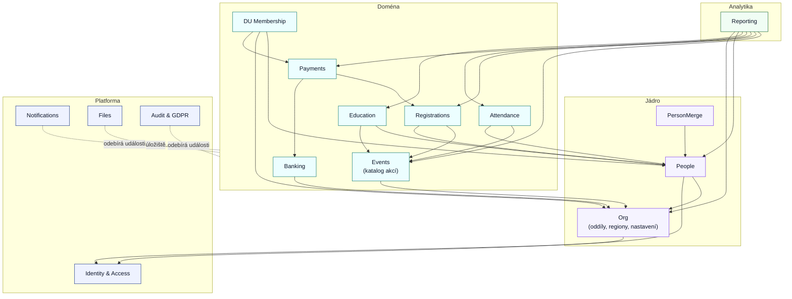

# Hranice modulů, vlastnictví dat a doménové události

Implementační detail ke specifikaci [README.md](../README.md).

> Rozděluje systém na moduly, přiřazuje každé entitě z [data-model.md](data-model.md) právě jednoho vlastníka a definuje doménové události, kterými spolu moduly mluví. Není to API kontrakt (endpointy/DTO) — ten se z těchto hranic teprve odvodí, viz **Co z toho plyne pro API**.

Nasazení je dané: **modulární monolit** — jedna aplikace, jedna databáze, moduly sdílejí proces a nenasazují se samostatně ([non-functional.md](non-functional.md) → **Architektura**). Hranice níže jsou proto hranicemi kódu a vlastnictví dat, ne síťovými hranicemi; události se doručují in-process nad outbox tabulkou.

## Vynucení modulárních hranic

Architektonické hranice modulů musí být automaticky ověřovány v CI. Nesmí vznikat nepovolené závislosti mezi moduly. Kontrola musí být realizována statickou analýzou (Deptrac, PHPStan Architecture Rules nebo ekvivalentní nástroj). Code review samo o sobě není považováno za dostatečný mechanismus.

Každé pravidlo z tohoto dokumentu, které jde vyjádřit jako závislost mezi jmennými prostory, tam patří.

## Pozor na dvojí význam slova „modul"

| Význam                    | Kde žije                                                             | Poznámka                                                                                |
| ------------------------- | -------------------------------------------------------------------- | --------------------------------------------------------------------------------------- |
| **Architektonický modul** | tento dokument                                                       | hranice kódu a vlastnictví dat; existuje vždy, nezávisle na oddílu                      |
| **Zapínatelný modul**     | `UNIT_MODULE.code` (`payment_matching`, `training`, `custom_fields`) | funkční přepínač per oddíl; zapíná chování uvnitř architektonického modulu, ne jeho kód |

Dále v textu „modul" = architektonický modul. Zapínatelné moduly jsou jeho konfigurací.

## Principy

1. **Jeden vlastník na entitu.** Zapisovat do tabulky smí jen její modul. Ostatní čtou přes jeho čtecí rozhraní, nikdy přímým UPDATE.
2. **Závislosti jdou jen dolů.** Vrstvy: platforma → jádro → doména → analytika. Cyklus se rozbíjí událostí, ne obousměrným voláním.
3. **Synchronně se ptáme, asynchronně oznamujeme.** Guard (potřebuji rozhodnout teď) = dotaz do nižší vrstvy. Následek (stalo se, ostatní ať reagují) = událost.
4. **Doména nezná e-maily.** Žádný modul nevolá odesílání pošty; notifikace se odvozují z událostí ([notifications.md](notifications.md)).
5. **Audit je posluchač, ne volaný.** Do [audit-log.md](audit-log.md) zapisuje modul Audit z odebíraných událostí, ne autor změny.
6. **Události jsou fakta v minulém čase** a nesou vždy `event_id`, `occurred_at`, `actor_account_id` (NULL = systém/job), `unit_id` (je-li v oddílovém scope) a identifikátory dotčených entit — ne celé objekty.

## Mapa modulů a závislostí

---

## Katalog modulů

### 1 · Identity & Access (platforma)

| Položka              | Obsah                                                                                                                                                                          |
| -------------------- | ------------------------------------------------------------------------------------------------------------------------------------------------------------------------------ |
| **Vlastní entity**   | `ACCOUNT`, `OAUTH_IDENTITY`, `USER_ROLE`, pozvánky rolí, tokeny bez účtu (rozcestník přihlášky, souhlas zástupce, náhradník)                                                   |
| **Vlastní pravidla** | přihlášení heslem/OAuth, unikátnost `login_email`, vyhodnocení oprávnění podle [authorization.md](authorization.md), platnost a jednorázovost tokenů, maskování citlivých polí |
| **Čte odjinud**      | `PERSON` (zobrazení jména u účtu), aktivní vazby rodič ↔ dítě z People pro odvozená práva, scope oddílu z Org                                                                  |
| **Nevlastní**        | osobu — účet je jen identita navázaná 1:1 na `PERSON`                                                                                                                          |
| **Rozhraní**         | `canDo(actor, action, scope)`, `resolveToken(token)`, `issueToken(purpose, subject)` — jediné místo, kde se rozhoduje o právech                                                |

Odvozená práva (rodič, vlastník přihlášky, osoba sama) se **počítají**, neukládají — modul si je táhne z People a Registrations dotazem.

### 2 · Org (jádro)

| Položka              | Obsah                                                                                                                                                      |
| -------------------- | ---------------------------------------------------------------------------------------------------------------------------------------------------------- |
| **Vlastní entity**   | `UNIT`, `REGION`, `UNIT_REGION`, `UNIT_MODULE`, `UNIT_SETTING`, `UNIT_MAIL_SETTING`, `MANDATE`, `LOCATION`, `NAME_WHITELIST`, `NAME_EXCEPTION`             |
| **Vlastní pravidla** | [region-lifecycle.md](region-lifecycle.md) — stavy regionu, slučování, verzovaná příslušnost; lhůty a přepínače oddílu; systémové šablony a whitelist jmen |
| **Čte odjinud**      | nic z domény — Org je nejníže v jádře                                                                                                                      |
| **Rozhraní**         | `settings(unitId, key)`, `regionOf(unitId, date)` (pro snapshot na akci), `isModuleActive(unitId, code)`                                                   |

Lhůty z [registration-lifecycle.md](registration-lifecycle.md) (souhlas zástupce, nabídka náhradníkovi, vypršení nezaplacené) vlastní **Org**, vyhodnocuje je **Registrations**.

### 3 · People (jádro)

| Položka              | Obsah                                                                                                                                                                                                           |
| -------------------- | --------------------------------------------------------------------------------------------------------------------------------------------------------------------------------------------------------------- |
| **Vlastní entity**   | `PERSON`, `PERSON_UNIT`, `PERSON_UNIT_HISTORY`, `PARENT_CHILD`, `PARENT_INVITATION`, `PERSON_SENSITIVE_DATA`, `CONSENT`, `UNIT_PATROL`, `UNIT_PATROL_MEMBER`, `CUSTOM_FIELD`, `CUSTOM_FIELD_VALUE`              |
| **Vlastní pravidla** | [person-lifecycle.md](person-lifecycle.md) (dvě osy, matice, archivace), [parent-child-lifecycle.md](parent-child-lifecycle.md), podmíněná povinnost polí z [validation.md](validation.md), scope citlivých dat |
| **Čte odjinud**      | `UNIT` z Org, `ACCOUNT` z IAM (existence účtu osoby)                                                                                                                                                            |
| **Rozhraní**         | `person(id)`, `isMinorAt(personId, date)`, `activeGuardians(personId)`, `membership(personId, unitId)`, `sensitive(personId, eventId, actor)`                                                                   |

**Věk se počítá zde**, ne v Registrations ani Race patrols — ty si o něj řeknou k rozhodnému datu ([race-patrols.md](race-patrols.md)).

### 4 · PersonMerge (jádro)

| Položka                 | Obsah                                                                                                                       |
| ----------------------- | --------------------------------------------------------------------------------------------------------------------------- |
| **Vlastní entity**      | `MERGE_REQUEST`, `MERGE_APPROVAL`, `MERGE_LOG`, `REPORT_MERGE`                                                              |
| **Vlastní pravidla**    | [person-merge.md](person-merge.md) — detekce kandidátů, schvalování oběma oddíly, konflikty polí, revert                    |
| **Zapisuje cizí data?** | Ne. Přenos vazeb provádí **každý vlastnící modul sám** na základě události `person.merged` — Merge jen orchestruje a loguje |
| **Rozhraní**            | `resolvePerson(id)` → platné `person_id` (tombstone `merged_into_person_id` se překládá centrálně)                          |

Tohle je nejcitlivější hranice: bez pravidla „přenos vazeb dělá vlastník" by Merge sahal do poloviny databáze.

### 5 · Events — katalog akcí (doména)

| Položka              | Obsah                                                                                                                                                                                                              |
| -------------------- | ------------------------------------------------------------------------------------------------------------------------------------------------------------------------------------------------------------------ |
| **Vlastní entity**   | `EVENT`, `ACTION_TEMPLATE`, `EVENT_PRICE`, `CANCELLATION_RULE`, `EVENT_ASSIGNMENT`, `EVENT_FIELD`, `EVENT_FIELD_OPTION`, `EVENT_DOCUMENT`, `EVENT_CUSTOM_FIELD`, `WORKSHOP`, `WORKSHOP_BLOCK`, `WORKSHOP_OFFERING` |
| **Vlastní pravidla** | [event-fields.md](event-fields.md) (režimy, kapacita volby, fáze, ceny), storno matice, splatnost relativní/absolutní, snapshot regionu při založení akce                                                          |
| **Čte odjinud**      | `UNIT`, `LOCATION`, `REGION` z Org; `BANK_ACCOUNT` z Banking (jen reference)                                                                                                                                       |
| **Nevlastní**        | kapacitu **obsazenou** — tu počítá Registrations; Events drží jen limit                                                                                                                                            |
| **Rozhraní**         | `event(id)`, `priceFor(eventId, participantType, options)`, `cancellationFee(eventId, date)`, `requiredDocuments(eventId)`, `dueDate(eventId, submittedAt)`                                                        |

Cena je **funkce**, ne uložené číslo — Registrations si ji vyžádá a uloží si výslednou částku, aby pozdější změna ceníku nepřepsala historii.

### 6 · Registrations (doména)

| Položka              | Obsah                                                                                                                                                                                 |
| -------------------- | ------------------------------------------------------------------------------------------------------------------------------------------------------------------------------------- |
| **Vlastní entity**   | `REGISTRATION` (vč. dílčích), `REGISTRATION_FIELD_VALUE`, `REGISTRATION_DOCUMENT`, `SUBSTITUTE_OFFER`, `RECOMMENDATION`, `WORKSHOP_REGISTRATION`, `RACE_PATROL`, `RACE_PATROL_MEMBER` |
| **Vlastní pravidla** | [registration-lifecycle.md](registration-lifecycle.md) — funkce `evaluate`, brány, guardy, kapacita a fronta náhradníků; skládání hlídek dle [race-patrols.md](race-patrols.md)       |
| **Čte odjinom**      | Events (cena, dokumenty, kapacita, splatnost), People (věk, zástupci, evidence v oddíle), Org (lhůty), Payments (součet alokací)                                                      |
| **Nevlastní**        | platby ani stav úhrady jako uložené pole — `evaluate` si součet alokací **vyžádá** a přepočte stav                                                                                    |
| **Rozhraní**         | `registration(id)`, `openRegistrations(personId)`, `occupancy(eventId)` (v **účastnících**, ne přihláškách), `amountDue(registrationId)`                                              |

Klíčová hrana: **Payments neposouvá stav přihlášky.** Publikuje `payment.allocated`, Registrations na ni zavolá vlastní `evaluate`.

### 7 · Payments (doména)

| Položka              | Obsah                                                                                                                             |
| -------------------- | --------------------------------------------------------------------------------------------------------------------------------- |
| **Vlastní entity**   | `PAYMENT_ALLOCATION` (vč. záporných = vratky)                                                                                     |
| **Vlastní pravidla** | [payment-matching.md](payment-matching.md) — pořadí pravidel párování, více kandidátů, přeplatek a vratka, potvrzení, ruční režim |
| **Čte odjinud**      | Banking (transakce), Registrations (VS, dlužná částka, vlastník), Org (zapnutý `payment_matching`)                                |
| **Rozhraní**         | `paidAmount(registrationId)`, `allocationsOf(transactionId)`                                                                      |

### 8 · Banking (doména)

| Položka              | Obsah                                                                                                   |
| -------------------- | ------------------------------------------------------------------------------------------------------- |
| **Vlastní entity**   | `BANK_ACCOUNT`, `BANK_TRANSACTION`                                                                      |
| **Vlastní pravidla** | [fio-sync.md](fio-sync.md) — token, kurzor, idempotence, rate limit, chybové stavy; ruční import výpisu |
| **Čte odjinud**      | `UNIT` z Org                                                                                            |
| **Nevlastní**        | přiřazení k přihláškám — to je Payments                                                                 |

Oddělení Banking/Payments je záměrné: `provider = 'manual'` mění jen Banking, zatímco pravidla párování zůstávají stejná.

### 9 · DU Membership (doména, agenda ústředí)

| Položka              | Obsah                                                                                      |
| -------------------- | ------------------------------------------------------------------------------------------ |
| **Vlastní entity**   | `DU_MEMBERSHIP`, `DU_FEE_RATE`, `DU_FEE_BATCH`, `DU_FEE_BATCH_ITEM`                        |
| **Vlastní pravidla** | evidenční oddíl, 1 členství na osobu a rok, uzamčení dávky, vznik členství až po zaplacení |
| **Čte odjinud**      | People (osoby, členství v oddíle), Payments (alokace na dávku), Org (sazby ústředí)        |

### 10 · Attendance (doména)

Vlastní `ATTENDANCE_RECORD` (docházka i dobrovolnické hodiny). Čte Events a People. Nezasahuje do přihlášek — účast je nezávislá na tom, zda přihláška existovala.

### 11 · Education (doména)

Vlastní `COURSE`, `PERSON_COURSE`. Čte People a Events (akce udělující kurz). Zapínatelné přes `UNIT_MODULE.code = 'training'`.

### 12 · Notifications (platforma)

Vlastní frontu odchozích e-mailů a evidenci odeslání ([non-functional.md](non-functional.md), [notifications.md](notifications.md)). **Nemá doménová pravidla** — jen mapu `událost → šablona → příjemce → načasování`. Odesílatele (oddílové SMTP vs. systém) si bere z `UNIT_MAIL_SETTING` v Org. Idempotenci drží na `event_id`, aby opakovaná fronta neposlala potvrzení o platbě dvakrát.

### 13 · Files (platforma)

Vlastní uložení a metadata souborů (dokumenty přihlášek, pověření staršovstva). Doména drží jen odkaz, nikdy binární obsah, a ptá se na podepsané URL. Retenci provádí na pokyn Audit & GDPR.

### 14 · Audit & GDPR (platforma)

Vlastní `AUDIT_LOG`, `GDPR_AUDIT`. Zapisuje **výhradně z odebíraných událostí** plus explicitních zápisů z ruční evidence plateb a dávek DU ([audit-log.md](audit-log.md)). Řídí retenční joby; anonymizaci provádí vlastník dat na příkaz, ne Audit sám.

### 15 · Reporting (analytika)

Vlastní pouze definice reportů a případné materializované pohledy ([reports.md](reports.md)). **Čte napříč, nezapisuje nikam.** Používá `REPORT_MERGE` z PersonMerge pro unikátní děti. Jediný modul, kterému je dovoleno spojovat data více modulů — proto je izolovaný v samostatné vrstvě a nikdo na něm nezávisí.

---

## Kdo vlastní co — rychlá tabulka

| Entita                                                                                                                                                                                                             | Vlastník      |
| ------------------------------------------------------------------------------------------------------------------------------------------------------------------------------------------------------------------ | ------------- |
| `ACCOUNT`, `OAUTH_IDENTITY`, `USER_ROLE`                                                                                                                                                                           | Identity      |
| `UNIT`, `REGION`, `UNIT_REGION`, `UNIT_MODULE`, `UNIT_SETTING`, `UNIT_MAIL_SETTING`, `MANDATE`, `LOCATION`, `NAME_WHITELIST`, `NAME_EXCEPTION`                                                                     | Org           |
| `PERSON`, `PERSON_UNIT`, `PERSON_UNIT_HISTORY`, `PARENT_CHILD`, `PARENT_INVITATION`, `PERSON_SENSITIVE_DATA`, `CONSENT`, `UNIT_PATROL`, `UNIT_PATROL_MEMBER`, `CUSTOM_FIELD`, `CUSTOM_FIELD_VALUE`                 | People        |
| `MERGE_REQUEST`, `MERGE_APPROVAL`, `MERGE_LOG`, `REPORT_MERGE`                                                                                                                                                     | PersonMerge   |
| `EVENT`, `ACTION_TEMPLATE`, `EVENT_PRICE`, `CANCELLATION_RULE`, `EVENT_ASSIGNMENT`, `EVENT_FIELD`, `EVENT_FIELD_OPTION`, `EVENT_DOCUMENT`, `EVENT_CUSTOM_FIELD`, `WORKSHOP`, `WORKSHOP_BLOCK`, `WORKSHOP_OFFERING` | Events        |
| `REGISTRATION`, `REGISTRATION_FIELD_VALUE`, `REGISTRATION_DOCUMENT`, `SUBSTITUTE_OFFER`, `RECOMMENDATION`, `WORKSHOP_REGISTRATION`, `RACE_PATROL`, `RACE_PATROL_MEMBER`                                            | Registrations |
| `PAYMENT_ALLOCATION`                                                                                                                                                                                               | Payments      |
| `BANK_ACCOUNT`, `BANK_TRANSACTION`                                                                                                                                                                                 | Banking       |
| `DU_MEMBERSHIP`, `DU_FEE_RATE`, `DU_FEE_BATCH`, `DU_FEE_BATCH_ITEM`                                                                                                                                                | DU Membership |
| `ATTENDANCE_RECORD`                                                                                                                                                                                                | Attendance    |
| `COURSE`, `PERSON_COURSE`                                                                                                                                                                                          | Education     |
| `AUDIT_LOG`, `GDPR_AUDIT`                                                                                                                                                                                          | Audit & GDPR  |

---

## Doménové události

Jmenná konvence `modul.agregát.událost` v minulém čase. Události, které už specifikace pojmenovala (`registration.created`, `guardian.approved`, `payment.allocated`, …), zůstávají beze změny — tabulka je jen zařazuje k vlastníkovi.

### Registrations

| Událost                                            | Payload (nad rámec hlavičky)                     | Odebírá                                             |
| -------------------------------------------------- | ------------------------------------------------ | --------------------------------------------------- |
| `registration.created`                             | `registration_id`, `event_id`, `person_id`, `vs` | Notifications, Audit, Reporting                     |
| `registration.state_changed`                       | `from`, `to`, `trigger`                          | Notifications, Audit, Reporting                     |
| `registration.canceled`                            | `fee_amount`, `refund_due`                       | Payments (vratka), Events (kapacita), Notifications |
| `registration.expired`                             | `reason`                                         | Notifications, Audit                                |
| `registration.capacity_released`                   | `event_id`, `freed_slots`                        | Registrations (výběr náhradníka), Reporting         |
| `guardian.requested` / `.approved` / `.expired`    | `guardian_email`, `deadline`                     | Notifications, People (vznik vazby), Audit          |
| `document.uploaded` / `.approved` / `.rejected`    | `document_id`, `comment`                         | Notifications, Files, Audit                         |
| `substitute.offer.sent` / `.accepted` / `.expired` | `offer_id`, `valid_until`                        | Notifications, Audit                                |
| `recommendation.requested` / `.confirmed`          | `mentor_contact`                                 | Notifications, Audit                                |
| `race_patrol.composition_changed`                  | `patrol_id`, `is_consistent`                     | Notifications (připomínka), Audit                   |

### Events

| Událost                            | Payload                                  | Odebírá                                                  |
| ---------------------------------- | ---------------------------------------- | -------------------------------------------------------- |
| `event.published`                  | `event_id`, `unit_id`, `region_snapshot` | Reporting, Audit                                         |
| `event.price_changed`              | `event_id`, `scope`                      | Registrations (`price.changed` → `evaluate`)             |
| `event.capacity_changed`           | `old`, `new`                             | Registrations (uvolnění/uzavření míst)                   |
| `event.registration_window_closed` | `event_id`                               | Registrations, Notifications                             |
| `event.canceled`                   | `event_id`, `reason`                     | Registrations (hromadné storno), Notifications           |
| `event.finished`                   | `event_id`                               | Registrations (zastavení přepočtů), Education, Reporting |

### Payments & Banking

| Událost                              | Payload                                        | Odebírá                                              |
| ------------------------------------ | ---------------------------------------------- | ---------------------------------------------------- |
| `bank.transaction.imported`          | `transaction_id`, `account_id`, `amount`, `vs` | Payments (párování), Audit                           |
| `bank.sync.failed`                   | `account_id`, `attempts`, `error`              | Notifications (`EMAIL_FIO_SYNC_FAILURE`)             |
| `bank.statement.imported_manually`   | `account_id`, `batch_id`                       | Payments, Audit                                      |
| `payment.allocated` / `.deallocated` | `registration_id`, `amount`, `match_method`    | Registrations (`evaluate`), Notifications, Reporting |
| `payment.overpaid`                   | `registration_id`, `surplus`                   | Notifications, Payments (návrh vratky)               |
| `payment.refund_issued`              | `registration_id`, `amount`                    | Registrations, Notifications, Audit                  |
| `payment.match.ambiguous`            | `transaction_id`, `candidates[]`               | UI fronta ÚČE, Audit                                 |

### People & Identity

| Událost                                                  | Payload                                    | Odebírá                                                        |
| -------------------------------------------------------- | ------------------------------------------ | -------------------------------------------------------------- |
| `person.created`                                         | `person_id`, `unit_id`, `membership_state` | Reporting, Audit                                               |
| `person.record_state_changed`                            | `from`, `to`, `scope`                      | Registrations, Attendance, People (družiny), Audit             |
| `person.reached_adulthood`                               | `person_id`                                | People (rodič → jen pro čtení), Notifications                  |
| `person.anonymized` / `.purged`                          | `person_id`, `scope`                       | všichni vlastníci dat osoby, Files, Audit                      |
| `person.merged`                                          | `source_person_id`, `target_person_id`     | **všechny** moduly s vazbou na osobu (přenos vazeb), Reporting |
| `person.merge.reverted`                                  | `merge_id`                                 | tytéž moduly, Audit                                            |
| `parent_child.link_requested` / `.approved` / `.revoked` | `parent_person_id`, `child_person_id`      | Identity (odvozená práva), Notifications, Audit                |
| `account.invited` / `.activated`                         | `account_id`, `role`, `unit_id`            | Notifications, Audit                                           |
| `role.granted` / `.revoked`                              | `account_id`, `role`, `unit_id`            | Identity (cache práv), Audit                                   |

### Org & agenda ústředí

| Událost                                    | Payload                              | Odebírá                                           |
| ------------------------------------------ | ------------------------------------ | ------------------------------------------------- |
| `unit.created` / `.hq_leader_assigned`     | `unit_id`, `account_id`              | Identity, Notifications, Audit                    |
| `unit.module_toggled`                      | `code`, `active`                     | dotčený modul, Audit                              |
| `region.created` / `.merged` / `.canceled` | `region_id`, `successor_region_id`   | Org (příslušnost), Reporting, Audit               |
| `unit.region_membership_changed`           | `unit_id`, `region_id`, `valid_from` | Reporting, Events (budoucí snapshoty)             |
| `du_fee_batch.locked`                      | `batch_id`, `amount`, `vs`           | Notifications (`EMAIL_DU_FEE_BATCH_QR`), Payments |
| `du_membership.granted`                    | `person_id`, `year`                  | Notifications, Reporting, Audit                   |

### Attendance & Education

| Událost               | Payload                              | Odebírá                  |
| --------------------- | ------------------------------------ | ------------------------ |
| `attendance.recorded` | `event_id`, `person_id`, `hours`     | Reporting, Audit         |
| `course.completed`    | `person_id`, `course_id`, `event_id` | Reporting, Notifications |

---

## Pravidla pro doručování

- **Transakční outbox.** Událost se ukládá ve stejné transakci jako změna stavu; odesílá ji samostatný worker. Bez toho se rozejde stav přihlášky s odeslaným e-mailem.
- **Idempotentní konzumenti.** Každý odběratel si drží zpracované `event_id`; opakované doručení nesmí poslat druhý e-mail ani druhou alokaci.
- **Pořadí jen v rámci agregátu.** Napříč moduly se na pořadí nespoléháme — `evaluate` v Registrations je čistá funkce nad aktuálním stavem, takže i přeházené `payment.allocated` dají správný výsledek.
- **Události nejsou API pro čtení.** Kdo potřebuje aktuální hodnotu, zeptá se přes čtecí rozhraní vlastníka; událost je notifikace o změně, ne zdroj pravdy.
- **Retence.** Události se uchovávají podle lhůt v [audit-log.md](audit-log.md); po expiraci zůstává jen auditní záznam.

## Kde hranice úmyslně nevede

| Pokušení                               | Proč ne                                                                                            |
| -------------------------------------- | -------------------------------------------------------------------------------------------------- |
| Samostatný modul „Rodič"               | rodičovství není role, ale odvození z `PARENT_CHILD` — patří do People, práva do Identity          |
| Samostatný modul „Portál" / „Admin"    | to jsou plochy UI ([du-doc-ux-pruvodce.md](du-doc-ux-pruvodce.md)), ne domény; sdílí stejné moduly |
| Sloučit Banking + Payments             | ruční režim bez API mění jen zdroj transakcí, ne pravidla párování                                 |
| Sloučit Events + Registrations         | katalog akce žije dál i bez přihlášek a mění se jiným tempem; kapacita by jinak měla dva vlastníky |
| Nechat Reporting psát do domény        | reporty jsou odvozená data; zápis by z nich udělal druhý zdroj pravdy                              |
| Dát každému modulu vlastní kopii osoby | osoba je nezávislá entita napříč oddíly (README) — kopie by rozbila deduplikaci i GDPR             |

## Co z toho plyne pro API

Zbývající část mezery „API kontrakt" je teď mechanická:

1. Čtecí rozhraní modulů výše = **interní kontrakt** (co smí volat kdo).
2. Kroky flow z UX průvodce = **use-case seznam** (jeden krok = jedna operace).
3. Endpointy vznikají až nad tím, po plochách: `/p/{token}` a veřejný portál nad Registrations + Events, `/oddil/{id}/...` nad zbytkem.
4. Každá operace musí mít doložený guard v [authorization.md](authorization.md) a vyjmenované události, které publikuje.
