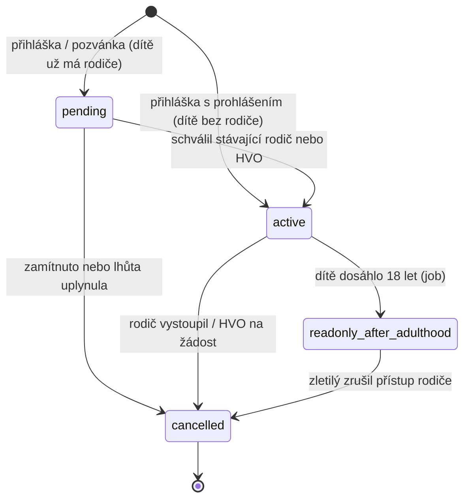

# Vazba rodič ↔ dítě — stavový automat

Formální model `PARENT_CHILD` ([README.md](../README.md) → **Rodič (zákonný zástupce)**). Schéma viz [data-model.md](data-model.md), navazující tok přihlášky [registration-lifecycle.md](registration-lifecycle.md).

## Princip: vazba je zdrojem práv, ne role

Rodičovství se **nepřiděluje jako role** — postavení zákonného zástupce plyne výhradně z existence vazby ve stavu `active`. Rozsah práv je proto vždy **per dítě**, ne globální, a nemůže se rozejít se skutečným stavem vazby.

Vazba je **asymetrická dvojice osob** (`parent_person_id`, `child_person_id`), ne vazba mezi účty — dítě zpravidla účet nemá. Rodič účet mít musí, protože jinak nemá jak práva vykonávat (výjimkou je schválení přihlášky odkazem z e-mailu, které účet nevyžaduje).

## Stavy

| Stav                       | Význam                                                 | Dává práva | Terminální |
| -------------------------- | ------------------------------------------------------ | ---------- | ---------- |
| `pending`                  | čeká na schválení (dítě už má jiného rodiče)           | ne         | ne         |
| `active`                   | platná vazba, rodič má plná práva k dítěti             | ano        | ne         |
| `readonly_after_adulthood` | dítě dosáhlo zletilosti, přístup zůstává jen pro čtení | jen čtení  | ne         |
| `cancelled`                | vazba zrušena rodičem, HVO nebo zletilým dítětem       | ne         | ano        |

`cancelled` je **terminální** — obnovit vazbu nelze, vzniká nová (původní zůstává pro auditní stopu).

## Vznik vazby

Tři cesty, všechny ústí do `pending` nebo `active` podle toho, zda dítě už nějakého rodiče má:

| Cesta                                       | Dítě bez rodiče                         | Dítě už má rodiče                               |
| ------------------------------------------- | --------------------------------------- | ----------------------------------------------- |
| Rodič přihlásí dítě na akci                 | → `active` (s prohlášením o zastoupení) | → `pending`, schvaluje stávající rodič nebo HVO |
| Nezletilý se přihlásí sám, zástupce schválí | → `active`                              | → `pending`                                     |
| Pozvánka druhému zákonnému zástupci         | → `pending`, schvaluje HVO              | → `pending`, schvaluje stávající rodič          |

**Prohlášení o zastoupení** u první cesty je povinný explicitní souhlas („jsem zákonný zástupce tohoto dítěte") — zapisuje se do auditního logu s časem a aktérem. Bez něj vazba nevznikne.

## Diagram

## Přechody

| Přechod                                | Spouštěč                                 | Guard                                                                      | Efekt                                                                   |
| -------------------------------------- | ---------------------------------------- | -------------------------------------------------------------------------- | ----------------------------------------------------------------------- |
| `→ pending`                            | přihláška, schválení zástupcem, pozvánka | dítě je nezletilé a už má aspoň jednu vazbu v `active`                     | e-mail schvalovateli, nastavení lhůty                                   |
| `→ active` (přímo)                     | přihláška s prohlášením                  | dítě je nezletilé a **nemá** žádnou vazbu v `active`; prohlášení potvrzeno | `valid_from`, zápis prohlášení do auditního logu                        |
| `pending → active`                     | odkaz v e-mailu / rozhraní               | schvaluje stávající rodič v `active`, nebo HVO oddílu dítěte               | `approved_by_account_id`, `valid_from`, notifikace žadateli             |
| `pending → cancelled`                  | schvalovatel, nebo job po lhůtě          | —                                                                          | `valid_to`, notifikace žadateli s důvodem                               |
| `active → readonly_after_adulthood`    | job (denně)                              | dítě dosáhlo 18 let                                                        | práva se omezí na čtení, notifikace oběma stranám                       |
| `active → cancelled`                   | rodič (vystoupení) nebo HVO na žádost    | —                                                                          | `valid_to`, zápis do auditního logu, kontrola osiření dítěte (viz níže) |
| `readonly_after_adulthood → cancelled` | zletilé dítě                             | dítě má vlastní účet                                                       | `valid_to`, rodič ztrácí i čtení                                        |

Zrušení se **vždy loguje** (README → **Auditní log**); u systémových přechodů (job) je aktérem systém.

## Práva podle stavu

| Operace                                     | `pending` | `active` | `readonly_after_adulthood` |
| ------------------------------------------- | --------- | -------- | -------------------------- |
| Číst údaje a přihlášky dítěte               | ne        | ano      | ano                        |
| Přihlásit dítě na akci, stornovat, platit   | ne        | ano      | ne                         |
| Upravovat údaje dítěte (adresa, pojišťovna) | ne        | ano      | ne                         |
| Doplnit chybějící kontaktní e-mail dítěte   | ne        | ano      | **ano** (výjimka)          |

Výjimka u kontaktního e-mailu existuje proto, aby šlo zletilému doručit výzvu k převzetí účtu, když e-mail chybí.

## Guardy a invarianty

- **Oba rodiče mají plná práva**, mezi vazbami není hierarchie; při souběžné úpravě platí poslední zápis.
- **Vazba nevzniká k zletilé osobě.** Je-li osoba v okamžiku pokusu už zletilá, vazba se nezaloží vůbec — nelze obejít omezení tím, že se založí a hned překlopí do `readonly`.
- **Chybí-li `birth_date`**, nelze zletilost vyhodnotit; systém datum vyžádá a vazba zůstává v `pending`.
- **Osiření dítěte:** zruší-li se poslední vazba v `active`, údaje a přihlášky nezletilého spravuje HVO oddílu, kde je dítě evidované, dokud se nepřipojí nový zástupce. Zrušení se tím **neblokuje** — nelze držet rodiče proti jeho vůli.
- **Zrušení vazby nemění existující přihlášky ani platby.** Přihlášky zůstávají v platnosti a přechází pod správu HVO (nebo druhého rodiče); už provedené platby a alokace se nedotýkají.
- **Zrušení nelze provést, dokud je vazba v `pending`** — nejdřív se musí rozhodnout o schválení; zamítnutí je samo přechodem do `cancelled`.
- **Sloučení osob** ([person-merge.md](person-merge.md)) přenáší vazby pod sjednocenou osobu; duplicitní vazba (stejný rodič i dítě) se sloučí do jedné.
- `record_state` osoby (viz [person-lifecycle.md](person-lifecycle.md)) **vazbu neovlivňuje** — deaktivace osoby v oddílu vazbu neruší.

## Časové lhůty

| Lhůta                                  | Výchozí                    | Kde se nastavuje                                                          |
| -------------------------------------- | -------------------------- | ------------------------------------------------------------------------- |
| schválení vazby (`pending`)            | 14 dní od odeslání žádosti | nastavení oddílu                                                          |
| schválení přihlášky zákonným zástupcem | 7 dní                      | nastavení oddílu ([registration-lifecycle.md](registration-lifecycle.md)) |

Lhůta pro schválení vazby je delší než pro schválení přihlášky — vazba je trvalé rozhodnutí, přihláška má vlastní kapacitní tlak.
