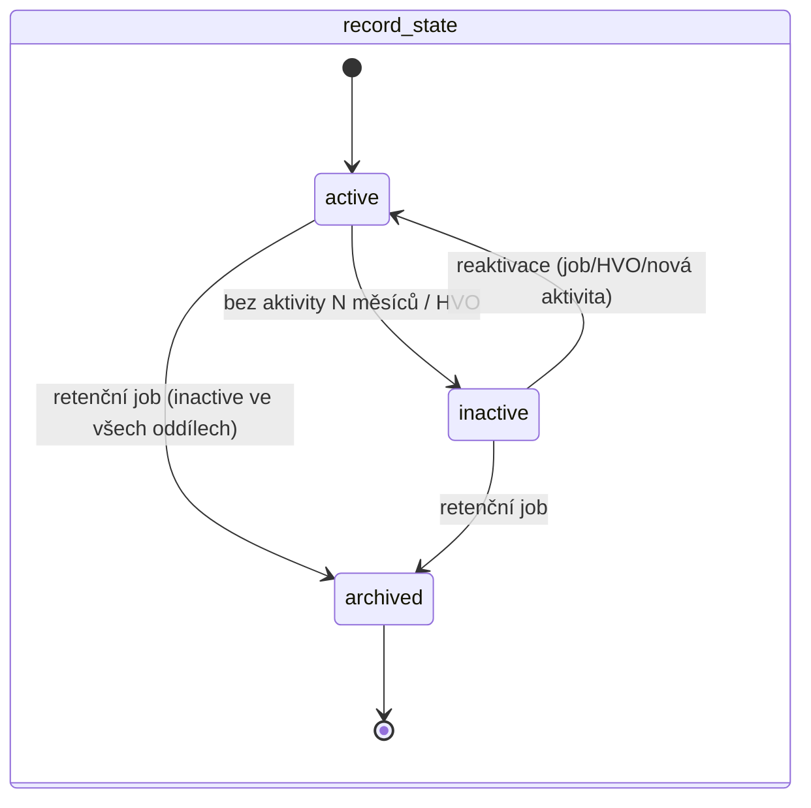
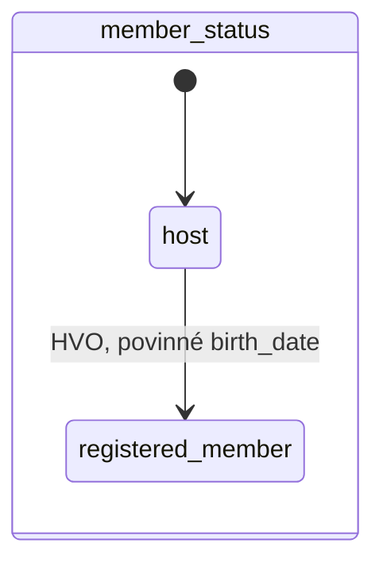

# Osoba — lifecycle (stav v rámci oddílu)

Formální model stavu osoby ve vazbě na oddíl ([README.md](../README.md) → **Stav osoby**). Schéma viz [data-model.md](data-model.md). Členství DU je samostatný záznam nezávislý na tomto modelu (README → **Člen DU**).

## Princip: dvě nezávislé osy

Stav osoby v oddílu se skládá ze **dvou na sobě nezávislých os**, ne z jednoho seznamu:

- **`member_status`** — typ vztahu k oddílu: `host` ↔ `registered_member`
- **`record_state`** — životnost záznamu: `active` → `inactive` → `archived`

Obě osy se mění nezávisle a v libovolném čase nese osoba dvojici `(member_status, record_state)`. Výchozí hodnota `record_state` při vzniku osoby v oddílu je vždy `active`.

## Matice povolených kombinací

| `member_status` \ `record_state` | `active`        | `inactive`                 | `archived`                                |
| -------------------------------- | --------------- | -------------------------- | ----------------------------------------- |
| `host`                           | ✅ výchozí stav | ✅ dlouhodobě bez aktivity | ✅ (viz níže — terminál přes obě hodnoty) |
| `registered_member`              | ✅              | ✅                         | ✅                                        |

`archived` je **absorbující stav nezávislý na `member_status`** — jakmile k němu dojde, poslední hodnota `member_status` se dál eviduje jen v historii (viz **Historie**), aktivní záznam osobní údaje nemá.

## Přechody osy `member_status`

| Přechod                    | Spouštěč | Guard                | Efekt                                                                                                                                                        |
| -------------------------- | -------- | -------------------- | ------------------------------------------------------------------------------------------------------------------------------------------------------------ |
| `host → registered_member` | HVO      | povinné `birth_date` | osoba začíná splňovat podmínky pro registrovaného člena; HVO jí může vystavit oddílový členský předpis a po úhradě složky DU ji zařadit do dávky pro ústředí |
| `registered_member → host` | zakázáno | —                    | degradace vztahu jde jen přes `inactive`, ne zpět na hosta — zabraňuje ztrátě `birth_date` a dalších polí, která registrovaný člen musí mít vyplněná         |

## Přechody osy `record_state`

| Přechod                        | Spouštěč                                                           | Guard                                                                                                                          | Efekt                                                                                                         |
| ------------------------------ | ------------------------------------------------------------------ | ------------------------------------------------------------------------------------------------------------------------------ | ------------------------------------------------------------------------------------------------------------- |
| `active → inactive`            | job (denně) nebo HVO manuálně                                      | dlouhodobě bez aktivity (viz níže), nebo manuální rozhodnutí HVO bez další podmínky                                            | osoba se přestane počítat do stavu členů, přestane dostávat automatické výzvy a připomínky                    |
| `inactive → active`            | HVO (reaktivace), nebo automaticky jakoukoli novou aktivitou osoby | žádný                                                                                                                          | osoba se znovu počítá a dostává výzvy                                                                         |
| `active`/`inactive → archived` | retenční job, nebo Administrátor (průřezový výmaz)                 | uplynutí retenční lhůty **a** `record_state = inactive` ve **všech** oddílech, kde je osoba evidovaná (viz **Rozsah a scope**) | nevratná globální anonymizace osobních a identifikačních údajů, zrušení účtu a zachování jen agregovaných dat |

Podání nové přihlášky, docházkový záznam nebo přihlášení do systému **automaticky reaktivuje** `inactive` osobu — aktivita sama je důkazem, že vztah dál trvá.

## Definice „dlouhodobě bez aktivity"

- **Aktivita** = nová nebo upravená přihláška, docházkový záznam, nebo přihlášení do systému (login), pokud osoba má účet.
- **Lhůta:** 12 měsíců pro hosty, 24 měsíců pro registrované členy — v souladu s retenčními lhůtami hosta a účtu (README → **Retence a GDPR**).
- **Job běží měsíčně** a před automatickou deaktivací pošle osobě (má-li kontaktní e-mail) a HVO **upozornění 30 dní předem**.
- Manuální deaktivace HVO se touto lhůtou neřídí a upozornění nevyžaduje.

## Diagram

Obě osy se kreslí zvlášť právě proto, že jsou na sobě nezávislé — kombinovaný diagram by musel zbytečně násobit stavy.

## Dopady na ostatní vazby při `active → inactive`

| Vazba                         | Dopad                                                                                          |
| ----------------------------- | ---------------------------------------------------------------------------------------------- |
| Členství v družině            | osoba se odebere ze **aktivních** družin; historické členství zůstává v historii               |
| Vazba zákonný zástupce ↔ dítě | nemění se — vazba žije nezávisle na `record_state` dítěte i zákonného zástupce                 |
| Role účtu (VO/RÁD/ÚČE)        | role se **needuje automaticky** — HVO ji musí odebrat explicitně, pokud chce                   |
| Budoucí přiřazení k akci      | nové přiřazení vyžaduje `active`; existující přiřazení k už proběhlým akcím zůstává v historii |
| Založení nové přihlášky       | dovoleno — samotné podání přihlášku reaktivuje (viz výše)                                      |

## Retence: citlivá data per oddíl, osoba globálně

- `record_state` a `member_status` jsou vazba **osoba ↔ oddíl** — stejná osoba může být `active` v oddíle A a `inactive` v oddíle B současně.
- `PERSON_SENSITIVE_DATA` patří konkrétnímu oddílu (`unit_id`). Retenční job oddílu jej po vlastní lhůtě (u zdravotních údajů typicky do 30 dnů po skončení akce) anonymizuje samostatně, i když je osoba aktivní v jiném oddílu. Lokální anonymizace nemění `PERSON`, účet, `PERSON_UNIT` ani data jiných oddílů.
- Retenční job smí spustit globální **archivaci (→ `archived`)** až tehdy, je-li osoba `inactive` **ve všech** oddílech, kde je evidovaná, a uplynula nejdelší relevantní retenční lhůta. Globální anonymizace maže `PERSON`, identifikační údaje účtu a všechny dosud neanonymizované lokální záznamy `PERSON_SENSITIVE_DATA`.
- Globální anonymizace musí vyprázdnit i **`REGISTRATION.contact_email` a `guardian_email`** — osobní údaj tam sedí i na přihláškách, kde osoba není `person_id` (zákonný zástupce, který přihlásil dítě).
- Každý lokální i globální výmaz vytvoří `GDPR_AUDIT` bez obsahu odstraněných údajů; záznam nese scope (`unit_id` u lokálního výmazu), čas, právní důvod a aktéra nebo retenční job.
- **Administrátor** smí spustit průřezový výmaz kdykoli i mimo tento guard (README → **Retence a GDPR**), musí ale uvést důvod a operace se loguje.

## Terminálnost archivace a návrat

- `archived` je **terminální a nevratný** — anonymizovaná data se needají obnovit.
- Vrátí-li se anonymizovaná osoba později do oddílu, založí se jako **nová osoba** (nový záznam) — jde o potenciální duplicitu se starým (anonymizovaným) záznamem, kterou dál řeší běžná deduplikace a reportovací sloučení (README → **Deduplikace osob, merge** a **Modul reporty ústředí**).

## Vazba osoba ↔ účet

- `record_state` osoby v jednom oddíle **nemá vliv na platnost účtu** — účet je globální (1 osoba ⇢ max 1 účet), ne per oddíl.
- Platnost přihlašovacího účtu se řídí vlastní retenční lhůtou (24 měsíců nečinnosti loginu, README → **Retence a GDPR**) nezávisle na `record_state` v jednotlivých oddílech.
- Je-li osoba `archived` (anonymizovaná), účet se ruší současně s anonymizací dat.

## Interakce s členstvím DU

- `DU_MEMBERSHIP` je nezávislý záznam (README → **Člen DU**) a existuje nezávisle na aktuálním `record_state`/`member_status`.
- Členství je **globální vůči osobě a roku** — `unit_id` na záznamu je jen evidenční oddíl, který členství založil. Ukončení vazby na tento oddíl (deaktivace, přesun jinam) členství **neruší** a nezakládá potřebu založit ho znovu v novém oddílu.
- HVO může osobě v `record_state = active` i `inactive` vystavit oddílový členský předpis a zařadit ji do dávky pro ústředí, splní-li podmínky příspěvku; vystavení nebo úhrada příspěvku je samo o sobě aktivitou (viz reaktivace výše). `DU_MEMBERSHIP` vzniká až systémově po spárování celé dávky s platbou na účtu ústředí.
- Osobě v `record_state = archived` **nelze založit nové** `DU_MEMBERSHIP` — historické záznamy pro už proběhlé roky zůstávají zachované podle vlastní retenční lhůty (členská evidence + 10 let), i po anonymizaci osoby.

## Historie

Každá změna kterékoli osy se zapisuje jako záznam s:

- **osa** (`member_status` nebo `record_state`),
- **výchozí a cílový stav**,
- **kdo** (aktér; prázdné u systémových/jobových změn),
- **kdy**,
- **důvod** (volitelný text, povinný jen u manuální archivace Administrátorem).

Report Retence a Reporty ústředí čtou tuto historii pro metriky přechodů (README → **Reporty**).
