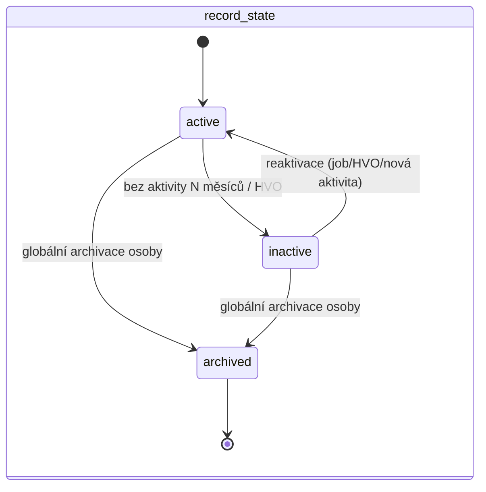
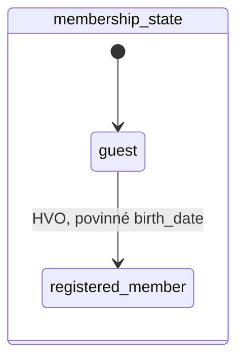

# Osoba — lifecycle (stav v rámci oddílu)

Formální model stavu osoby ve vazbě na oddíl ([README.md](../README.md) → **Stav osoby**). Schéma viz [data-model.md](data-model.md). Členství DU je samostatný záznam nezávislý na tomto modelu (README → **Člen DU**).

## Princip: dvě nezávislé osy

Stav osoby v oddílu se skládá ze **dvou na sobě nezávislých os**, ne z jednoho seznamu:

- **`membership_state`** — typ vztahu k oddílu: `guest` (host) ↔ `registered_member`
- **`record_state`** — životnost záznamu: `active` → `inactive` → `archived`

Obě osy se mění nezávisle a v libovolném čase nese osoba dvojici `(membership_state, record_state)`. Výchozí hodnota `record_state` při vzniku osoby v oddílu je vždy `active`. Výjimkou je globální archivace: přechod do `archived` se provede atomicky u všech otevřených vazeb `PERSON_UNIT` dané osoby.

## Matice povolených kombinací

| `membership_state` \ `record_state` | `active`        | `inactive`                 | `archived`                               |
| -------------------------------- | --------------- | -------------------------- | ---------------------------------------- |
| `guest`                          | ✅ výchozí stav | ✅ dlouhodobě bez aktivity | ✅ (jen globálně ve všech vazbách osoby) |
| `registered_member`              | ✅              | ✅                         | ✅ (jen globálně ve všech vazbách osoby) |

`archived` je **absorbující stav nezávislý na `membership_state`** — jakmile k němu dojde, poslední hodnota `membership_state` se dál eviduje jen v historii (viz **Historie**), aktivní záznam osobní údaje nemá.

## Přechody osy `membership_state`

| Přechod                    | Spouštěč | Guard                | Efekt                                                                                                                                                        |
| -------------------------- | -------- | -------------------- | ------------------------------------------------------------------------------------------------------------------------------------------------------------ |
| `guest → registered_member` | HVO      | povinné `birth_date` | osoba začíná splňovat podmínky pro registrovaného člena; HVO jí může vystavit oddílový členský předpis a po úhradě složky DU ji zařadit do dávky pro ústředí |
| `registered_member → guest` | zakázáno | —                    | degradace vztahu jde jen přes `inactive`, ne zpět na `guest` — zabraňuje ztrátě `birth_date` a dalších polí, která registrovaný člen musí mít vyplněná         |

## Přechody osy `record_state`

| Přechod                        | Spouštěč                                                           | Guard                                                                                                                          | Efekt                                                                                                                                                              |
| ------------------------------ | ------------------------------------------------------------------ | ------------------------------------------------------------------------------------------------------------------------------ | ------------------------------------------------------------------------------------------------------------------------------------------------------------------ |
| `active → inactive`            | job (denně) nebo HVO manuálně                                      | dlouhodobě bez aktivity (viz níže), nebo manuální rozhodnutí HVO bez další podmínky                                            | osoba se přestane počítat do stavu členů, přestane dostávat automatické výzvy a připomínky                                                                         |
| `inactive → active`            | HVO (reaktivace), nebo automaticky jakoukoli novou aktivitou osoby | žádný                                                                                                                          | osoba se znovu počítá a dostává výzvy                                                                                                                              |
| `active`/`inactive → archived` | retenční job, nebo Administrátor (průřezový výmaz)                 | uplynutí retenční lhůty **a** `record_state = inactive` ve **všech** oddílech, kde je osoba evidovaná (viz **Rozsah a scope**) | atomicky nastaví `archived` u všech otevřených `PERSON_UNIT` osoby; pak nevratně anonymizuje osobní a identifikační údaje, ruší účet a zachová jen agregovaná data |

Podání nové přihlášky, docházkový záznam nebo přihlášení do systému **automaticky reaktivuje** `inactive` osobu — aktivita sama je důkazem, že vztah dál trvá.

## Definice „dlouhodobě bez aktivity"

- **Aktivita** = nová nebo upravená přihláška, docházkový záznam, nebo přihlášení do systému (login), pokud osoba má účet.
- **Deaktivace:** host po 12 měsících bez aktivity, registrovaný člen po 24 měsících. Job před ní pošle osobě (má-li kontaktní e-mail) a HVO upozornění 30 dní předem.
- **Návrat hosta:** neaktivní host zůstává dalších 12 měsíců dostupný pro reaktivaci. Každá nová aktivita jej automaticky vrátí do `active` a obě lhůty se počítají znovu od této aktivity.
- **Archivace hosta:** teprve po 12 měsících v `inactive` bez návratu retenční job tiše spustí globální archivaci; neposílá se e-mail hostovi ani HVO.
- **Archivace registrovaného člena** se touto lhůtou **neřídí** — jeho evidence se drží **po dobu členství + 10 let** (README → **Retence a GDPR**, doložitelnost pro dotace). Deaktivace po 24 měsících ho tedy jen přestane počítat mezi členy; archivace přijde o řádovou dekádu později. Vypočítaná lhůta se počítá od konce posledního členství, ne od poslední aktivity.
- **Job běží denně** a hlídá upozornění před deaktivací, deaktivaci i archivaci podle těchto lhůt.
- Manuální deaktivace HVO se touto lhůtou neřídí a upozornění nevyžaduje.

## Diagram

Obě osy se kreslí zvlášť právě proto, že jsou na sobě nezávislé — kombinovaný diagram by musel zbytečně násobit stavy.

## Dopady na ostatní vazby při `active → inactive`

| Vazba                         | Dopad                                                                                          |
| ----------------------------- | ---------------------------------------------------------------------------------------------- |
| Členství v družině            | osoba se odebere ze **aktivních** družin; historické členství zůstává v historii               |
| Vazba zákonný zástupce ↔ dítě | nemění se — vazba žije nezávisle na `record_state` dítěte i zákonného zástupce                 |
| Role účtu (VO/RÁD/ÚČE)        | role se **neruší automaticky** — HVO ji musí odebrat explicitně, pokud chce                   |
| Budoucí přiřazení k akci      | nové přiřazení vyžaduje `active`; existující přiřazení k už proběhlým akcím zůstává v historii |
| Založení nové přihlášky       | dovoleno — samotné podání přihlášku reaktivuje (viz výše)                                      |

## Retence: citlivá data per oddíl, osoba globálně

- `record_state` a `membership_state` jsou vazba **osoba ↔ oddíl** — stejná osoba může být `active` v oddíle A a `inactive` v oddíle B současně.
- `PERSON_SENSITIVE_DATA` patří konkrétnímu oddílu (`unit_id`). Retenční job oddílu jej po vlastní lhůtě (u zdravotních údajů typicky do 30 dnů po skončení akce) anonymizuje samostatně, i když je osoba aktivní v jiném oddílu. Lokální anonymizace nemění `PERSON`, účet, `PERSON_UNIT` ani data jiných oddílů.
- Retenční job smí spustit globální **archivaci (→ `archived`)** až tehdy, je-li osoba `inactive` **ve všech** oddílech, kde je evidovaná, a uplynula nejdelší relevantní retenční lhůta. U hosta je to 12 měsíců neaktivity a dalších 12 měsíců ve stavu `inactive`; každá nová aktivita lhůtu přeruší a osobu reaktivuje. U registrovaného člena je to **konec členství + 10 let**, takže osoba, která byla kdy registrovaným členem kteréhokoli oddílu, se archivuje podle této delší lhůty i tehdy, je-li jinde vedená jen jako host — rozhoduje vždy nejdelší lhůta napříč všemi jejími vazbami. Archivace je atomická: nastaví `record_state = archived` u všech otevřených `PERSON_UNIT` osoby, takže žádná její vazba nezůstane `active` ani `inactive`. Globální anonymizace maže `PERSON`, identifikační údaje účtu a všechny dosud neanonymizované lokální záznamy `PERSON_SENSITIVE_DATA`; okamžik zaznamená `PERSON.anonymized_at` (NULL = osoba dosud neanonymizována) — reporty podle něj poznají, že se osoba smí počítat jen v agregátech, ne jmenovitě (viz [reports.md](reports.md)).
- Globální anonymizace musí vyprázdnit i **`REGISTRATION.contact_email` a `guardian_email`** — osobní údaj tam sedí i na přihláškách, kde osoba není `person_id` (zákonný zástupce, který přihlásil dítě).
- Každý lokální i globální výmaz vytvoří `GDPR_AUDIT` bez obsahu odstraněných údajů; záznam nese scope (`unit_id` u lokálního výmazu), čas, právní důvod a aktéra nebo retenční job.
- **Administrátor** smí spustit průřezový výmaz kdykoli i mimo tento guard (README → **Retence a GDPR**), musí ale uvést důvod a operace se loguje.

## Terminálnost archivace a návrat

- `archived` je **terminální a nevratný** — anonymizovaná data se nedají obnovit.
- Vrátí-li se anonymizovaná osoba později do oddílu, založí se jako **nová osoba** (nový záznam) — jde o potenciální duplicitu se starým (anonymizovaným) záznamem, kterou dál řeší běžná deduplikace a reportovací sloučení (README → **Deduplikace osob, merge** a **Modul reporty ústředí**).

## Vazba osoba ↔ účet

- `record_state` osoby v jednom oddíle **nemá vliv na platnost účtu** — účet je globální (1 osoba ⇢ max 1 účet), ne per oddíl.
- Platnost přihlašovacího účtu se řídí vlastní retenční lhůtou (24 měsíců nečinnosti loginu, README → **Retence a GDPR**) nezávisle na `record_state` v jednotlivých oddílech.
- Je-li osoba `archived` (anonymizovaná), účet se ruší současně s anonymizací dat.

## Interakce s členstvím DU

- `DU_MEMBERSHIP` je nezávislý záznam (README → **Člen DU**) a existuje nezávisle na aktuálním `record_state`/`membership_state`.
- Členství je **globální vůči osobě a roku** — `unit_id` na záznamu je jen evidenční oddíl, který členství založil. Ukončení vazby na tento oddíl (deaktivace, přesun jinam) členství **neruší** a nezakládá potřebu založit ho znovu v novém oddílu.
- HVO může osobě v `record_state = active` i `inactive` vystavit oddílový členský předpis a zařadit ji do dávky pro ústředí, splní-li podmínky příspěvku; vystavení nebo úhrada příspěvku je samo o sobě aktivitou (viz reaktivace výše). `DU_MEMBERSHIP` vzniká až systémově po spárování celé dávky s platbou na účtu ústředí.
- Osobě v `record_state = archived` **nelze založit nové** `DU_MEMBERSHIP` — historické záznamy pro už proběhlé roky zůstávají zachované podle vlastní retenční lhůty (členská evidence + 10 let), i po anonymizaci osoby.

## Historie

Každá změna kterékoli osy se zapisuje do `PERSON_UNIT_HISTORY` jako záznam s:

- **výchozí a cílový stav obou os** (`from_membership`/`to_membership`, `from_record`/`to_record`),
- **kdo** (`changed_by_account_id`; prázdné u systémových/jobových změn),
- **kdy** (`changed_at`),
- **důvod** (`note` — volitelný text, povinný jen u manuální archivace Administrátorem).

Záznam nenese příznak, které osy se změna týkala — **osa, která se nezměnila, má `from` shodné s `to`**. Samostatný rozlišovač by nic nepřidal a překážel by u přechodů, které mění obě osy najednou.

Report Retence a Reporty ústředí čtou tuto historii pro metriky přechodů (README → **Reporty**).
