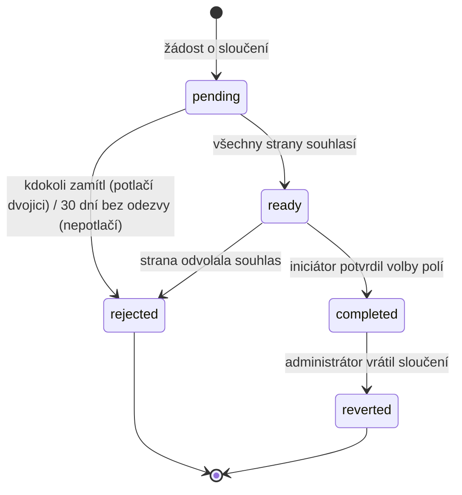

# Sloučení osob — konflikty a revert

Implementační detail k [README.md](../README.md) → **Deduplikace osob, merge**. Schéma (`MERGE_REQUEST`, `MERGE_APPROVAL`, `MERGE_LOG`, `REPORT_MERGE`) viz [data-model.md](data-model.md).

Dokument řeší tři věci, které business popis nechává otevřené: **kdo co schvaluje**, **jak se řeší konflikt pole po poli a kolize vazeb** a **co přesně umí revert**.

## Detekce kandidátů

- Kandidáti se **jen navrhují, nikdy neslučují automaticky**. Sloučení je nevratné z pohledu uživatele a týká se osobních údajů — rozhoduje vždy člověk.
- Silný kandidát = shodné `birth_date` **a** shodné normalizované jméno i příjmení (bez diakritiky, malá písmena, ořezané mezery). Slabý kandidát = shodné `birth_date` a podobné příjmení, nebo shodné jméno i příjmení bez data narození.
- Přezdívka (`nickname`) se do porovnání započítává jako alternativa křestního jména (Pepa / Josef), a to jen na straně návrhu — sama o sobě kandidáta nezakládá.
- Kandidáti se hledají **napříč oddíly**; duplicity uvnitř jednoho oddílu vidí HVO přímo v seznamu osob.
- Zamítnutá žádost (`state = 'rejected'`) funguje jako **trvalé potlačení dvojice** — stejná dvojice se už znovu nenabízí, dokud je ADM výslovně neodblokuje. **Potlačení zakládá jen zamítnutí, o kterém někdo rozhodl**, ne propadnutí bez odezvy (viz **Schvalování**): mlčení není úsudek o totožnosti osob. Odblokování zapíše `suppression_lifted_at`, ADM, který jej provedl, a povinný důvod; vytvoří také záznam `AUDIT_LOG` typu `MERGE_REQUEST` s akcí `update`. Další nalezení kandidáta pak založí novou žádost, původní zamítnutá žádost zůstává v historii.

## Schvalování

| `kind`   | Strany (`MERGE_APPROVAL.party`)                                                                         |
| -------- | ------------------------------------------------------------------------------------------------------- |
| `person` | `initiator`, `hvo` (druhého oddílu), `candidate` — má-li kandidát vlastní účet                          |
| `child`  | `parent` obou dětí; nemá-li dítě aktivního zákonného zástupce, nastupuje `hvo` oddílu, kde je evidováno |

- Žádost je `pending`, dokud **všechny** strany nerozhodly. Souhlas všech → `ready`. Jediné zamítnutí → `rejected` (terminální).
- Sloučení spouští **iniciátor** až ze stavu `ready` — mezi souhlasem a provedením se dělá volba konfliktních polí.
- Nerozhodnutá žádost **propadá po 30 dnech** → `rejected` s důvodem „bez odezvy". **Propadnutí dvojici nepotlačuje** — na rozdíl od zamítnutí, o kterém někdo rozhodl. Detekce ji smí navrhnout znovu, nejdřív však 30 dní po propadnutí, aby se stejný návrh nevracel dokola. Dovolená, změna HVO nebo e-mail ve spamu by jinak natrvalo pohřbily nalezenou duplicitu a odblokovat by ji směl jen ADM.
- **7 dní před propadnutím** dostanou strany, které dosud nerozhodly, připomínku `EMAIL_MERGE_REQUEST_REMINDER`; po propadnutí se `EMAIL_MERGE_REQUEST_EXPIRED` odešle **jen iniciátorovi** — ostatní mlčeli a další zpráva jim nic nepřinese ([notifications.md](notifications.md)).
- Sloučení dětí **nespojuje účty zákonných zástupců**, jen osobu dítěte.
- Schvalující HVO vidí náhled obou osob k porovnání, ale **nevidí citlivá data z cizího oddílu** — jen základní pole, která se slučují.

## Konflikt základních polí

Řeší se **pole po poli**, ne „vezmi celou osobu A":

| Situace               | Chování                                                                   |
| --------------------- | ------------------------------------------------------------------------- |
| jedna strana prázdná  | vyhrává vyplněná hodnota, volba se nenabízí                               |
| obě vyplněné a shodné | beze změny                                                                |
| obě vyplněné a různé  | **vyžaduje explicitní volbu A/B**; bez rozhodnutí nelze sloučení dokončit |
| různé `birth_date`    | varování „pravděpodobně nejde o stejnou osobu"; potvrzuje HVO zvlášť      |

- Nabízí se **jen volba A/B, ne ruční přepis hodnoty** — u každého pole musí jít doložit, odkud se vzalo, jinak by revert vracel něco, co v žádné z původních osob nebylo. Opravit hodnotu lze až po sloučení běžnou editací.
- Volba se dělá nad poli `PERSON`: jméno, příjmení, přezdívka, tituly, pohlaví, datum narození, e-mail, adresa, pojišťovna.
- **Účet:** zůstává jeden (`MERGE_REQUEST.keep_account_id`), druhý se ruší. OAuth identity se přenesou; kolidují-li identity téhož poskytovatele, zůstává identita ponechaného účtu. Přihlašovací e-mail zrušeného účtu se uvolní.

## Přenos vazeb a kolize unikátů

Vazby se **nevolí, přenášejí se všechny** na cílovou osobu — přihlášky, docházka, členství DU, oddílové členské předpisy, vzdělání, dokumenty, alokace plateb, historie stavů. Kolize unikátních klíčů se řeší takto:

| Entita                | Kolize                               | Řešení                                                                                                                                                                                                                  |
| --------------------- | ------------------------------------ | ----------------------------------------------------------------------------------------------------------------------------------------------------------------------------------------------------------------------- |
| `PERSON_UNIT`         | stejná osoba + oddíl                 | sloučí se: `membership_state` silnější (registrovaný > host), `record_state` aktivnější (aktivní > neaktivní > archivovaný), `valid_from` dřívější, `valid_to` pozdější (NULL vyhrává)                                  |
| `PERSON_UNIT_HISTORY` | —                                    | záznamy obou os se spojí a seřadí podle času; nic se nezahazuje (čtou to reporty)                                                                                                                                       |
| `DU_MEMBERSHIP`       | stejná osoba + rok                   | zůstává záznam cílové osoby; zdrojový se zahodí do snapshotu a HVO dostane poznámku, lišil-li se evidenční oddíl. Členství platí globálně, takže sloučením se žádné neztrácí — mění se jen to, který oddíl osobu vykáže |
| `REGISTRATION`        | obě osoby na téže akci               | je-li jedna v terminálním stavu, zůstává druhá; **jsou-li obě aktivní, sloučení se zablokuje** a musí to nejdřív vyřešit vedoucí přihlášky                                                                                   |
| `UNIT_MEMBER_FEE`     | stejná osoba + oddíl + rok           | je-li jeden předpis uhrazený a druhý ne, zůstává uhrazený a neuhrazený se stornuje (`Canceled`); **jsou-li uhrazené oba, sloučení se zablokuje** a účetní musí nejdřív jeden vypořádat vratkou — dvě zaplacené částky nelze tiše sloučit do jedné               |
| `ATTENDANCE_RECORD`   | stejná osoba + akce                  | zůstává záznam s nejvyšší skutečnou účastí: `on_time`, pak `late`, `excused_in_advance`, `absent`                                                                                                                       |
| `PARENT_CHILD`        | stejná dvojice zákonný zástupce–dítě | zůstává jedna vazba, aktivní má přednost před zrušenou                                                                                                                                                                  |
| `USER_ROLE`           | stejná role + oddíl                  | ponechá se jedna                                                                                                                                                                                                        |

- **Citlivá data zůstávají per oddíl.** Sloučením osoby se nespojí zdravotní údaje ani dokumenty napříč oddíly — zůstávají navázané na oddíl a jen ukazují na sjednocenou osobu. HVO oddílu A tím nezískává přístup k datům z oddílu B.
- **Zdrojová osoba se nemaže**, zůstává jako **tombstone** s odkazem na cílovou osobu (`merged_into_person_id`). Staré odkazy, uložené URL i externí evidence tak vedou na správnou osobu a revert má co oživit.
- Sloučení běží **v jedné transakci**. Selže-li kterákoli část (např. blokující kolize přihlášek), nezmění se nic.

## Revert

Sloučení lze vrátit — proto `MERGE_LOG.snapshot`. Co v něm musí být:

- úplný stav `PERSON` **obou** osob před sloučením,
- **rozhodnutá volba u každého konfliktního pole** (odkud hodnota pochází),
- seznam všech přenesených vazeb ve tvaru entita + id záznamu + původní `person_id`,
- záznamy zahozené kvůli kolizi unikátů a hodnoty přepsané při slučování `PERSON_UNIT`,
- zrušený účet, jeho přihlašovací e-mail a přenesené OAuth identity.

Pravidla:

- Revert provádí **administrátor**, jen ze stavu `completed`, a jen dokud existuje `MERGE_LOG` (retence 3 roky).
- Revert vrátí zpět **jen to, co je ve snapshotu**. Záznamy vzniklé **po** sloučení (nová přihláška, nová platba, nové členství) zůstávají u cílové osoby — systém je při revertu vypíše, aby bylo vidět, co se nerozdělí.
- Revert **neobnoví** data smazaná mezitím podle retence a **nevrátí** odeslané e-maily ani potvrzení o platbě.
- Zrušený účet se obnoví jen tehdy, není-li mezitím jeho přihlašovací e-mail použitý jiným účtem; jinak se revert dokončí bez účtu a administrátor dostane upozornění.
- Obojí — co revert vrátí a co ne — se zobrazí **před potvrzením**, ne až po něm.
- HVO dotčeného oddílu může u dokončeného sloučení podat žádost o revert s povinným důvodem. Žádost obsahuje stejný náhled změn, které se vrátí a které zůstanou u cílové osoby; samotný revert provádí vždy ADM. ADM může žádost také podat i schválit.
- Podání žádosti i její vyřízení se zapíše do `AUDIT_LOG` jako změna `MERGE_REQUEST` s aktérem a důvodem.
- Revert je jednorázový (`reverted_at`, `MERGE_REQUEST.state = 'reverted'`). Opětovné sloučení znamená novou žádost.

## Reportovací sloučení (`REPORT_MERGE`)

Jiný mechanismus, snadno se plete se skutečným sloučením:

- **Nemění žádná data ani vazby** — jen říká, že dvě osoby se pro účely počítání unikátních dětí mají počítat jako jedna.
- Zakládá ho ústředí bez schvalování ostatními stranami, protože nikomu nemění záznamy.
- Respektuje ho **jen report unikátních dětí** (R10 v [reports.md](reports.md)); všechny ostatní reporty počítají osoby podle `PERSON.id`.
- Je kdykoli zrušitelné, protože nic nepřepsalo.

## Požadavky na datový model

| Co                                        | Proč                                                          |
| ----------------------------------------- | ------------------------------------------------------------- |
| `PERSON.merged_into_person_id`            | tombstone zdrojové osoby, přesměrování starých odkazů         |
| `MERGE_REQUEST.expires_at`                | propadnutí žádosti bez odezvy po 30 dnech                     |
| údaje o zrušení potlačení `MERGE_REQUEST` | auditovatelné ruční odblokování zamítnuté dvojice pouze ADM   |
| údaje žádosti o revert `MERGE_REQUEST`    | HVO může požádat, ale revert provádí pouze ADM                |
| struktura `MERGE_LOG.snapshot` viz výše   | bez seznamu přenesených vazeb nelze revert provést spolehlivě |
