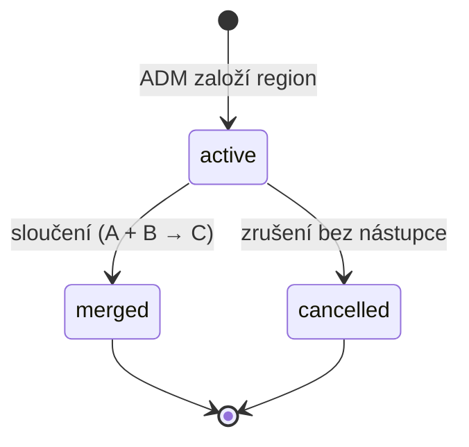

# Region — stavový automat a verzování příslušnosti

Formální model `REGION` a `UNIT_REGION` ([README.md](../README.md) → **Region**). Schéma viz [data-model.md](data-model.md), použití v reportech [reports.md](reports.md).

## Princip: dvě věci, které se mění nezávisle

- **`REGION`** — samotný region jako entita se stavem (`active` / `merged` / `cancelled`).
- **`UNIT_REGION`** — **verzovaná příslušnost oddílu k regionu** s platností od/do. Díky ní lze určit, do jakého regionu oddíl patřil k libovolnému datu.

Regiony se **nikdy nemažou** — historie příslušností na ně odkazuje a reporty z nich čtou. Zrušení je vždy jen změna stavu.

Ústředí (`UNIT.is_hq = true`) do regionů **nepatří** a nikdy nemá záznam v `UNIT_REGION`.

## Stavy regionu

| Stav        | Význam                                                     | Lze do něj přiřadit oddíl | Terminální |
| ----------- | ---------------------------------------------------------- | ------------------------- | ---------- |
| `active`    | běžný, funkční region                                      | ano                       | ne         |
| `merged`    | sloučen do nástupnického regionu (`merged_into_region_id`) | ne                        | ano        |
| `cancelled` | zrušen bez nástupce (rozpuštěn)                            | ne                        | ano        |

Oba koncové stavy jsou **terminální** — region se z nich nevrací. Rozdíl je v tom, že `merged` nese odkaz na nástupce, takže reporty umí dohledat, kam se historie přelila; `cancelled` nástupce nemá.

## Diagram

## Operace

Všechny operace smí provést **jen ADM** ([README.md](../README.md) → **Administrátor**). Každá se zapisuje do auditního logu.

| Operace                   | Efekt na `REGION`                                                   | Efekt na `UNIT_REGION`                                                                  |
| ------------------------- | ------------------------------------------------------------------- | --------------------------------------------------------------------------------------- |
| **Vznik**                 | nový záznam ve stavu `active`, `valid_from` = dnes                  | žádný                                                                                   |
| **Přiřazení oddílu**      | žádný                                                               | nový řádek s `valid_from`, `valid_to = NULL`                                            |
| **Přesun oddílu**         | žádný                                                               | stávající řádek dostane `valid_to`, založí se nový do cílového regionu se stejným datem |
| **Sloučení (A + B → C)**  | A i B → `merged` s `merged_into_region_id = C`; C musí být `active` | všem oddílům z A i B se uzavře příslušnost a otevře nová na C ke stejnému datu          |
| **Rozdělení (C → A + B)** | vzniknou nové regiony `active`; C → `cancelled`                     | oddílům se uzavře příslušnost na C a otevře nová na cílový region                       |
| **Zrušení**               | → `cancelled`                                                       | všem oddílům se uzavře příslušnost; zůstávají bez regionu, dokud je ADM nepřiřadí jinam |

## Guardy

- **Sloučení:** nástupnický region musí být `active` a různý od zdrojových. Nelze slučovat do regionu, který je sám `merged` — vznikl by řetěz.
- **Rozdělení** je opačná operace ke sloučení, ne její návrat: původní region skončí jako `cancelled`, historie se nepřepisuje.
- **Zrušení regionu s aktivními oddíly** je povolené, ale ADM dostane upozornění se seznamem osiřelých oddílů. Oddíl bez regionu je platný stav — jen se nezapočítá do žádné regionální agregace.
- **Ústředí nelze přiřadit** do regionu (guard na `UNIT.is_hq`).
- Terminální stavy jsou konečné — `merged` ani `cancelled` region nelze reaktivovat.

## Invarianty verzované příslušnosti

- **Oddíl je v daném okamžiku nejvýše v jednom regionu** — intervaly `[valid_from, valid_to)` téhož oddílu se **nesmí překrývat**.
- **Nejvýše jeden otevřený řádek** na oddíl (`valid_to = NULL`).
- **Díra v historii je povolená** — oddíl může být období bez regionu (nově založený, nebo po zrušení regionu). Překryv povolený není.
- Přesun i sloučení pracují **ke stejnému datu** na obou stranách (uzavření staré a otevření nové příslušnosti), aby nevznikl ani jednodenní překryv či mezera.
- Historie se **nikdy nepřepisuje** — oprava chybného zařazení se řeší novým intervalem, ne úpravou starého.

## Snapshot na akci

Region se do reportů nebere dotazem „kam oddíl patří teď", ale ze **snapshotu uloženého na akci v okamžiku jejího vzniku** (`EVENT.region_id_snapshot`):

- Snapshot se určí z `UNIT_REGION` platné k datu vzniku akce.
- **Pozdější přesun oddílu ani sloučení regionu už existující akce a reporty nemění** — historické výkazy zůstávají stabilní.
- Nové akce počítají podle aktuálního zařazení.
- Je-li oddíl v okamžiku vzniku akce bez regionu, snapshot je prázdný a akce se v regionální agregaci neobjeví.
- Ukazuje-li snapshot na region, který je dnes `merged`, reporty ho zobrazí pod původním názvem; přes `merged_into_region_id` lze dohledat nástupce, ale agregace ho **nepřepočítává** (viz [reports.md](reports.md)).
