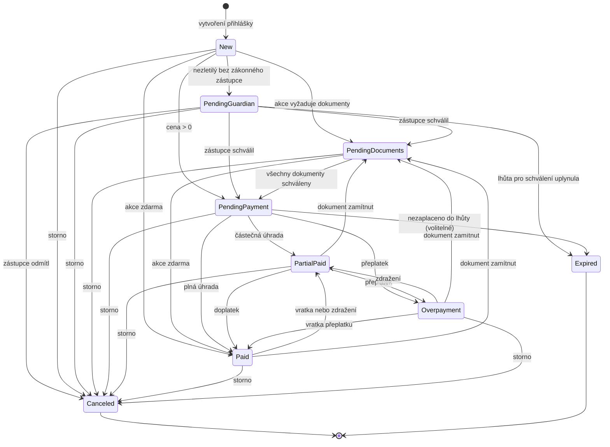

# Přihláška na akci — stavový automat

Formální model stavů `REGISTRATION` ([README.md](../README.md) → **Přihlašování na akce**). Schéma popisuje [data-model.md](data-model.md), výpočet úhrady [payment-matching.md](payment-matching.md).

## Princip: stav se počítá, neukládá se jako výsledek kroku

Přihláška neprochází pevnou posloupností kroků. **Stav je čistá funkce podmínek** — po každé relevantní změně se přepočítá `evaluate(registration)` a výsledek se uloží. Tím nemůže vzniknout nekonzistence typu „zaplaceno, ale chybí dokument".

Jednotkou kapacity je účastník; jedna přihláška nese právě jednoho účastníka, dílčí přihlášky se počítají samostatně.

`UNIT_REGISTRATION` je pouze otevřený nebo uzavřený kontejner pro individuální přihlášky dětí jednoho oddílu na vybranou akci ústředí. Nemá vlastní stav účasti, cenu, platbu ani kapacitní místo; každá připojená `REGISTRATION` prochází tímto automatem samostatně.

Výjimkou jsou dva **terminální stavy** (`Canceled`, `Expired`) a stav `New`; ty se nastavují explicitně a přepočet je nepřepíše.

```
evaluate(registration):
    if state in (Canceled, Expired):            return state          # terminální
    if category = substitute and offer not accepted: return New       # čeká na nabídku místa
    if guardian_required and guardian_approved_at is null: return PendingGuardian
    if has_unapproved_required_documents:       return PendingDocuments
    return payment_state(paid, price)                                 # viz payment-matching.md
```

`payment_state` (z [payment-matching.md](payment-matching.md)): `price = 0 → Paid`, `paid = 0 → PendingPayment`, `paid < price → PartialPaid`, `paid = price → Paid`, `paid > price → Overpayment`.

**Pořadí bran je závazné** — brány se vyhodnocují shora dolů a první nesplněná určuje stav. Výjimkou je vlastní přihláška RÁD na akci pořádajícího oddílu: RÁD ji může podat sám a brána schválení zákonným zástupcem se nepoužije. U ostatních nezletilých má zástupce přednost před dokumenty (nezletilý nesmí nic nahrávat, dokud přihlášku nikdo neschválil), dokumenty před platbou (nemá smysl vybírat peníze za přihlášku, která nemůže projít).

## Stavy

| Stav               | Význam                                                               | Počítá se do kapacity | Terminální |
| ------------------ | -------------------------------------------------------------------- | --------------------- | ---------- |
| `New`              | vznikla; čeká na první vyhodnocení nebo na nabídku místa (náhradník) | ne                    | ne         |
| `PendingGuardian`  | čeká na schválení zákonným zástupcem                                 | ne                    | ne         |
| `PendingDocuments` | chybí nebo nejsou schválené povinné dokumenty                        | ano                   | ne         |
| `PendingPayment`   | nezaplaceno                                                          | ano                   | ne         |
| `PartialPaid`      | zaplacena jen část ceny                                              | ano                   | ne         |
| `Paid`             | uhrazeno přesně (nebo je akce zdarma)                                | ano                   | ne         |
| `Overpayment`      | uhrazeno víc, než je cena                                            | ano                   | ne         |
| `Canceled`         | stornována účastníkem nebo vedoucím                                  | ne                    | ano        |
| `Expired`          | propadla, aniž byla dokončena                                        | ne                    | ano        |

Do kapacity akce se počítají jen přihlášky `category = 'participant'` v nekoncovém stavu mimo `New` a `PendingGuardian`.

## Diagram



Šipky mezi platebními stavy a zpět do `PendingDocuments` ukazují, že **cesta není jednosměrná** — zamítnutý dokument nebo vratka vrátí přihlášku zpět.

## Události a jejich dopad

| Událost                                              | Spouštěč                                                         | Guard                                                                                                            | Efekt                                                                                                                                                                                         |
| ---------------------------------------------------- | ---------------------------------------------------------------- | ---------------------------------------------------------------------------------------------------------------- | --------------------------------------------------------------------------------------------------------------------------------------------------------------------------------------------- |
| `registration.created`                               | účastník / zákonný zástupce / vedoucí                            | otevřené přihlašování, volná kapacita nebo místo náhradníka                                                      | vznik přihlášky s `created_at`, přiřazení VS, `evaluate`; u akce `mentor_recommendation` se vytvoří token a odešle ověření kontaktu                                                           |
| `registration.contact_email_confirmed`               | držitel ověřovacího odkazu                                       | kontakt registrujícího odpovídá přihlášce, token je platný a jednorázový                                         | `contact_email_confirmed_at`; u akce `mentor_recommendation` vzniknou a odešlou se žádosti mentorovi a hlavnímu vedoucímu odvozenému z oddílu, případně ručně zadanému u účastníka bez oddílu |
| `unit_registration.created`                          | HVO nebo VO oddílu                                               | akce má `unit_registration_enabled = true`, otevřené přihlašování                                                | vznik kontejneru s jedinečným `share_token`                                                                                                                                                   |
| `unit_registration.closed`                           | HVO nebo VO oddílu                                               | kontejner patří jeho oddílu a přihlašovací okno ještě trvá                                                       | `state = 'closed'`; existující individuální přihlášky se nemění                                                                                                                               |
| `unit_registration.registration_added`               | zákonný zástupce nebo vedoucí s odkazem                          | kontejner je otevřený a individuální přihláška splní běžné guardy                                                | vznik nebo dokončení individuální `REGISTRATION`, `evaluate`                                                                                                                                  |
| `unit_registration.registration_updated`             | zákonný zástupce nebo vedoucí s odkazem                          | individuální přihláška patří do otevřeného kontejneru                                                            | změna obsahu `REGISTRATION`; změny stavu, plateb a dokumentů zůstávají na svých událostech                                                                                                    |
| `unit_registration.selected`                         | účastník / zákonný zástupce z veřejného portálu                  | veřejná publikovaná akce ústředí se zapnutým režimem přihlášek oddílů, vybraný kontejner je otevřený             | vznik nebo dokončení individuální `REGISTRATION` pod vybraným oddílem                                                                                                                         |
| `registration.invoice_note_changed`                  | účastník, zákonný zástupce nebo vedoucí                          | při uložení poznámky přihlášky její nová hodnota obsahuje text `faktur` bez ohledu na velikost písmen            | informace účetnímu oddílu; běžná změna poznámky bez tohoto textu událost nevyvolá                                                                                                             |
| `guardian.requested`                                 | `evaluate` → `PendingGuardian`                                   | osoba je nezletilá, nemá aktivní vazbu na zákonného zástupce a nejde o vlastní přihlášku RÁD na akci jeho oddílu | e-mail zástupci s odkazem, nastavení lhůty                                                                                                                                                    |
| `guardian.approved`                                  | odkaz v e-mailu                                                  | token platný, lhůta neuplynula                                                                                   | `guardian_approved_at`, vznik vazby zákonný zástupce–dítě, `evaluate`                                                                                                                         |
| `guardian.rejected`                                  | odkaz v e-mailu                                                  | token platný, lhůta neuplynula, stav je `PendingGuardian`                                                        | stav `Canceled`, `guardian_rejected_at` a volitelný důvod, token se zneplatní, **vazba zákonný zástupce–dítě nevzniká**, notifikace účastníkovi                                               |
| `guardian.expired`                                   | job                                                              | lhůta uplynula a stav je `PendingGuardian`                                                                       | stav `Expired`, notifikace účastníkovi                                                                                                                                                        |
| `document.uploaded`                                  | účastník                                                         | přihláška není terminální; u náhradníka až po přijetí nabídky                                                    | dokument ke schválení, `evaluate`                                                                                                                                                             |
| `document.approved` / `rejected`                     | vedoucí                                                          | oprávnění „úprava přihlášek" na akci                                                                             | záznam kdo/kdy/komentář, při zamítnutí e-mail, `evaluate`                                                                                                                                     |
| `payment.allocated` / `deallocated`                  | párování plateb, účetní                                          | —                                                                                                                | `evaluate`, potvrzení o platbě (jednou na alokaci)                                                                                                                                            |
| `price.changed`                                      | změna volby v číselníku nebo ruční úprava základní ceny vedoucím | akce ještě neskončila; úprava základní ceny vyžaduje `can_edit_prices`                                           | `evaluate` (může vrátit `Paid` → `PartialPaid`)                                                                                                                                               |
| `substitute.offer.accepted`                          | náhradník                                                        | nabídka platná, kapacita stále volná                                                                             | `category` → `participant`, odemknutí dokumentů, `evaluate`                                                                                                                                   |
| `substitute.offer.expired`                           | job                                                              | nabídka nepřijata ve lhůtě                                                                                       | nabídka propadá, **přihláška zůstává náhradníkem v `New`**                                                                                                                                    |
| `registration.canceled`                              | účastník, zákonný zástupce nebo vedoucí                          | stav není terminální                                                                                             | stav `Canceled`, výpočet storno poplatku, uvolnění kapacity                                                                                                                                   |
| `registration.expired`                               | job                                                              | zapnuté vypršení nezaplacených a lhůta uplynula                                                                  | stav `Expired`, uvolnění kapacity                                                                                                                                                             |
| `event.canceled`                                     | vedoucí                                                          | —                                                                                                                | hromadné `Canceled` s nulovým storno poplatkem, vratky                                                                                                                                        |
| `mentor.requested` / `confirmed` / `updated`         | systém / mentor / vlastník přihlášky                             | akce typu `mentor_recommendation`; platný jednorázový token při potvrzení; změna jen vlastníkem                  | žádost a potvrzení mentora; při změně se předchozí žádost nahradí novou                                                                                                                       |
| `head_leader_recommendation.requested` / `submitted` | systém / hlavní vedoucí                                          | akce typu `mentor_recommendation`; platný jednorázový token; obě odpovědi neprázdné a do 600 znaků               | žádost, uložení doporučení a e-mailová kopie odpovědí                                                                                                                                         |

Každá změna stavu se zapisuje s časem, původcem a událostí, která ji vyvolala (systémové změny bez původce) — z toho čte report Platby i auditní log. Čas posledního přechodu drží `REGISTRATION.state_changed_at`; report R8 (storna v čase) ho čte odtud, ne z `AUDIT_LOG`, který má vlastní retenci a není dotazovací plocha ([audit-log.md](audit-log.md)).

## Guardy a invarianty

- **Storno je možné z každého nekoncového stavu**, i ze `zaplaceno`. Výše vratky se řídí storno pravidly akce k datu storna; vratka se eviduje jako záporná alokace, nikoli smazáním plateb.
- **Terminální stavy jsou konečné.** Vrátit stornovanou přihlášku nelze — vzniká nová (původní zůstává pro historii a účetnictví).
- **Odmítnutí zástupcem končí v `Canceled`, ne v `Expired`.** Rozhoduje, že za tím stojí rozhodnutí člověka — `Expired` je vyhrazené pro mlčení a uplynulou lhůtu. Storno poplatek je vždy nulový: přihláška ve stavu `PendingGuardian` nikdy nedošla k platbě a nezabírá kapacitní místo, takže není co vracet ani uvolňovat.
- **Odmítnout lze jen z `PendingGuardian`.** Po schválení už zástupce bránu prošel a získal vazbu k dítěti; chce-li přihlášku zrušit později, dělá to jako běžné storno v roli zákonného zástupce, ne tímto tokenem. Token se odmítnutím zneplatní, aby nešlo rozhodnutí dodatečně otočit.
- **Odmítnutí nezakládá vazbu zákonný zástupce–dítě.** Vazbu vytváří až souhlas ([parent-child-lifecycle.md](parent-child-lifecycle.md)); kdo přihlášku odmítl, nezískává k dítěti žádná práva. Nezletilý smí podat novou přihlášku — je to nová žádost s novým tokenem a odmítnutí na té staré platí dál.
- **Náhradník nemá otevřené brány.** Dokud nepřijme nabídku, zůstává v `New`, nezapočítává se do kapacity a nemůže nahrávat dokumenty ani platit.
- **Uvolnění kapacity** (storno, expirace) spouští výběr náhradníka; nabídka je časově omezená a její propadnutí nemění stav přihlášky náhradníka.
- **Po uzavření přihlašování** lze přihlášku stále doplnit a opravit: zamítnutý povinný dokument ji vrátí do `PendingDocuments`, i když se už nové přihlášky nepřijímají. Po skončení akce se automatické přepočty zastaví s jedinou výjimkou plateb (účetní může dopárovat i zpětně); dokumenty ani zástupce už stav nemění.
- **Dílčí přihlášky** (přihláška s nadřazenou přihláškou) mají vlastní stav a vyhodnocují se nezávisle; skládání hlídek pracuje jen s těmi, které nejsou `Canceled`, `Expired` **ani `New`** — čekající náhradník ještě nemá místo, ze kterého by mohl do hlídky vstoupit ([race-patrols.md](race-patrols.md) → **Registration scope**).
- **Přihláška bez data narození** nelze vyhodnotit v bráně zástupce — systém místo toho vyžádá doplnění a přihláška zůstává v `New`.
- **Potvrzení e-mailu registrujícího** je samostatná, neblokující událost: nemění výsledek `evaluate(registration)`, kapacitu ani splatnost. U akce typu `mentor_recommendation` je však podmínkou pro odeslání žádostí mentorovi a hlavnímu vedoucímu.

## Časové lhůty

| Lhůta                          | Výchozí                   | Kde se nastavuje                          |
| ------------------------------ | ------------------------- | ----------------------------------------- |
| schválení zákonným zástupcem   | 7 dní od odeslání žádosti | nastavení oddílu                          |
| platnost nabídky náhradníkovi  | 48 hodin                  | nastavení oddílu                          |
| splatnost                      | 14 dní od podání          | nastavení akce (relativní nebo absolutní) |
| vypršení nezaplacené přihlášky | vypnuto                   | nastavení oddílu                          |

Vypršení nezaplacené přihlášky je **záměrně vypnuté ve výchozím stavu** — přihlášku ruší vedoucí vědomě, aby systém sám nerušil místa lidem, kteří platí pozdě. U akce navázané na **bankovní účet bez API** (`provider = 'manual'`) ho nelze zapnout vůbec — systém nezná stav úhrady v reálném čase a rušil by místa na základě neúplné informace. Ze stejného důvodu se u takové akce neposílají automatické připomínky nezaplacených plateb (viz [payment-matching.md](payment-matching.md) → **Oddíl bez bankovního API**).
